# Loopsy — Enterprise Architecture Blueprint

> Reverse-engineered from the live codebase (`backend/` Next.js 14 API + `frontend/` React 19/Vite) and rewritten as a venture-scale SaaS architecture. Every "current state" claim is grounded in real files; every "target state" claim is labelled as such.
>
> **Authors (role hats):** Principal PM · Principal UX Researcher · Staff Product Designer · Staff Frontend Architect · Staff Backend Architect · Principal Cloud Architect · Principal Security Architect · Principal DevOps Engineer · Principal Data Architect
>
> **Scope note from the owner:** *"Before moving on to M5 (monetization), perfect the current project."* → **Section 0** is the hardening punch-list that does exactly that. Everything after it is the venture-scale blueprint that M5+ builds toward.

---

## Table of Contents

0. [Section 0 — "Perfect It Before M5" Hardening Punch-List](#section-0)
1. [Executive Summary](#1-executive-summary)
2. [Product Blueprint (D1, D2)](#2-product-blueprint)
3. [UX Blueprint (D3, D4, D5)](#3-ux-blueprint)
4. [UI Blueprint (D6, D7)](#4-ui-blueprint)
5. [Backend Blueprint (D8, D10)](#5-backend-blueprint)
6. [Database Blueprint (D9)](#6-database-blueprint)
7. [Security Blueprint (D11)](#7-security-blueprint)
8. [DevOps Blueprint (D12–D17)](#8-devops-blueprint)
9. [AI Blueprint (D18)](#9-ai-blueprint)
10. [Growth Blueprint (D19)](#10-growth-blueprint)
11. [Roadmap (D20)](#11-roadmap)
12. [Technical Debt Analysis](#12-technical-debt-analysis)
13. [Engineering Tasks (backlog)](#13-engineering-tasks)
14. [Figma / Design Specifications](#14-figma-specifications)
15. [Investor-Ready Architecture Deck](#15-investor-deck)

---

<a name="section-0"></a>
## Section 0 — "Perfect It Before M5" Hardening Punch-List

This is the bridge between *what exists today* and *being ready to take money*. It is intentionally first. Items are ordered by risk × effort. Each maps to a grounded finding elsewhere in this doc.

### P0 — Must fix before charging anyone (security & correctness)

> **Status:** **All P0 done** — 0.1 ✅ 0.2 ✅ 0.3 ✅ 0.4 ✅ (email verify + password reset; provider-agnostic mailer logs the link until `RESEND_API_KEY` is set) 0.5 ✅ (Origin-check + SameSite=Lax; full double-submit deferred) 0.6 ✅.
>
> **P1/P2 in-repo items also done:** 0.10 ✅ (heic2any pinned), 0.11 ✅ (Vite `manualChunks` — three/heic2any/motion split out; main bundle 574 kB → 440 kB), 0.12 ✅ (frontend `node:test` suite in CI), 0.13 ✅ (cookie renamed `loopsy_session`, legacy still honoured), 0.15 ✅ (logger `child`/`captureError`/request-id seam), 0.16 ✅ (soft-delete `deletedAt` + `audit_log`).
>
> **Still blocked on your input / infra (not code):** 0.7–0.9 (Postgres host + Redis + AWS/EKS/Terraform/staging), 0.15-Sentry (needs a DSN), and 0.14 = Stripe (that's M5). Email currently logs the link — drop in a Resend key (`RESEND_API_KEY` + `EMAIL_FROM`) to send for real.

| # | Item | Evidence (file) | Fix |
|---|------|-----------------|-----|
| 0.1 | **No brute-force / rate limiting on `/api/auth/login`** | `app/api/auth/login/route.js`, `lib/utils/planLimits.js` (only meters AI usage, not auth) | Add IP+account throttle (e.g. 5/min, exponential lockout) via a `rate_limits` table or Redis; generic error messages. |
| 0.2 | **No security headers (CSP, HSTS, X-Frame-Options, X-Content-Type-Options, Referrer-Policy)** | `next.config.js` only sets CORS | Add a `headers()` block with a strict CSP (allow self + fonts.googleapis + Anthropic), HSTS, frame-deny. |
| 0.3 | **CORS falls back to `*`** | `next.config.js` line 8 (`FRONTEND_URL || "*"`) | Require `FRONTEND_URL`; never wildcard in prod; add `Access-Control-Allow-Credentials` only for the known origin. |
| 0.4 | **No email verification, no password reset** | `app/api/auth/*` — only signup/login/logout | Add verification token + reset flow (table + transactional email) before billing accounts exist. |
| 0.5 | **Session token not rotated on login; no CSRF defense beyond SameSite=Lax** | `lib/auth/session.js` | Rotate session on privilege change; add a double-submit CSRF token for state-changing routes, or move to `SameSite=Strict` where UX allows. |
| 0.6 | **Secrets only via env, no validation/secret manager** | `aiService.js` reads `process.env.ANTHROPIC_API_KEY` directly | Centralize config with validation at boot (fail fast if missing in prod); move to a secrets manager when on AWS. |

### P1 — Scale & reliability ceilings (will block M5 traffic)
| # | Item | Evidence | Fix |
|---|------|----------|-----|
| 0.7 | **SQLite single-writer is the hard scaling ceiling** | `lib/db/index.js` (`better-sqlite3`, single file, WAL); code even notes build-time lock races | Plan migration to **Postgres** behind the existing model layer (`lib/models/*` is the seam). Keep SQLite for local/dev. |
| 0.8 | **Single instance / single region; SQLite blocks horizontal scale** | `package.json start: next start -p $PORT`; Railway single volume | Stateless app + managed Postgres + Redis enables N replicas (see §8 scaling). |
| 0.9 | **No staging environment, no IaC** | repo has no Dockerfile/Terraform/k8s; CI builds only | Add Dockerfile, staging env, and Terraform once on AWS (see §8). |
| 0.10 | **`heic2any@^0.0.4` is a pre-release, 1.35 MB chunk** | `frontend/package.json`; build warns `heic2any … 1,352 kB` | Pin a known-good version or move HEIC decode server-side; it's already lazy-loaded, keep it that way. |
| 0.11 | **Large 3D/vendor chunks** (`ContactShadows 899 kB`, `index 574 kB`) | `npm run build` output | Already split via `React.lazy`; add route-level manualChunks + drei tree-shaking; budget the initial bundle. |

### P2 — Product/quality polish
| # | Item | Evidence | Fix |
|---|------|----------|-----|
| 0.12 | **No frontend tests** | only `backend/test/*` exists | Add Vitest + React Testing Library for the engine-facing flows; Playwright for the 4 critical journeys. |
| 0.13 | **Legacy branding leak: cookie is `stitchflow_session`** | `lib/auth/session.js` line 7 | Rename with a migration window (accept both names for 30 days). |
| 0.14 | **Plan upgrades are manual DB edits** | `AGENTS.md` notes `UPDATE subscriptions …` | This *is* M5 — Stripe. Scaffold structure now (entitlements centralized per CLAUDE.md decision #11). |
| 0.15 | **No observability beyond a logger** | `lib/logger.js` only | Add request IDs, metrics, and an error tracker (Sentry) before paid traffic. |
| 0.16 | **Soft-delete & audit log absent** | no `deletedAt`, no audit table | Add before Team tier (multi-user data needs accountability) — see §6. |

> **Definition of "perfected":** P0 fully closed, P1 has a committed migration plan + staging, P2 at least 0.12/0.15 done. That is the gate to start M5.

---

<a name="1-executive-summary"></a>
## 1. Executive Summary

**Loopsy is an AI-native crochet design studio whose defensible core is a deterministic geometry engine that computes exact stitch counts — never letting an LLM guess them.** Three "front doors" (text prompt, photo via Vision Studio, and a Design Canvas) all emit one contract — the **Design Spec** — which the engine (`lib/engine/`) compiles into verified, row-by-row patterns. A `validator` independently re-derives every count to earn a "Verified math ✓" badge.

**Current maturity:** A well-architected single-tenant MVP. Milestones M1–M4 shipped (templates → compiler → vision → canvas) plus a hardening pass (engine test suite + CI, structured logging, DB backup, mobile-responsive UI). Stack: Next.js 14 API-only backend on Railway (SQLite), React 19 SPA on Vercel, Anthropic Claude (Haiku→engine→Sonnet) with an Ollama fallback.

**The gap to venture scale** is not the product idea — it is **infrastructure and trust surface**: SQLite caps concurrency, there is no billing, no email/auth recovery, no security headers, no observability stack, and no multi-tenant/team model. This blueprint lays out the path: harden (Section 0), monetize (M5/Stripe), then scale (Postgres + Redis + AWS/EKS + event-driven jobs).

**The moat to protect at all costs:** the engine + validator + test suite. Everything else (UI, AI prompts, infra) is replaceable; "computed, not guessed" is the brand.

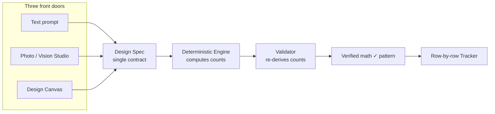

---

<a name="2-product-blueprint"></a>
## 2. Product Blueprint

### 2.1 Problem
Crochet patterns are error-prone artisanal artifacts. Stitch counts in human-written and AI-written patterns are frequently wrong, which wastes yarn, time, and trust. Existing AI tools (ChatGPT et al.) hallucinate counts confidently. Designing original 3D amigurumi or colorwork requires expertise most makers lack.

### 2.2 Solution
A studio where **every number is computed by a geometry engine and independently verified**, wrapped in three approachable creation modes and a guided row tracker.

### 2.3 Target audience
- **Hobbyist crocheters** (beginner→intermediate) who want reliable patterns.
- **Pattern designers / sellers** who want to design faster and sell verified patterns.
- **Gift/seasonal makers** who follow trends (amigurumi characters, shields, plush).
- Future: **craft educators / studios / brands** (Team & Enterprise tiers).

### 2.4 Core workflows (grounded in routes/pages)
1. **Discover** (`/`) → browse templates, beginner path, recent creations.
2. **Create from text** (`/create`) → `POST /api/ai/generate-pattern` (SSE) → verified pattern.
3. **Create from photo** (Vision Studio) → `POST /api/ai/analyze-image` → editable Design Spec chips → `POST /api/ai/generate-from-spec`.
4. **Design from imagination** (`/design`) → Build (shapes + Sculpt/revolve + live 3D) or Draw (colorwork chart/medallion) → `POST /api/design/preview` (live verified math) → generate.
5. **Track** (`/tracker/:id`) → row-by-row, Crochet Mode focus, AI Tutor.
6. **Share** (`/d/:id`) → public design page with OG image.

### 2.5 Strengths
- **Verified-math moat** with an automated regression suite (`backend/test/*`, CI-gated).
- Clean separation: LLM does creativity/voice, engine does arithmetic (CLAUDE.md decision #10).
- Honest failure mode: returns `AI_UNAVAILABLE` rather than saving a fake pattern.
- Strong, cohesive design system ("Atelier · Ink & Violet"), motion, and now mobile-responsive (bottom tab bar, dvh, safe areas).
- Compiler-first AI is cost-smart (cheap Haiku for parse, Sonnet for prose).

### 2.6 Weaknesses (current)
- Single-tenant, single-instance, SQLite — no team model, no horizontal scale.
- No billing, email verification, password reset, or observability stack.
- Security surface incomplete (headers, CSRF, login throttling).
- Frontend untested; several 400–730-line page components (`Create.jsx` 729, `Tracker.jsx` 682).
- Vision pipeline only validated against fallback (no live key in CI).

### 2.7 Missing features (product)
Teams/collaboration, pattern marketplace & payouts, PDF/printable export, yarn-stash & project management, social/community, mobile apps, version history for designs, search across patterns/templates, notifications, public template submission.

### 2.8 Competitor analysis
| Competitor | What they do | Loopsy's edge |
|---|---|---|
| Ravelry | Massive pattern marketplace/community | Loopsy *generates* verified patterns; Ravelry is a catalog. |
| Generic LLMs (ChatGPT) | Will "write" a pattern | They hallucinate counts; Loopsy computes + verifies. |
| Etsy pattern sellers | Human PDFs | Loopsy lets sellers design faster, with a verification badge as trust signal. |
| Stitch Fiddle / chart tools | Manual colorwork charts | Loopsy auto-compiles charts to worked-in-round 3D + verified counts. |
| Hookpad/amigurumi generators | Niche generators | None combine text+photo+canvas → one verified engine. |

### 2.9 Strategic statements
- **Vision:** *Anyone can turn an idea — a sentence, a photo, or a sketch — into a crochet pattern whose every stitch is correct.*
- **Mission:** *Replace guesswork in fiber crafts with computed, verifiable patterns and a delightful guided make.*
- **Positioning:** *For makers and designers who are tired of wrong counts, Loopsy is the AI crochet studio that computes and verifies every stitch — unlike chatbots that guess and PDFs that can't be trusted.*

### 2.10 Value Proposition Canvas
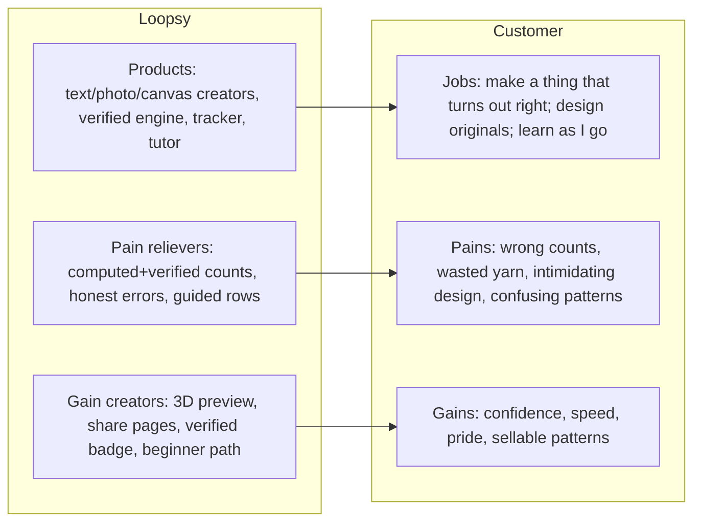

### Personas (D2) — summary table (full detail in §3 journeys)
| Persona | Demographics | Primary goal | Top frustration | Key actions |
|---|---|---|---|---|
| **New User (Maya)** | 28, hobbyist, mobile-first | Make one thing successfully | "Will this actually work?" | Browse → text-generate → track |
| **Returning User (Sam)** | 35, weekly maker | Resume & make more | Re-finding projects | `/tracker` list → continue |
| **Power User / Designer (Priya)** | 42, sells patterns | Design originals fast | Limits, no export/marketplace | `/design`, share, regenerate |
| **Team Owner (Dana)** | 38, runs a craft studio | Shared library, seats | No team model yet | (Target) invite, manage seats |
| **Administrator (internal)** | Ops/eng | Health, abuse, support | No admin portal yet | (Target) impersonate, refund, flags |
| **Support (internal)** | CX | Resolve tickets | No tooling/visibility | (Target) view usage, reset, comp credits |

---

<a name="3-ux-blueprint"></a>
## 3. UX Blueprint

### 3.1 Journey maps (D3)

**Guest flow**
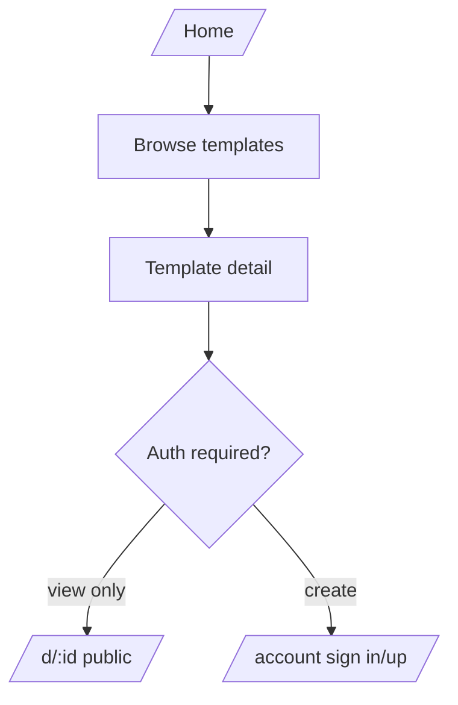

**Registration flow**
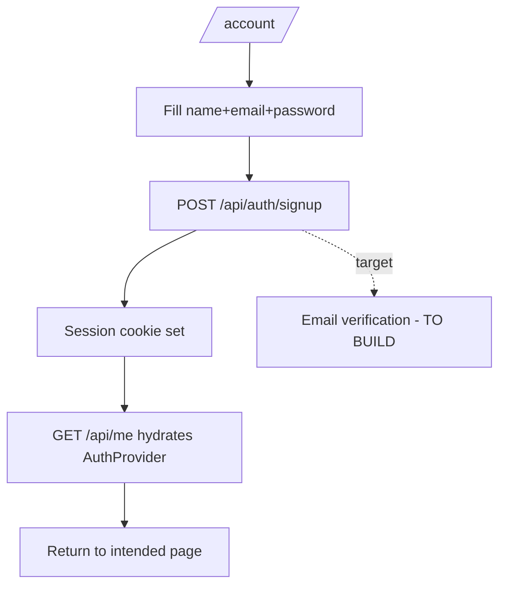

**Onboarding flow**
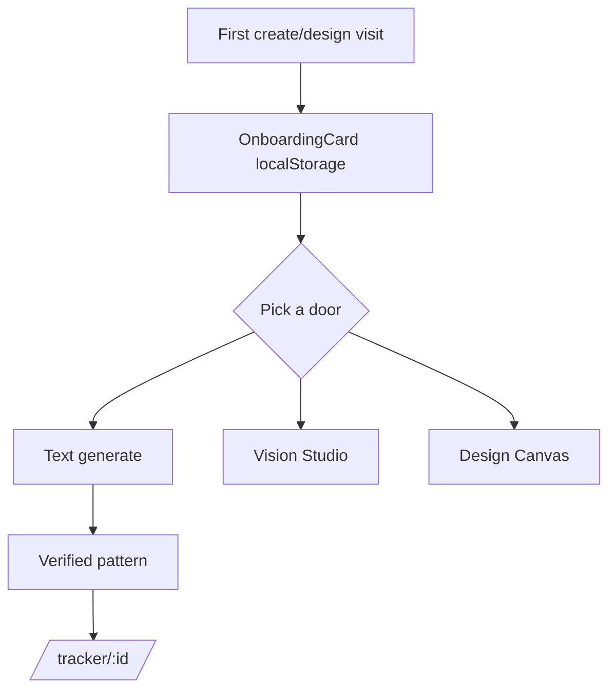

**Core product flow**
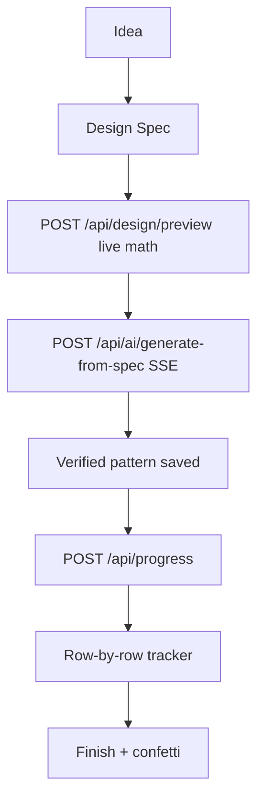

**Upgrade flow (target M5)**
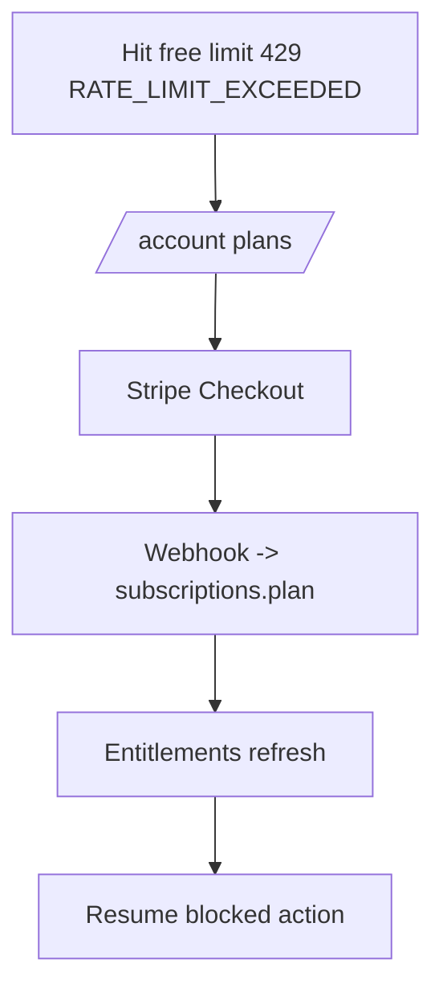

**Support flow (target)**
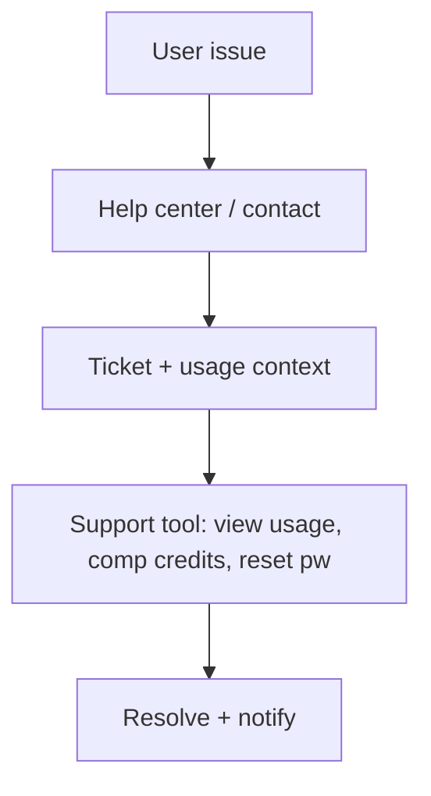

**Retention flow**
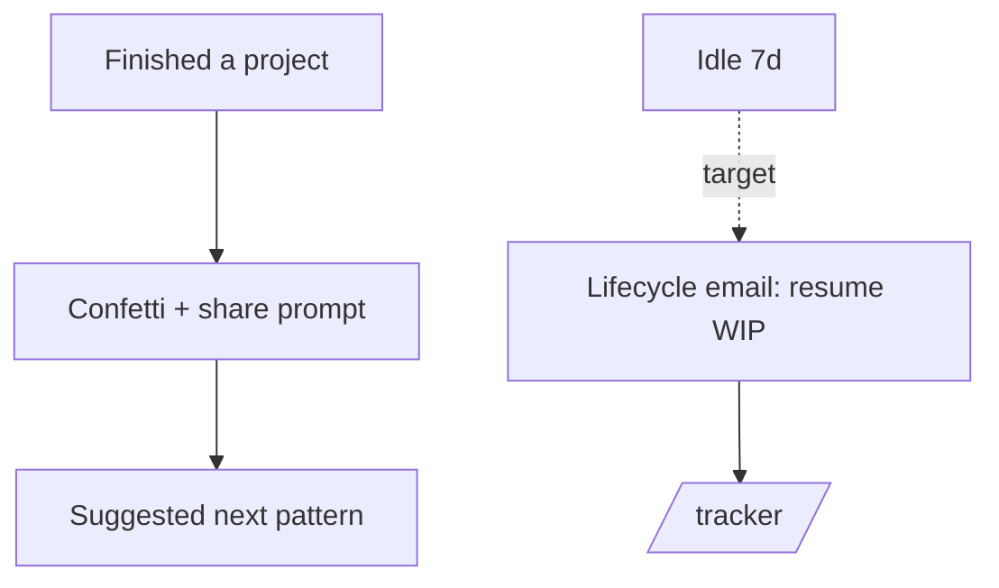

**Referral flow (target)**
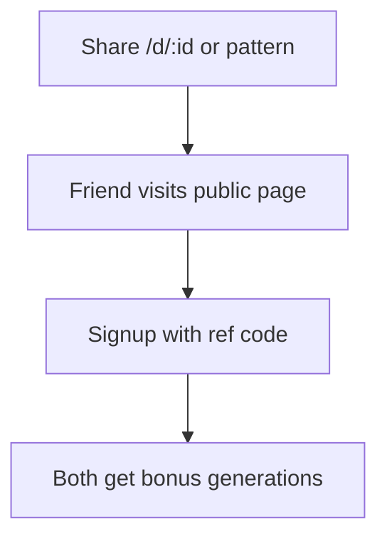

### 3.2 Information Architecture (D4)

**Sitemap**
```mermaid
flowchart TD
  Root[/] --> Templates[/templates/:id/]
  Root --> Create[/create/:templateId?/]
  Root --> Design[/design/]
  Root --> Share[/d/:id public/]
  Root --> Tracker[/tracker/:patternId?/]
  Root --> Account[/account/]
  Account -. target .-> Settings[/settings/]
  Account -. target .-> Billing[/billing/]
  Root -. target .-> Admin[/admin/*/]
  Root -. target .-> Search[/search/]
```

**Navigation by breakpoint** (grounded):
- **Desktop (≥md):** `SideNav` (220px sticky) on app pages; `TopNav` (fixed) only on Home.
- **Tablet:** same as desktop ≥768px; below, mobile.
- **Mobile (<md):** new global `MobileTabBar` (Explore/Create/Design/Projects/Account, hidden on `/design` and `/d/`), plus `MobileNav` drawer where a hamburger exists. Editors collapse to a single vertical scroll.

**Permission matrix (current + target)**
| Resource | Guest | User (free) | Maker Pro | Creator | Team Owner* | Admin* |
|---|---|---|---|---|---|---|
| Browse templates | ✅ | ✅ | ✅ | ✅ | ✅ | ✅ |
| View public design `/d/:id` | ✅ | ✅ | ✅ | ✅ | ✅ | ✅ |
| Generate (text/spec) | ❌ | 3/mo | 30/mo | ∞ | pooled | ✅ |
| Vision analyze | ❌ | 1 lifetime | monthly gen | ∞ | pooled | ✅ |
| Tutor | ❌ | 3/mo | ∞ | ∞ | ∞ | ✅ |
| Save/track patterns | ❌ | ✅ (own) | ✅ | ✅ | team-scoped | ✅ |
| Manage seats/billing | ❌ | ❌ | ❌ | ❌ | ✅ | ✅ |
| Impersonate/refund/flags | ❌ | ❌ | ❌ | ❌ | ❌ | ✅ |

`*` = target tiers not yet implemented. Plan limits grounded in `lib/utils/planLimits.js` (`free` gen=3/tutor=3, `maker_pro` gen=30/tutor=∞, `creator` ∞; vision free=1 lifetime).

### 3.3 UX Audit (D5)
| ID | Issue | Severity | Impact | Root cause | Recommendation |
|---|---|---|---|---|---|
| UX-1 | No global search across templates/patterns | High | Discovery ceiling; retention | Catalog-only Home filter (`Home.jsx`) | Add `/search` + server search (and later vector search). |
| UX-2 | God-component pages (`Create` 729, `Tracker` 682) | Med | Maintainability, perf | Organic growth | Decompose into feature modules (Tracker already split once). |
| UX-3 | No client cache; every page re-fetches | Med | Latency, redundant calls | Raw `fetch`+`useState` | Adopt React Query (SWR) for `/templates`, `/patterns`, `/usage`. |
| UX-4 | A11y gaps: no skip-link, no focus trap in drawers/modals, heading order not enforced | Med | WCAG 2.2 AA risk | No a11y pass | Add skip-link, focus-trap (MobileNav/Onboarding/CrochetMode), audit headings, contrast tokens. |
| UX-5 | Form errors via toast, not `aria-describedby` | Low | SR users miss inline errors | Toast-first pattern (`Account.jsx`) | Inline field errors + live region. |
| UX-6 | No empty/error states for some fetch failures | Low | Confusion | Happy-path coding | Standard empty/error components. |
| UX-7 | Cognitive load on Design editor (many panels) | Med | New-user drop-off | Power surface | Progressive disclosure; the mobile single-scroll already helps. |
| UX-8 | No notifications/inbox | Low | Re-engagement | Not built | Add notification center (target). |
| PERF-1 | 0.9–1.35 MB lazy chunks (three/drei/heic2any) | Med | Slow on cold 3D/HEIC | Heavy deps | Budget + manualChunks; consider server-side HEIC. |

---

<a name="4-ui-blueprint"></a>
## 4. UI Blueprint

### 4.1 Design principles (2026)
1. **Computed confidence** — surface the "Verified math ✓" everywhere arithmetic appears.
2. **Tactile-digital** — fiber warmth (grain, aurora, yarn accents) with crisp modern structure.
3. **Motion with restraint** — every animation respects `prefers-reduced-motion` (already enforced globally).
4. **One token source** — `frontend/src/index.css` `@theme` only; never reintroduce a second config.
5. **Mobile-first parity** — every flow usable one-thumb.

### 4.2 Color system (grounded — `index.css`)
- **Light "Cloud":** surface `#F7F7FB`, on-surface `#1A1726`; **primary violet `#6C4CE8`** (dim `#5736CC`); secondary mint `#0E8C74`; tertiary rose `#C8417E`; error `#C53030`.
- **Dark "Ink":** surface `#0E0D15`, on-surface `#ECE8F6`; primary `#A78BFF`; secondary `#5FD4B2`; tertiary `#FF8FBE`; error `#EF6E5E`.
- **Yarn accents (theme-stable):** coral `#FF6584`, marigold `#FFB02E`, sage `#4ECBA0`, periwinkle `#8B7CF6`, rose `#F472B6`.
- **Effects:** aurora radial washes (7%/10%), SVG grain (3%/4.5%), `--shadow-rgb` per theme.
- **Surface ladder:** `surface-container-lowest…highest` (full ramp present both themes).
- **Target add:** documented WCAG contrast pairs + a `--focus` token; verify AA on `on-surface-variant`.

### 4.3 Typography scale
- Display: **Fraunces** (variable, SOFT/WONK axes; `display-wonk` hover). Body/label/headline: **Plus Jakarta Sans**.
- **Target scale (rem):** 0.75 / 0.875 / 1 / 1.125 / 1.25 / 1.5 / 1.9 / 2.4 / 3.2 / 4.4 (the responsive heading steps already used after the mobile pass).

### 4.4 Spacing, radius, elevation, motion (grounded)
- **Radius tokens:** `--radius 1rem`, `md 1.5rem`, `lg 2rem`, `xl 3rem`, `full 9999px`.
- **Elevation:** `shadow-warm` / `-md` / `-lg` / `-xl` (theme-aware dual shadows).
- **Motion:** `motion` lib + `lib/motionTokens.js` (durations + springs); signatures `CursorDot`, `ScrollThread`, `Marquee`, `Reveal`, `PageTransition`.
- **Target add:** an 8pt spacing scale token set (`--space-1…12`) to replace ad-hoc paddings.

### 4.5 Component library spec (target component contracts)
For each: variants, sizes, states (default/hover/active/focus-visible/disabled/loading), a11y.
- **Button** — primary/secondary/ghost/destructive; sm/md/lg; `shine-sweep` on primary; min 44px touch; `:focus-visible` ring (token). 
- **Input/Textarea** — label + `aria-describedby` error; invalid state; prefix/suffix; autosize textarea (already in AiTutor).
- **Dropdown/Select** — keyboard nav, typeahead, `role=listbox`.
- **Card** — `card-lift`, `glass-panel`, media/header/body/footer slots.
- **Table** — sticky header, sortable, density toggle, zebra; mobile → stacked rows.
- **Modal/Drawer** — focus-trap, ESC, scrim, `role=dialog` + `aria-modal` (retrofit MobileNav/Onboarding/CrochetMode).
- **Tabs** — `role=tablist`, arrow keys, animated active pill (pattern already exists in nav).
- **Breadcrumbs** — for `/templates/:id` and admin.
- **Navigation** — SideNav/TopNav/MobileTabBar (built); add command-palette entry.
- **Charts** — usage & analytics (Recharts/visx) for Account + Admin.
- **Search** — global, debounced, keyboard-first; results grouped (templates/patterns/designs).
- **Notifications/Toast** — built (`Toast.jsx`); extend to a persistent inbox.
- **Command Palette (⌘K)** — jump to actions/pages/patterns (new).

### 4.6 Screen redesigns (D7) — wireframe specs (text)
Each: Layout / Sections / Components / Interactions / Mobile.
- **Landing:** hero (3D yarn ball, lazy) + value props + verified-badge proof + beginner path + template grid + footer marquee. Mobile: stacked, tab bar.
- **Auth:** split panel (brand + form); inline validation; OAuth (target Google/Apple). Mobile: full-width form.
- **Dashboard (new, target):** "Continue making" (WIP), usage meters, suggested templates, recent designs. Replaces the implicit Home-as-dashboard.
- **Analytics (new):** usage over time, verified-rate, popular shapes (Admin + Creator self-analytics).
- **Projects:** `/tracker` list as cards w/ progress rings; filters; search.
- **Profile/Settings (new):** profile, skill level, theme, email prefs, danger zone (delete account).
- **Notifications (new):** inbox of finishes, shares, billing, system.
- **Admin Portal (new):** users, subscriptions, usage, abuse flags, impersonate, refunds (see §7 RBAC).

---

<a name="5-backend-blueprint"></a>
## 5. Backend Blueprint

### 5.1 C4 Model (D8)

**L1 — System Context**
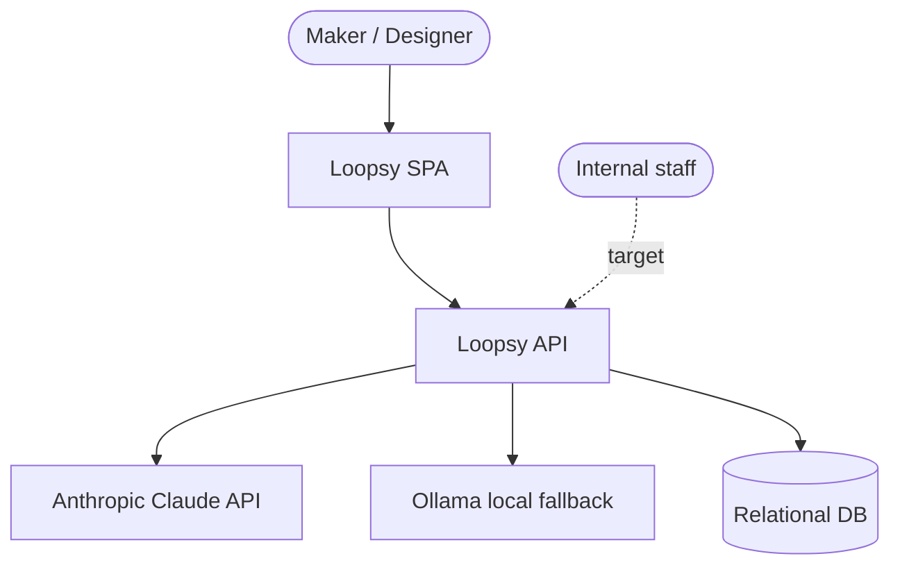

**L2 — Containers**
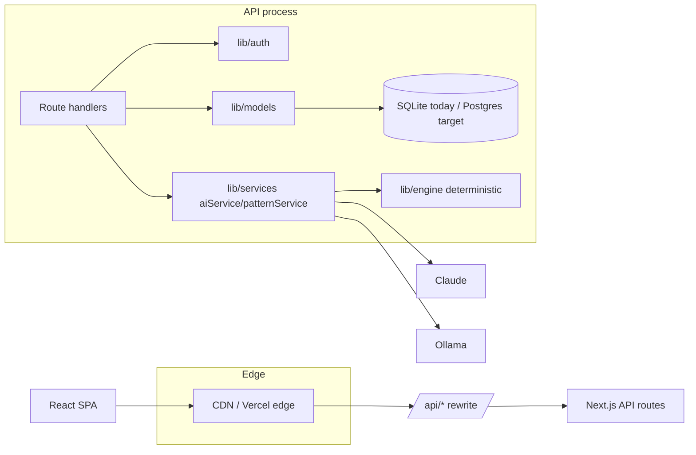

**L3 — Component (engine, the moat)**
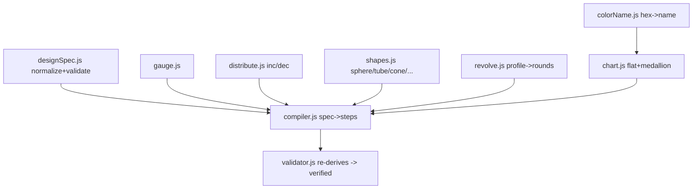

**L4 — Code (generation request path)**
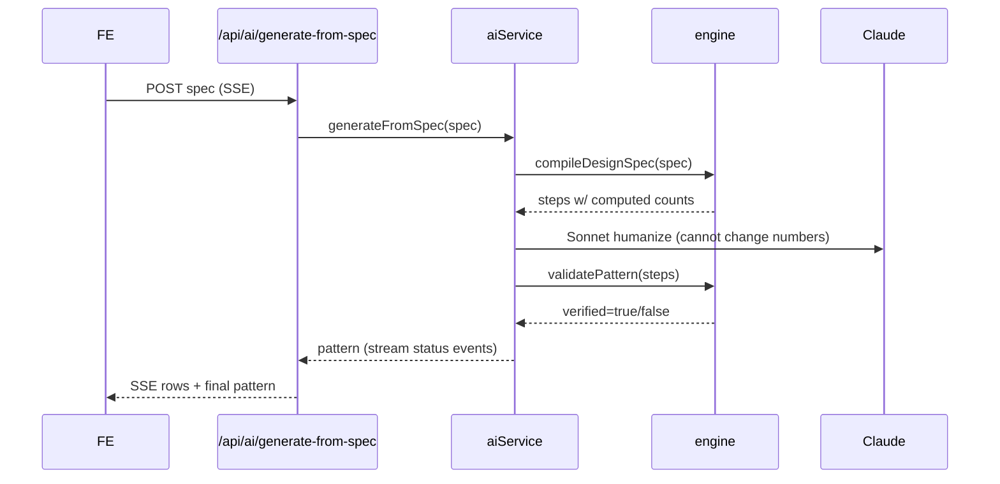

### 5.2 API architecture (D10)

**REST inventory (grounded; methods inferred from handlers/usage)**
| Route | Methods | Auth | Notes |
|---|---|---|---|
| `/api/auth/signup` `/login` `/logout` | POST | public | session cookie `stitchflow_session` |
| `/api/me` | GET | cookie | hydrates AuthProvider |
| `/api/templates` `/templates/:id` | GET | public | seeded catalog |
| `/api/patterns` | GET, POST | cookie (write) | user-scoped |
| `/api/patterns/:id` | GET, PATCH/DELETE | owner | |
| `/api/progress` | GET, POST | cookie | |
| `/api/progress/:id` | PATCH | owner | mark steps |
| `/api/progress/pattern/:patternId` | GET | owner | |
| `/api/designs` | GET, POST | cookie | canvas spec JSON |
| `/api/designs/:id` | GET (public), PATCH (owner) | mixed | share page reads public |
| `/api/designs/:id/og` | GET | public | SVG OG image |
| `/api/design/preview` | POST | cookie | live compile, no save |
| `/api/ai/generate-pattern` | POST (SSE) | cookie + rate-limit | text→verified |
| `/api/ai/generate-from-spec` | POST (SSE) | cookie + rate-limit | canvas/approved spec |
| `/api/ai/generate-chart` | POST | cookie + rate-limit | colorwork |
| `/api/ai/analyze-image` | POST | cookie + **vision meter** | metered (free=1 lifetime) |
| `/api/ai/regenerate` | POST | cookie + rate-limit | |
| `/api/ai/tutor` | POST | cookie + rate-limit | step Q&A |
| `/api/usage` | GET | cookie | meters for Account |
| `/api/analytics` | GET/POST | internal | counters |

**Auth flow:** opaque 32-byte session token (DB-backed), `httpOnly`+`SameSite=Lax`+`Secure(prod)`, 30-day TTL, expired rows swept on read (`sessionModel.getSessionByToken`). Password = scrypt(N=16384) with per-user 16-byte salt + `timingSafeEqual`.

**Authorization:** ownership checks in handlers via `requireAuthenticatedUser` + `userId` scoping. **Target:** centralize into a policy layer (`can(user, action, resource)`) and RBAC for Team/Admin.

**Rate limiting:** today = DB usage counters per `(userId,type,month)` for AI only. **Target:** add edge/IP rate limiting (Redis token bucket) for all routes + login throttle.

**Caching strategy (target):** CDN cache `/api/templates` (public, ETag), Redis cache `/api/me` & `/usage` (short TTL), HTTP caching headers on OG images.

**API Gateway (target):** keep Vercel rewrite for SPA→API; on AWS, API behind ALB + WAF; per-route throttles at gateway.

**GraphQL (target, optional):** a thin GraphQL BFF for the Design Canvas + dashboard to reduce waterfall fetches; REST remains the system of record. **WebSockets (target):** replace SSE-only with WS/SSE hybrid for collaborative canvas + live tutor.

**OpenAPI:** generate `openapi.yaml` from the route inventory above (engineering task ENG-API-1) and publish a typed client for the SPA.

---

<a name="6-database-blueprint"></a>
## 6. Database Blueprint (D9)

### 6.1 Current ER (grounded — `lib/db/index.js`)
```mermaid
erDiagram
  users ||--o| subscriptions : has
  users ||--o{ sessions : owns
  users ||--o{ patterns : creates
  users ||--o{ progress : tracks
  users ||--o{ designs : creates
  users ||--o{ ai_usage : meters
  templates ||--o{ patterns : seeds
  patterns ||--o{ progress : has
  designs ||--o| patterns : links

  users { TEXT id PK; TEXT email UK; TEXT name; TEXT passwordHash; TEXT skillLevel; TEXT createdAt }
  subscriptions { TEXT id PK; TEXT userId UK; TEXT plan; TEXT status; TEXT createdAt; TEXT updatedAt }
  sessions { TEXT id PK; TEXT userId; TEXT token UK; TEXT expiresAt; TEXT createdAt }
  templates { TEXT id PK; TEXT name; TEXT difficulty; TEXT category; TEXT defaultPattern }
  patterns { TEXT id PK; TEXT userId; TEXT title; TEXT templateId; TEXT steps; INT verified; INT isExperimental; INT isFallback; TEXT createdAt }
  progress { TEXT id PK; TEXT userId; TEXT patternId; INT totalSteps; TEXT steps; INT progressPercentage; TEXT createdAt }
  ai_usage { TEXT id PK; TEXT userId; TEXT type; TEXT month; INT count; }
  designs { TEXT id PK; TEXT userId; TEXT name; TEXT spec; TEXT patternId; TEXT createdAt; TEXT updatedAt }
  analytics { TEXT key PK; INT value }
```

**Indexes present:** `progress(patternId)`, `patterns(userId)`, `progress(userId)`, `sessions(userId)`, `users(email)`, `sessions(token)`, `patterns(templateId)`, `ai_usage(userId,type,month)`, `designs(userId)`. Good coverage for current queries.

### 6.2 Normalization analysis
- Mostly 3NF for relational fields. JSON-in-TEXT columns (`steps`, `materials`, `tags`, `notes`, `defaultPattern`, `spec`) are denormalized blobs — acceptable for document-like pattern data, but **not queryable** (e.g., can't search by stitch). On Postgres → `JSONB` with GIN indexes.
- `analytics` is a global counter table — fine for MVP, replace with event metrics at scale.

### 6.3 Target schema additions (venture-scale)
- **Multi-tenancy:** `organizations`, `memberships(org_id,user_id,role)`, add `org_id` to patterns/designs for Team tier.
- **Billing:** `stripe_customers`, `stripe_subscriptions` (mirror), `invoices`, `entitlements` (derived).
- **Trust/ops:** `audit_log(actor_id, action, resource, before, after, ip, at)`; **soft delete** via `deletedAt` on user-content tables (filter in models); **versioning** for `designs` (`design_versions`).
- **Auth recovery:** `email_verifications`, `password_resets`.
- **Search:** `JSONB` + GIN; later `pgvector` for semantic pattern/template search.

### 6.4 Indexing / partitioning / retention (Postgres target)
- B-tree on all FKs + `(userId, createdAt)` for timelines.
- GIN on `patterns.steps`, `designs.spec` (JSONB).
- Partition `ai_usage` and `audit_log` by month (range) for cheap pruning.
- Retention: prune expired `sessions` (already), archive `audit_log` > 1y to S3.

### 6.5 Migration path (SQLite → Postgres)
1. Introduce a DB adapter behind `lib/models/*` (already the only DB seam).
2. Port schema + idempotent migrations to a real migration tool (Prisma/Drizzle/Knex).
3. Dual-write/backfill window; cut over; keep SQLite for local dev/tests.
The engine is pure and DB-agnostic — **zero engine changes** required.

---

<a name="7-security-blueprint"></a>
## 7. Security Blueprint (D11)

### OWASP Top 10 (2021) — current posture
| Risk | Status | Evidence | Action |
|---|---|---|---|
| A01 Broken Access Control | ⚠️ partial | per-handler ownership checks; no central policy | Policy layer + RBAC; tests per route. |
| A02 Cryptographic Failures | ✅ ok | scrypt + timingSafeEqual; cookie Secure in prod | Add pepper/secret-manager; enforce TLS/HSTS. |
| A03 Injection | ✅ low | parameterized `better-sqlite3` prepared stmts | Keep; validate all input (zod) at route edges. |
| A04 Insecure Design | ⚠️ | no threat model, no abuse limits on auth | Threat-model M5; add throttles. |
| A05 Security Misconfig | ❌ | no CSP/HSTS/security headers; CORS `*` fallback | §0.2/§0.3. |
| A06 Vulnerable Components | ⚠️ | `heic2any@0.0.4` pre-release | pin/replace; add Dependabot + `npm audit` in CI. |
| A07 Auth Failures | ❌ | no login throttle, no email verify/reset, no MFA | §0.1/§0.4; add MFA for Team/Admin. |
| A08 Integrity Failures | ⚠️ | no SRI/signing; CI builds untested deps | lockfile audit, provenance. |
| A09 Logging/Monitoring | ⚠️ | structured logger only; no alerting | add Sentry + metrics + audit log. |
| A10 SSRF | ✅ low | server only calls Claude/Ollama (fixed hosts) | allowlist outbound. |

### Authentication / Authorization / Session
- **Now:** cookie sessions, opaque tokens, ownership checks.
- **Target:** add email verification, password reset, optional OAuth (Google/Apple), MFA (TOTP) for elevated roles; rotate session on login; CSRF token for mutations; RBAC roles `user|maker_pro|creator|team_admin|support|admin`.

### Secrets / Encryption / Audit / Compliance
- Secrets → AWS Secrets Manager / SSM; encrypt at rest (RDS KMS), in transit (TLS 1.2+).
- Audit log for all privileged + billing actions.
- Compliance roadmap: GDPR/CCPA (data export + delete; **soft-delete then purge**), SOC 2 readiness for Enterprise (access reviews, change mgmt via CI/CD, logging).
- PII minimization: Vision images are pass-through, **never stored** (keep this invariant; document it in the privacy policy).

---

<a name="8-devops-blueprint"></a>
## 8. DevOps Blueprint (D12–D17)

### 8.1 Scalability stages (D12)
| Stage | Users | Architecture |
|---|---|---|
| Now | <1K | Vercel SPA + Railway Next/SQLite (single instance) |
| 10K | | Postgres (RDS) + Redis cache/limits; 2–3 stateless API replicas behind ALB; CDN for static + templates |
| 100K | | HPA autoscaling on EKS; read replicas; queue (SQS/Kafka) for AI jobs; per-route rate limits at gateway/WAF |
| 1M | | Sharded/replicated Postgres (Aurora) + PgBouncer; multi-AZ; cache tiers; async generation workers pool; pgvector search service |
| 10M | | Multi-region active-passive; CQRS read models; event-driven everything; cost controls on AI; dedicated inference budget/queue |

### 8.2 Target AWS architecture (D14)
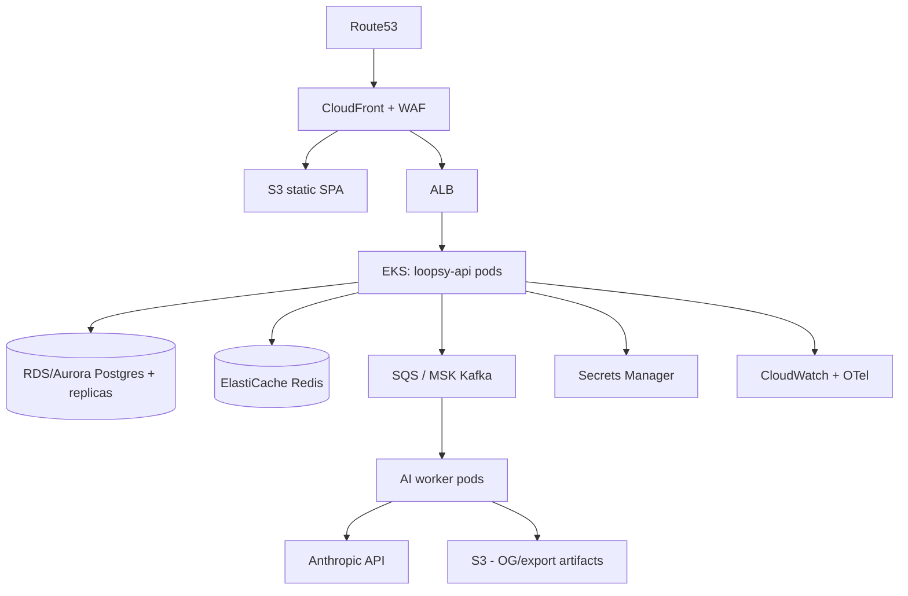

### 8.3 Kubernetes design (D15)
- **Namespaces:** `loopsy-prod`, `loopsy-staging`, `observability`, `ingress`.
- **Workloads:** `Deployment loopsy-api` (HPA cpu/RPS), `Deployment loopsy-worker` (HPA queue-depth via KEDA), `Service` (ClusterIP) + `Ingress` (ALB/Nginx).
- **Config:** `ConfigMap` (non-secret), `Secret` (synced from Secrets Manager via External Secrets), `HPA`, `PDB` (minAvailable 1), `NetworkPolicy` (default-deny; api↔db/redis only).
- **Helm chart structure:**
```
charts/loopsy/
  Chart.yaml  values.yaml  values-staging.yaml  values-prod.yaml
  templates/{deployment-api,deployment-worker,service,ingress,hpa,pdb,
             configmap,externalsecret,networkpolicy,servicemonitor}.yaml
```

### 8.4 CI/CD (D16)
- **Now (grounded `.github/workflows/ci.yml`):** on push→main + all PRs: backend `npm test` (engine moat) + `build`; frontend `lint` + `build`. Node 20.
- **Target pipeline:**
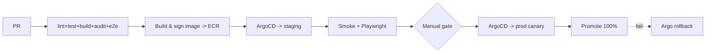
- **IaC:** Terraform (VPC, EKS, RDS, Redis, S3, CF, WAF, IAM). **Promotion:** image digest promoted across envs (immutable). **Environments:** dev (local SQLite) → staging → prod.

### 8.5 Event-driven architecture (D13)
**Domain events:** `pattern.generated`, `pattern.verified`, `design.shared`, `progress.completed`, `usage.recorded`, `subscription.updated`, `vision.analyzed`, `user.signed_up`.
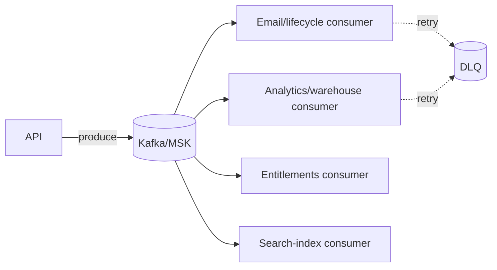
- **Topics:** `loopsy.patterns`, `loopsy.billing`, `loopsy.usage`, `loopsy.users`. **Retry:** exponential, max 5, then **DLQ** + alert. Idempotent consumers keyed by event id.

### 8.6 Observability (D17)
- **Metrics:** Prometheus (RED + business: gen latency, verified-rate, AI cost/req, queue depth) → **Grafana**.
- **Logs:** **Loki** (structured logger already emits JSON in prod).
- **Traces:** **Tempo** + **OpenTelemetry** SDK in API/worker (span the engine compile + Claude call).
- **SLIs/SLOs:** API availability 99.9%; p95 generate (non-AI compile) < 300ms; p95 end-to-end generate < 8s; verified-rate ≥ 99% for in-vocabulary specs. **SLA:** 99.9% (paid), error budget alerting.
- **Alerting:** SLO burn-rate, DLQ > 0, AI error spike, RDS CPU/conns, 5xx rate.

---

<a name="9-ai-blueprint"></a>
## 9. AI Blueprint (D18)

**Current pipeline (grounded `aiService.js`):** Haiku (`claude-haiku-4-5`) parses intent → tool `submit_design_spec`; engine computes; Sonnet (`claude-sonnet-4-6`) humanizes; validator verifies. Ollama (`phi3`) is the keyless fallback; honest `AI_UNAVAILABLE` when all fail.

**Opportunities, RICE-prioritized** (Reach·Impact·Confidence / Effort):
| Feature | R | I | C | E | RICE | Notes |
|---|---|---|---|---|---|---|
| **AI Search (semantic)** over templates/patterns | 9 | 3 | 0.8 | 3 | 7.2 | pgvector; fixes UX-1. |
| **Copilot in Design Canvas** ("make ears bigger") | 7 | 3 | 0.7 | 4 | 3.7 | edits Spec, engine recomputes. |
| **Recommendations** ("makers also made") | 8 | 2 | 0.8 | 3 | 4.3 | from events/embeddings. |
| **Auto-difficulty & time estimate calibration** | 6 | 2 | 0.7 | 2 | 4.2 | learn from real tracker completion data. |
| **Vision multi-object decomposition** | 5 | 3 | 0.6 | 5 | 1.8 | extends Vision Studio. |
| **Predictive yarn quantity** | 6 | 2 | 0.7 | 2 | 4.2 | engine already knows geometry. |
| **Analytics copilot (Creator/Admin)** | 4 | 2 | 0.6 | 3 | 1.6 | NL over usage. |

**Guardrails:** LLMs never compute counts (engine-only). Cache Haiku parses by prompt hash. Budget/quotas per plan already exist; add cost telemetry + circuit breaker.

---

<a name="10-growth-blueprint"></a>
## 10. Growth Blueprint (D19 — Monetization, M5)

**Tiers**
| Tier | Price (illustrative) | Entitlements (extend `PLAN_LIMITS`) |
|---|---|---|
| **Free** | $0 | 3 generations/mo, 3 tutor/mo, 1 lifetime vision trial, track unlimited own |
| **Maker Pro** | $9/mo | 30 gen/mo, ∞ tutor, vision = monthly gen, PDF export |
| **Creator** | $19/mo | ∞ gen/tutor/vision, marketplace selling, analytics, priority AI |
| **Team** | $49/mo + seats | pooled quota, shared library, roles, SSO (Enterprise) |
| **Enterprise** | custom | SSO/SAML, SOC2, SLA, dedicated support, audit export |

**Revenue model:** subscription (primary) + marketplace take-rate (Creator pattern sales) + future print-on-demand kits.

**Growth loops**
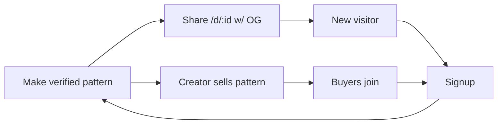
**Retention loops:** WIP resume emails, finish→share→celebrate, seasonal template drops, streaks. **Referral:** bonus generations for both sides.

**M5 implementation seam (grounded):** Stripe Checkout + webhook → write `subscriptions.plan/status` (table exists) → entitlements derived centrally (CLAUDE.md decision: "keep entitlement checks centralized"). The `429 RATE_LIMIT_EXCEEDED` path and `/account` plan cards already exist as the upgrade hook.

---

<a name="11-roadmap"></a>
## 11. Roadmap (D20)

```mermaid
gantt
  title Loopsy to venture scale
  dateFormat  YYYY-MM-DD
  section Perfect (Sec 0)
  Security headers/CSRF/login throttle :a1, 2026-06-20, 10d
  Email verify + password reset        :a2, after a1, 10d
  Sentry + request IDs + audit log     :a3, after a1, 7d
  Frontend tests (Vitest+Playwright)   :a4, 2026-06-25, 14d
  section M5 Monetize
  Stripe checkout+webhook+entitlements :b1, after a2, 14d
  PDF export + plan gates              :b2, after b1, 10d
  section Scale
  Postgres adapter + migration         :c1, after b1, 21d
  Redis cache + rate limit             :c2, after c1, 10d
  AWS/EKS + Terraform + staging        :c3, after c1, 30d
  section Platform
  Teams/org model + RBAC               :d1, after c3, 30d
  Search (pgvector) + Copilot          :d2, after c3, 30d
  Marketplace + payouts                :d3, after d1, 45d
```
- **30 days:** Section 0 P0/P1 closed; staging + Sentry; frontend test harness.
- **90 days:** M5 live (Stripe, PDF export); Postgres migration underway; Redis rate limiting.
- **6 months:** AWS/EKS prod; Teams/RBAC; global search; Copilot beta.
- **12 months:** Marketplace + payouts; analytics; multi-region readiness; SOC2 path.
- **24 months:** Mobile apps; Enterprise/SSO; predictive AI; international.

---

<a name="12-technical-debt-analysis"></a>
## 12. Technical Debt Analysis (grounded)

| Debt | Location | Severity | Interest (cost of waiting) |
|---|---|---|---|
| SQLite single-writer | `lib/db/index.js` | High | Caps concurrent users; blocks multi-instance & teams |
| No billing | `subscriptions` table unused by code path | High | No revenue; manual ops |
| Missing auth recovery & verification | `app/api/auth/*` | High | Support load, account lockout, spam signups |
| No security headers / CORS `*` | `next.config.js` | High | XSS/clickjacking exposure |
| No login throttle | `auth/login` | High | Credential stuffing |
| `heic2any@0.0.4` pre-release + heavy chunks | `frontend/package.json`, build output | Med | Reliability + perf |
| God components (`Create` 729, `Tracker` 682, `VisionStudio` 411) | `frontend/src/pages,components` | Med | Velocity, bugs |
| No client cache | all pages | Med | Latency, redundant load |
| No frontend tests | repo | Med | Regressions in UI |
| Legacy cookie name `stitchflow_session` | `auth/session.js` | Low | Brand leak |
| JSON-in-TEXT not queryable | patterns/designs columns | Med (later) | Blocks search/analytics |
| No soft-delete/audit/versioning | schema | Med (Team tier) | Compliance/accountability |
| No IaC/staging | repo | Med | Risky deploys |

---

<a name="13-engineering-tasks"></a>
## 13. Engineering Tasks (actionable backlog)

**Security (P0)**
- ENG-SEC-1 Add `headers()` CSP/HSTS/frame-deny/nosniff/referrer-policy in `next.config.js`.
- ENG-SEC-2 Require `FRONTEND_URL`; remove `*` CORS; add credentials handling.
- ENG-SEC-3 Login throttle + generic errors (Redis/table); lock after N fails.
- ENG-SEC-4 Email verification + password reset (tables + transactional email provider).
- ENG-SEC-5 CSRF token for mutations; rotate session on login; config validation at boot.
- ENG-SEC-6 Dependabot + `npm audit --production` + pin/replace `heic2any`.

**Reliability/Scale (P1)**
- ENG-DB-1 DB adapter seam in `lib/models/*`; Drizzle/Prisma migrations; Postgres in staging.
- ENG-DB-2 Add `deletedAt` soft-delete + `audit_log` + `design_versions`.
- ENG-OBS-1 Sentry + request IDs + OTel traces around engine + Claude calls.
- ENG-INF-1 Dockerfile + Terraform skeleton + staging env + ArgoCD.
- ENG-PERF-1 Bundle budget + manualChunks; server-side HEIC option.

**Product/Quality (P2)**
- ENG-TEST-1 Vitest + RTL for AuthProvider/Tracker/Create; Playwright 4 journeys.
- ENG-API-1 Generate `openapi.yaml`; typed SPA client; adopt React Query.
- ENG-UX-1 Skip-link + focus-traps (MobileNav/Onboarding/CrochetMode) + heading audit.
- ENG-UX-2 Decompose `Create.jsx`/`VisionStudio.jsx` into feature modules.
- ENG-SEARCH-1 `/search` route + server search (later pgvector).

**M5 (after P0)**
- ENG-PAY-1 Stripe Checkout + webhook → `subscriptions`; central entitlements; PDF export behind gates.

---

<a name="14-figma-specifications"></a>
## 14. Figma / Design Specifications

- **Library structure:** `Foundations` (color/type/space/elevation/motion tokens mirrored from `index.css`), `Components` (per §4.5 with variants/states), `Patterns` (nav, cards, forms, editor panels), `Screens` (§4.6), `Flows` (mirror §3 Mermaid).
- **Tokens → Figma variables:** one-to-one with CSS vars (Cloud/Ink modes) so design and code share a single source.
- **Specs per component:** spacing (8pt grid), radii (`--radius*`), shadows (`shadow-warm*`), motion (durations/springs from `motionTokens.js`), focus ring token, min 44px touch.
- **Handoff:** Figma Dev Mode → Tailwind class mapping; never hard-code hex (use tokens).

---

<a name="15-investor-deck"></a>
## 15. Investor-Ready Architecture Deck (outline)

1. **One-liner:** The AI crochet studio where every stitch is computed and verified — not guessed.
2. **Problem:** Wrong counts waste yarn, time, trust; LLMs hallucinate.
3. **Insight & Moat:** Separate creativity (LLM) from arithmetic (deterministic engine + validator + test suite). Hard to copy, easy to trust ("Verified math ✓").
4. **Product:** Three front doors → one Spec → verified pattern → guided tracker. (Demo: text, photo, canvas.)
5. **Traction proxy:** M1–M4 shipped, mobile-ready, CI-gated engine moat.
6. **Architecture:** Spec-contract + pure engine = DB-agnostic, scalable; clean path to Postgres/EKS/event-driven.
7. **Business model:** Free→Pro→Creator→Team→Enterprise; subscription + marketplace take-rate; viral share/OG loop.
8. **GTM:** SEO via public design pages, creator-led growth, seasonal drops.
9. **Roadmap:** Perfect → Monetize → Scale → Platform/Marketplace.
10. **Ask & use of funds:** infra (AWS), AI cost, 2 eng + 1 design, compliance (SOC2) for Enterprise.
11. **Why now:** AI quality + makers' distrust of AI = verification is the wedge.

---

### Appendix A — Grounding index (where claims come from)
- Schema/indexes/migrations: `backend/lib/db/index.js`
- Auth/session/password/cookie: `backend/lib/auth/session.js`, `backend/lib/models/sessionModel.js`
- Plan limits/vision metering: `backend/lib/utils/planLimits.js`
- AI pipeline/models/fallback: `backend/lib/services/aiService.js`
- CORS: `backend/next.config.js` · SPA→API rewrite: `frontend/vercel.json`
- CI: `.github/workflows/ci.yml` · Deps/scripts: `*/package.json`
- Engine moat: `backend/lib/engine/*`, `backend/test/*`
- Design system/IA/components/a11y/perf: `frontend/src/index.css`, `frontend/src/App.jsx`, `frontend/src/components/*`, `frontend/src/pages/*`
