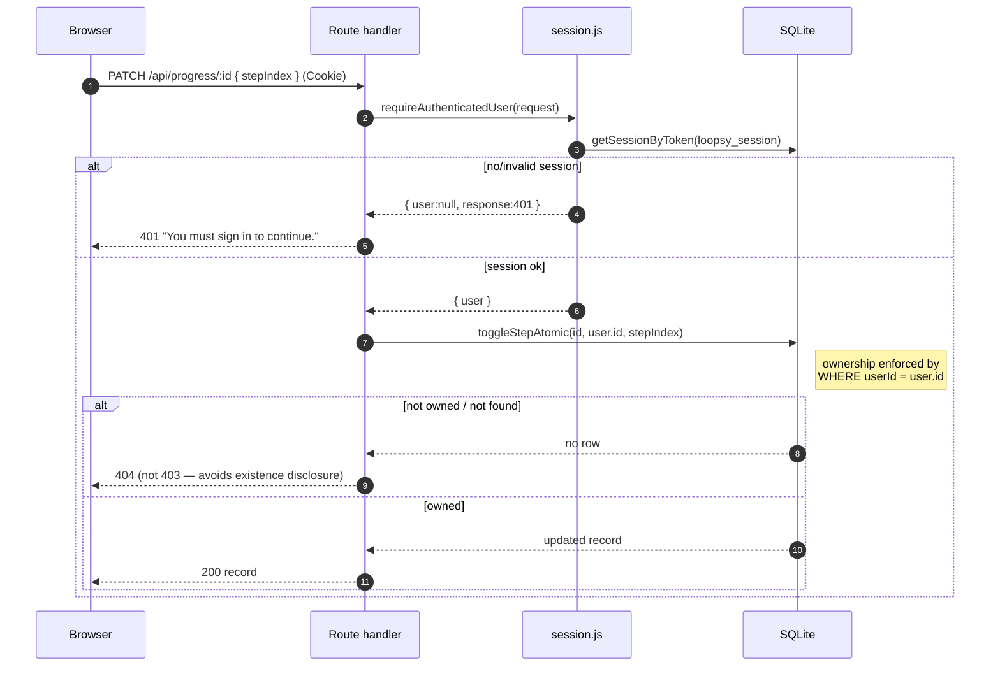

# Loopsy API — Endpoint Catalog (Phase 9, Current)

> **Status:** Current state as implemented. Verified against `backend/app/api/**/route.js`,
> `backend/lib/auth/session.js`, `backend/lib/auth/request.js`, `backend/lib/utils/planLimits.js`,
> and `backend/next.config.js`. No GraphQL, no WebSockets today; streaming is **Server-Sent Events (SSE)** only.

Authors: Backend Architect + Senior Backend Engineer.

---

## 1. Conventions

- **Transport:** Next.js 14 App Router route handlers. All routes live under `/api`.
- **Auth model:** cookie session (`loopsy_session`; legacy `stitchflow_session` still read & cleared).
  `requireAuthenticatedUser(request)` returns `{ user, response }` — the route early-returns the `401`
  `response` when `user` is null.
- **Ownership:** enforced by threading `user.id` into model queries (patterns, progress) or, in one
  case (`PATCH /api/designs/:id`), an explicit `design.userId !== user.id` → `403` check.
- **CSRF:** `isCrossSiteRequest()` (Origin/Referer vs `FRONTEND_URL` allowlist) gates the three
  **public** auth POSTs that consume tokens or trigger email (`verify-email`, `forgot-password`,
  `reset-password`). `login`/`signup` rely on `SameSite=Lax` + rate limiting; `logout` is unguarded.
- **Errors:** ad-hoc `{ error, details? }` JSON today (no shared envelope — see `02-api-modernization.md`).
  AI failures use machine codes: `AI_UNAVAILABLE`, `RATE_LIMIT_EXCEEDED`, `VISION_TRIAL_USED`,
  `SPEC_INVALID`, `CHART_INVALID`/`CHART_FAILED`, `COMPILE_FAILED`, `NO_API_KEY`.
- **Rate limits:** two systems — (a) DB rolling-window counters in `rate_limits` (auth throttling),
  (b) DB plan/usage counters in `ai_usage` via `lib/utils/planLimits.js` (AI quotas).
- **Security headers (all `/api/*`):** `nosniff`, `X-Frame-Options: DENY`,
  `Referrer-Policy: strict-origin-when-cross-origin`, `Permissions-Policy` (camera/mic/geo off), HSTS.
  CORS pinned to `FRONTEND_URL` with credentials — **no wildcard** (prod requires it set).

### Auth-level legend

| Level | Meaning |
|-------|---------|
| **public** | No session required. |
| **cookie** | Valid `loopsy_session` required (`requireAuthenticatedUser`). |
| **owner** | Cookie + resource must belong to `user.id`. |
| **metered** | Cookie + plan quota consumed (`checkRateLimit`/`recordUsage` or `checkVisionAccess`/`recordVisionUse`). |
| **tolerant** | Reads the session if present, returns `null`/`[]` instead of `401` when absent. |

### Plan limits (`lib/utils/planLimits.js`)

| Plan | generation | tutor | vision |
|------|-----------|-------|--------|
| free | 3 / mo | 3 / mo | 1 **lifetime** trial → `429 VISION_TRIAL_USED` |
| maker_pro | 30 / mo | ∞ | counts as a generation |
| creator | ∞ | ∞ | ∞ |

---

## 2. Endpoint catalog

### Auth

| Method | Path | Auth | Rate limit | Request | Response | Notes |
|--------|------|------|-----------|---------|----------|-------|
| POST | `/api/auth/signup` | public | `signup:ip:<ip>` 10/IP/hr → 429 | `{ email, name, password≥8 }` | `201 { user }` + Set-Cookie; `400` invalid; `409` exists; `403` cross-site; `500` | scrypt hash; fires best-effort verify email (24h token); creates `free` subscription. |
| POST | `/api/auth/login` | public | `login:ip:<ip>` 20/IP + `login:acct:<ip>:<email>` 5 / 15min → 429 | `{ email, password }` | `200 { user }` + Set-Cookie; `400`; `401` invalid (no enumeration); `403`; `429`; `500` | success clears the account bucket; CSRF via `isCrossSiteRequest`. |
| POST | `/api/auth/logout` | public | — | none | `200 { ok:true }` clears cookie (+legacy) | destroys session row; not CSRF-gated. |
| POST | `/api/auth/verify-email` | public | — | `{ token }` | `200 { verified:true }`; `400` invalid/expired; `403`; `500` | single-use hashed `verify` token; writes `audit_log`. |
| POST | `/api/auth/forgot-password` | public | `forgot:ip:<ip>` 5/IP/15min → 429 | `{ email }` | `200 { ok:true, message }` (generic, no enumeration); `403`; `429`; `500` | emails 1h reset link only if account exists. |
| POST | `/api/auth/reset-password` | public | `reset:ip:<ip>` 10/IP/15min → 429 | `{ token, password≥8 }` | `200 { ok:true }`; `400`; `403`; `429`; `500` | consumes `reset` token; writes `audit_log`. |
| GET | `/api/me` | tolerant | — | — | `200 { user: user\|null }`; `500` | never 401; powers client auth bootstrap. |

### Account / usage

| Method | Path | Auth | Rate limit | Request | Response | Notes |
|--------|------|------|-----------|---------|----------|-------|
| GET | `/api/usage` | cookie | — | — | `200 { plan, limits:{generations,tutor}, used:{generations,tutor}, vision:{mode,...} }`; `500` | vision mode: free=`trial`, maker_pro=`generation`, creator=`unlimited`. |

### Templates (read-only catalog)

| Method | Path | Auth | Rate limit | Request | Response | Notes |
|--------|------|------|-----------|---------|----------|-------|
| GET | `/api/templates` | public | — | `?difficulty&category&q` | `200 [templateSummary]`; `500` | seeded on first startup. |
| GET | `/api/templates/:id` | public | — | — | `200 template` (incl. `defaultPattern`); `404`; `500` | |

### Patterns (user-scoped)

| Method | Path | Auth | Rate limit | Request | Response | Notes |
|--------|------|------|-----------|---------|----------|-------|
| GET | `/api/patterns` | tolerant | — | — | `200 [pattern]` (own) or `[]` | filters `deletedAt`. |
| POST | `/api/patterns` | cookie | — | `{ templateId, title, customization:{color,size} }` | `201 pattern`; `400` no templateId; `404`; `500` | template-derived, scoped to `user.id`. |
| GET | `/api/patterns/:id` | owner | — | — | `200 pattern`; `404`; `500` | `getPatternById(id, user.id)`. |
| DELETE | `/api/patterns/:id` | owner | — | — | `200 { deleted:true, id }`; `404`; `500` | **soft delete** (`deletedAt`), audited, recoverable. |

### Progress (user-scoped)

| Method | Path | Auth | Rate limit | Request | Response | Notes |
|--------|------|------|-----------|---------|----------|-------|
| GET | `/api/progress` | cookie | — | — | `200 summaryForUser`; `500` | |
| POST | `/api/progress` | owner | — | `{ patternId }` | `200 record`; `400`; `404` (not owned); `500` | idempotent `getOrCreateProgress`, seeded from pattern steps. |
| PATCH | `/api/progress/:id` | owner | — | `{ stepIndex }` (non-neg int) | `200 record`; `400`; `404`; `500` | `toggleStepAtomic(id, user.id, stepIndex)`. |
| GET | `/api/progress/pattern/:patternId` | owner | — | — | `200 [record]`; `500` | user-scoped lookup. |

### Designs — Canvas (M4)

| Method | Path | Auth | Rate limit | Request | Response | Notes |
|--------|------|------|-----------|---------|----------|-------|
| GET | `/api/designs` | cookie | — | — | `200 [design]`; `500` | own designs. |
| POST | `/api/designs` | cookie | — | `{ name, spec }` | `201 design`; `400` no spec; `500` | normalizes Design Spec. |
| GET | `/api/designs/:id` | **public** | — | — | `200 design`; `404`; `500` | shareable `/d/:id` read. |
| PATCH | `/api/designs/:id` | owner | — | `{ patternId }` | `200 design`; `400`; `403` not owner; `404`; `500` | explicit `userId` check; links compiled pattern. |
| GET | `/api/designs/:id/og` | **public** | — | — | `200 image/svg+xml`, `Cache-Control: public, max-age=3600`; `404` text | raw SVG OG card; no JSON, no 500 handler. |
| POST | `/api/design/preview` | cookie | — | `{ spec }` | `200 { ok:true, verified, rows, partCount, peakStitches, finishedSize, hookSize, yarnWeight, parts[] }` or `{ ok:false, errors }`; `400`/`500` | live compile, **no AI, no save, no quota**. |

### AI generation

| Method | Path | Auth | Rate limit | Request | Response | Notes |
|--------|------|------|-----------|---------|----------|-------|
| POST | `/api/ai/generate-pattern` | metered | `checkRateLimit(generation)` → `429 RATE_LIMIT_EXCEEDED` | `{ prompt, difficulty, stream? }` | non-stream `201 pattern`; **`stream:true` → SSE**; `400`; `503 AI_UNAVAILABLE`; `429` | SSE events `status`/`step`/`pattern`/`error`. Quota charged **only on success**; fallback never saved. |
| POST | `/api/ai/generate-from-spec` | cookie | — (not metered) | `{ spec, difficulty, stream? }` | `201 pattern` / SSE; `400 SPEC_INVALID`; `500 COMPILE_FAILED` | deterministic follow-through of an already-metered spec (canvas / vision). |
| POST | `/api/ai/generate-chart` | cookie | — (not metered) | `{ name, yarnWeight, cols, rows, grid[], difficulty, construction, stream? }` | `201 pattern` / SSE; `400 CHART_INVALID`; `500 CHART_FAILED` | deterministic (no LLM); `verified:true`, `fromChart:true`. `construction:"round"` → medallion. |
| POST | `/api/ai/analyze-image` | metered (vision) | `checkVisionAccess` → `429 VISION_TRIAL_USED` / generation-limit | `{ images[1..3], hint? }` (≤5MB, JPEG/PNG/WebP/GIF) | `200 { confidence, observed[], feasible, spec, access }`; `400`/`413`/`429`; `503 AI_UNAVAILABLE` | requires `ANTHROPIC_API_KEY`; **metered on the analysis itself**; images passed through, never stored. |
| POST | `/api/ai/regenerate` | metered | `checkRateLimit(generation)` → `429` | `{ prompt, difficulty }` | `201 pattern`; `400`; `503 AI_UNAVAILABLE`; `500` | non-streaming; fallback not saved/charged. |
| POST | `/api/ai/tutor` | metered | `checkRateLimit(tutor)` → `429` | `{ patternId, currentStepIndex, userMessage, history }` | `200 { reply }`; `400`; `404` (not owned); `429`; `503 NO_API_KEY`; `500` | requires `ANTHROPIC_API_KEY`; pattern fetched with ownership; last 6 history turns. |

### Analytics

| Method | Path | Auth | Rate limit | Request | Response | Notes |
|--------|------|------|-----------|---------|----------|-------|
| GET | `/api/analytics` | **public** | — | — | `200 { ...analytics, totalPatterns, aiPatterns, totalTemplates, progressRecords, avgCompletion }`; `500` | counts do **not** filter `deletedAt` (known over-count; hardening candidate). |

---

## 3. Authentication flow (current)

```mermaid
sequenceDiagram
    autonumber
    participant U as Browser (SPA)
    participant API as Next.js /api
    participant DB as SQLite

    Note over U,API: Sign up
    U->>API: POST /api/auth/signup { email, name, password }
    API->>API: isCrossSiteRequest()? (Origin vs FRONTEND_URL)
    API->>API: rate_limits peek signup:ip (10/hr)
    API->>API: scryptSync(password, salt) → salt:hash
    API->>DB: createUser + subscription(free) + session row
    API->>DB: createEmailToken(verify, 24h)
    API-->>U: 201 { user } + Set-Cookie loopsy_session (HttpOnly, SameSite=Lax)
    API->>U: email verify link (best-effort)

    Note over U,API: Email verification
    U->>API: POST /api/auth/verify-email { token }
    API->>DB: consumeEmailToken(token, "verify") → mark emailVerified, audit_log
    API-->>U: 200 { verified:true }

    Note over U,API: Login
    U->>API: POST /api/auth/login { email, password }
    API->>API: isCrossSiteRequest()? + rate_limits peek (5/acct, 20/ip per 15m)
    API->>DB: getUserByEmail → verifyPassword (timingSafeEqual)
    alt invalid
        API->>DB: hit ip & acct buckets
        API-->>U: 401 "Invalid email or password." (no enumeration)
    else valid
        API->>DB: clear acct bucket; createSession (32B token, 30d)
        API-->>U: 200 { user } + Set-Cookie
    end

    Note over U,API: Password reset
    U->>API: POST /api/auth/forgot-password { email }
    API->>API: rate_limits peek forgot:ip (5/15m)
    API->>DB: createEmailToken(reset, 1h) if account exists
    API-->>U: 200 { ok:true } (generic; emails link only if exists)
    U->>API: POST /api/auth/reset-password { token, password }
    API->>DB: consumeEmailToken(reset) → set scrypt hash, audit_log
    API-->>U: 200 { ok:true }

    Note over U,API: Authenticated request
    U->>API: GET /api/me (Cookie: loopsy_session)
    API->>DB: getSessionByToken → getUserWithSubscriptionById
    API-->>U: 200 { user | null }
```

**Hardening summary**
- Passwords: `scryptSync(64B)` with per-user 16B salt, compared via `timingSafeEqual`.
- Sessions: opaque 32-byte random token, 30-day TTL, `HttpOnly + SameSite=Lax + Secure(prod)`.
- Tokens (verify/reset): single-use, **hashed at rest**, expiring (`email_tokens`).
- CSRF: `SameSite=Lax` cookie + Origin/Referer allowlist check (fails **closed** on mismatch, **open** when no allowlist is configured).
- No account enumeration on login or forgot-password.

---

## 4. Authorization model (current)

Loopsy has **no roles today** — authorization is binary (authenticated or not) plus per-resource
ownership scoping. There is no central policy layer; checks live inline in each route.



**Authorization patterns in use**
- **Query-scoped ownership** (patterns, progress): `WHERE userId = ?`; a non-owner sees `404`, not `403`
  (avoids leaking resource existence).
- **Explicit ownership check** (`PATCH /api/designs/:id`): compares `design.userId !== user.id` → `403`,
  because the GET on the same resource is intentionally public for sharing.
- **Public reads**: `templates/*`, `designs/:id`, `designs/:id/og`, `analytics`, and tolerant
  `me` / `patterns` GET.
- **Quota as authorization** (`planLimits.js`): metered AI routes treat plan exhaustion as a `429`
  gate distinct from authentication.

**Known gaps (informational, fixed in target doc):** no RBAC/teams/admin; `analytics` is public and
ignores `deletedAt`; no central `can(user, action, resource)` policy — entitlement logic is duplicated
across route files.

---

Reviewed by: Principal Reviewer / Security Architect / Backend Architect
