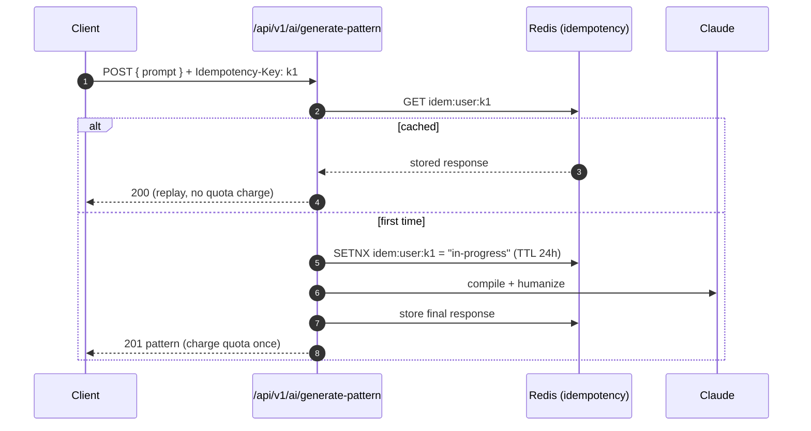
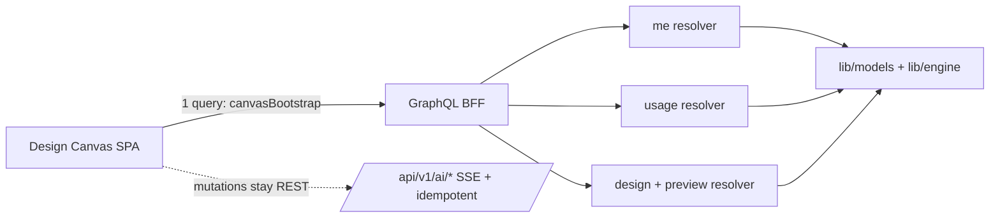
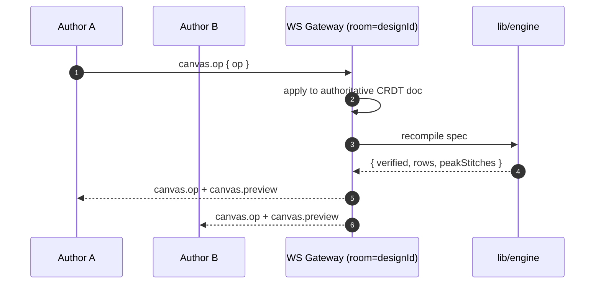
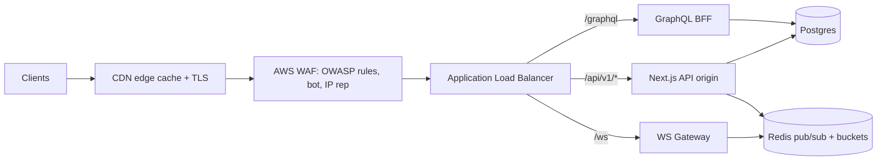

# Loopsy API — Modernization Design (Phase 9, Target)

> **Status:** TARGET architecture. Every item below is forward-looking design, not current
> behavior. The current surface is documented in `01-endpoint-catalog.md`. Items are labeled
> **[TARGET]**. Nothing here is implemented yet.

Authors: Backend Architect + Senior Backend Engineer.

Guiding principle (carried from CLAUDE.md): **the Design Spec is the single contract every front
door produces; the engine owns all arithmetic. No modernization step may move stitch-count math
out of `lib/engine` or into an LLM.**

---

## 0. Why modernize

| Pain point today | Target remedy |
|------------------|---------------|
| No API versioning — any change risks breaking the SPA | `/api/v1` namespace + deprecation policy |
| Ad-hoc `{ error, details }` shapes | Uniform error envelope + machine codes |
| Generation can be double-charged on client retry | Idempotency keys |
| Design Canvas fires a fetch waterfall (`/me`, `/usage`, `/designs/:id`, `/preview`) | GraphQL BFF single round-trip |
| SSE-only — no upstream channel for collaborative canvas / interactive tutor | WS/SSE hybrid |
| Entitlement checks scattered per-route; no roles | Central `can(user, action, resource)` + RBAC |
| Rate limits are single-instance SQLite counters | Edge/Redis token bucket, horizontally scalable |
| No CDN/Redis caching; `/templates` & OG recomputed every hit | Tiered caching strategy |
| Direct origin exposure | ALB + WAF gateway |

---

## (a) [TARGET] Versioned REST surface

### Namespace & lifecycle
- Introduce **`/api/v1/*`**. Current unversioned routes alias to `v1` for one deprecation window,
  then 308-redirect. New breaking changes land in `/api/v2`.
- Version pinning via path (primary) with optional `Accept: application/vnd.loopsy.v1+json` override.
- Deprecation signaled with `Deprecation` + `Sunset` response headers and a changelog entry.

### Error envelope
```json
{
  "error": {
    "code": "RATE_LIMIT_EXCEEDED",
    "message": "You've used all 3 generations on the free plan.",
    "status": 429,
    "requestId": "req_01HX...",
    "details": { "limit": 3, "used": 3, "plan": "free" },
    "retryAfter": 3600
  }
}
```
Success envelope stays minimal (`{ data, meta? }`) to avoid churn on the SPA. Existing machine codes
(`AI_UNAVAILABLE`, `SPEC_INVALID`, `VISION_TRIAL_USED`, `CHART_INVALID`, `COMPILE_FAILED`,
`NO_API_KEY`) become the canonical `error.code` vocabulary.

### Idempotency keys (generation)
Expensive, non-deterministic POSTs (`generate-pattern`, `regenerate`, `analyze-image`) accept an
`Idempotency-Key` header. The server stores `(userId, key) → response` for 24h; a replay returns the
stored result **without** re-charging quota or re-calling the LLM. This makes client retries and
flaky-network re-sends safe — critical now that quota is money.



### OpenAPI 3.1 (representative excerpt — auth + AI)
```yaml
openapi: 3.1.0
info:
  title: Loopsy API
  version: 1.0.0
servers:
  - url: https://api.loopsy.app/api/v1
components:
  securitySchemes:
    cookieSession:
      type: apiKey
      in: cookie
      name: loopsy_session
  schemas:
    Error:
      type: object
      required: [error]
      properties:
        error:
          type: object
          required: [code, message, status]
          properties:
            code: { type: string, example: RATE_LIMIT_EXCEEDED }
            message: { type: string }
            status: { type: integer }
            requestId: { type: string }
            details: { type: object, additionalProperties: true }
            retryAfter: { type: integer, nullable: true }
    User:
      type: object
      properties:
        id: { type: string }
        email: { type: string, format: email }
        name: { type: string }
        emailVerified: { type: boolean }
        subscription:
          type: object
          properties:
            plan: { type: string, enum: [free, maker_pro, creator] }
            status: { type: string }
    Pattern:
      type: object
      properties:
        id: { type: string }
        title: { type: string }
        verified: { type: boolean, description: validator-proven stitch math }
        isExperimental: { type: boolean }
        steps:
          type: array
          items: { type: object }
paths:
  /auth/login:
    post:
      operationId: login
      security: []
      requestBody:
        required: true
        content:
          application/json:
            schema:
              type: object
              required: [email, password]
              properties:
                email: { type: string, format: email }
                password: { type: string }
      responses:
        '200':
          description: Signed in; sets loopsy_session cookie
          headers:
            Set-Cookie: { schema: { type: string } }
          content:
            application/json:
              schema:
                type: object
                properties:
                  data:
                    type: object
                    properties: { user: { $ref: '#/components/schemas/User' } }
        '401': { description: Invalid credentials (no enumeration), content: { application/json: { schema: { $ref: '#/components/schemas/Error' } } } }
        '429': { description: Throttled, content: { application/json: { schema: { $ref: '#/components/schemas/Error' } } } }
  /ai/generate-pattern:
    post:
      operationId: generatePattern
      security: [{ cookieSession: [] }]
      parameters:
        - name: Idempotency-Key
          in: header
          required: false
          schema: { type: string }
      requestBody:
        required: true
        content:
          application/json:
            schema:
              type: object
              required: [prompt]
              properties:
                prompt: { type: string }
                difficulty: { type: string, enum: [beginner, intermediate, advanced] }
                stream: { type: boolean, default: false }
      responses:
        '201':
          description: Verified pattern (non-streaming)
          content:
            application/json:
              schema:
                type: object
                properties: { data: { $ref: '#/components/schemas/Pattern' } }
        '200':
          description: SSE stream when stream=true (events status|step|pattern|error)
          content:
            text/event-stream:
              schema: { type: string }
        '429': { description: RATE_LIMIT_EXCEEDED, content: { application/json: { schema: { $ref: '#/components/schemas/Error' } } } }
        '503': { description: AI_UNAVAILABLE (no save, no charge), content: { application/json: { schema: { $ref: '#/components/schemas/Error' } } } }
  /ai/analyze-image:
    post:
      operationId: analyzeImage
      security: [{ cookieSession: [] }]
      requestBody:
        required: true
        content:
          application/json:
            schema:
              type: object
              required: [images]
              properties:
                images:
                  type: array
                  minItems: 1
                  maxItems: 3
                  items: { type: string, description: base64 data URL ≤5MB }
                hint: { type: string }
      responses:
        '200':
          description: Confidence-scored Design Spec (metered)
          content:
            application/json:
              schema:
                type: object
                properties:
                  data:
                    type: object
                    properties:
                      confidence: { type: number }
                      observed: { type: array, items: { type: string } }
                      feasible: { type: boolean }
                      spec: { type: object }
                      access: { type: object }
        '413': { description: Image too large }
        '429': { description: VISION_TRIAL_USED or generation limit, content: { application/json: { schema: { $ref: '#/components/schemas/Error' } } } }
```

---

## (b) [TARGET] GraphQL BFF (Backend-for-Frontend)

### When & why
REST stays the system-of-record API. A **read-optimized GraphQL BFF** is added **only** to collapse
client fetch waterfalls — chiefly the **Design Canvas**, which today serially fires `/api/me`,
`/api/usage`, `/api/designs/:id`, and `/api/design/preview`. One GraphQL query resolves the whole
screen in a single round-trip. Mutations that cost money or stream (generation, vision) **stay on
REST** so idempotency keys, SSE, and quota accounting remain in one place.

### Schema sketch
```graphql
type User {
  id: ID!
  email: String!
  name: String!
  emailVerified: Boolean!
  subscription: Subscription!
  usage: Usage!            # resolves /usage equivalent
  patterns: [Pattern!]!    # own, deletedAt filtered
  designs: [Design!]!
}

type Subscription {
  plan: Plan!
  status: String!
}
enum Plan { FREE MAKER_PRO CREATOR }

type Usage {
  generations: Quota!
  tutor: Quota!
  vision: VisionAccess!
}
type Quota { used: Int!, limit: Int }   # null limit = unlimited
type VisionAccess { mode: String!, remaining: Int }

type Pattern {
  id: ID!
  title: String!
  verified: Boolean!
  isExperimental: Boolean!
  steps: [JSON!]!
  progress: Progress       # current user's progress, if any
}

type Progress {
  id: ID!
  completedSteps: [Int!]!
  percent: Float!
}

type Design {
  id: ID!
  name: String!
  spec: JSON!
  linkedPattern: Pattern
  isOwner: Boolean!        # policy-evaluated for the viewer
  preview: DesignPreview!  # server-side compile summary (no save)
}
type DesignPreview {
  ok: Boolean!
  verified: Boolean!
  rows: Int, partCount: Int, peakStitches: Int
  finishedSize: String, errors: [String!]
}

type Query {
  me: User
  template(id: ID!): Template
  templates(difficulty: String, category: String, q: String): [Template!]!
  design(id: ID!): Design          # public, viewer-scoped isOwner
  canvasBootstrap(designId: ID!): CanvasBootstrap!   # the waterfall-killer
}

type CanvasBootstrap {            # one request → the whole Design Canvas
  me: User!
  design: Design!
}
```



DataLoader batches per-request DB reads; the engine compile in `design.preview` is memoized per spec
hash. The BFF holds **no business logic** — it is a thin aggregation/projection layer over existing
models and the engine.

---

## (c) [TARGET] Realtime — WS/SSE hybrid

SSE is correct for one-way, single-author streams (pattern generation step-by-step) and stays. Add
**WebSockets** for the two bidirectional cases:

| Capability | Channel | Why |
|-----------|---------|-----|
| Pattern/chart generation stream | **SSE** (keep) | server→client only; resumable; proxy-friendly |
| Collaborative Design Canvas | **WS** | multiple authors, presence, low-latency edits |
| Interactive live tutor | **WS** | back-and-forth turns; typing indicators |

### Canvas collaboration events
```
client → server: canvas.join { designId }
client → server: canvas.op { designId, op }      # CRDT/OT spec mutation
server → client: canvas.op { actorId, op, rev }  # broadcast to room
server → client: canvas.preview { rows, peakStitches, verified }  # engine recompile result
server → client: presence.update { actors: [...] }
server → client: canvas.error { code, message }
```

### Live tutor events
```
client → server: tutor.message { patternId, stepIndex, text }
server → client: tutor.token { delta }           # streamed Claude tokens
server → client: tutor.done { quotaRemaining }
server → client: tutor.error { code }            # NO_API_KEY | RATE_LIMIT_EXCEEDED
```



**Auth:** WS upgrade reuses the `loopsy_session` cookie; room membership is gated by the same
`can(user, "edit", design)` policy (below). Horizontal scale via a Redis pub/sub fan-out so any node
can serve any room. SSE remains the fallback when WS is blocked by a proxy.

---

## (d) [TARGET] Central authorization — `can()` + RBAC

Replace inline, duplicated ownership checks with one policy module evaluated everywhere
(REST, GraphQL, WS).

```js
// lib/auth/policy.js (target)
can(user, action, resource) -> boolean
// e.g. can(user, "pattern:delete", pattern)
//      can(user, "design:edit",   design)
//      can(user, "admin:analytics:read", null)
```

### Roles (RBAC, additive to plans)
| Role | Grants |
|------|--------|
| `member` (default) | own patterns/progress/designs; read public templates |
| `team_editor` | edit designs shared into their team workspace |
| `team_admin` | manage team members, reassign designs |
| `admin` | read `/analytics` (no longer public), soft-delete recovery, audit access |

`plan` (free/maker_pro/creator) governs **quota**; `role` governs **capability**. A policy decision
combines both: e.g. `design:collaborate` requires `role ∈ {team_editor, team_admin}` **and** a paid plan.

```mermaid
graph TD
  REQ[Request: action + resource] --> POL{can(user, action, resource)}
  POL -->|role check| RBAC[(roles / team membership)]
  POL -->|ownership check| OWN[(resource.userId / team)]
  POL -->|entitlement| PLAN[(plan limits)]
  RBAC --> DEC{allow?}
  OWN --> DEC
  PLAN --> DEC
  DEC -->|no| F[403 / 429 + audit_log]
  DEC -->|yes| H[handler]
```

Immediate wins this unlocks: `/analytics` becomes `admin`-only (and starts honoring `deletedAt`);
soft-deleted pattern recovery becomes an explicit admin capability; team sharing of designs replaces
the all-or-nothing public `/d/:id`.

---

## (e) [TARGET] Rate limiting upgrade — edge/Redis token bucket

Current single-node SQLite counters don't survive horizontal scaling and add DB write load on the hot
path. Move to a **Redis token-bucket** at the edge, keyed per route **and** per plan.

| Bucket | Key | Limit (example) |
|--------|-----|-----------------|
| auth login | `rl:login:{ip}` + `rl:login:{ip}:{email}` | 20/ip, 5/acct per 15m |
| AI generation | `rl:gen:{userId}` | by plan: free 3/mo, maker_pro 30/mo, creator ∞ |
| AI tutor | `rl:tutor:{userId}` | free 3/mo, paid ∞ |
| vision | `rl:vision:{userId}` | free 1 lifetime, maker_pro→gen bucket, creator ∞ |
| generic per-route burst | `rl:{route}:{userId}` | sliding token bucket (e.g. 60/min) |

- **Monthly/lifetime quotas** stay authoritative in Postgres/`ai_usage` (money), with Redis as a
  fast-path cache + burst limiter; reconciliation on the billing boundary.
- Standard headers: `RateLimit-Limit`, `RateLimit-Remaining`, `RateLimit-Reset`, `Retry-After`.
- Evaluated at the gateway/edge so abusive traffic never reaches origin compute.

---

## (f) [TARGET] Caching strategy

| Surface | Layer | Mechanism |
|---------|-------|-----------|
| `GET /templates`, `/templates/:id` | CDN | `Cache-Control: public, s-maxage=3600, stale-while-revalidate` + **ETag**; templates are seeded/static |
| `GET /designs/:id/og` | CDN/HTTP | already `public, max-age=3600`; promote to CDN edge cache, ETag on spec hash |
| `GET /me` | Redis | short-TTL (30–60s) per-session cache; invalidate on profile/subscription change |
| `GET /usage` | Redis | derive from rate-limit counters; TTL ~15s; invalidate on `recordUsage` |
| `GET /designs`, `/patterns` | Redis | per-user list cache; invalidate on create/delete/link |
| AI generation responses | none | non-cacheable; idempotency keys cover replay |

ETag flow: client sends `If-None-Match`; unchanged templates return `304`. Redis caches are
write-through-invalidated by the mutating route so we never serve stale entitlement data.

---

## (g) [TARGET] API gateway — ALB + WAF



- **WAF**: managed OWASP ruleset, rate-based rules (defense-in-depth under the app token bucket),
  bot control, geo/IP reputation. Enforces request size caps (e.g. the 5MB vision image limit) before
  origin.
- **ALB**: path-based routing to REST / GraphQL / WS targets; sticky sessions not required (cookie
  sessions are stateless server-side via the `sessions` table / Redis).
- **TLS termination + HSTS** at the edge (current HSTS header stays as belt-and-suspenders).
- Security headers (`nosniff`, `frame-deny`, `Referrer-Policy`, `Permissions-Policy`) and the pinned
  CORS origin move to a shared gateway policy so every target inherits them uniformly.
- Health checks, structured access logs, and request-id propagation (`X-Request-Id`) wired through to
  `lib/logger` for end-to-end tracing.

---

## Migration sequencing (non-breaking)

1. Add error envelope + `/api/v1` aliases (no behavior change).
2. Idempotency keys on the three paid POSTs.
3. Publish OpenAPI 3.1; generate the SPA client from it.
4. Extract inline checks into `lib/auth/policy.js` `can()` (behavior-preserving), then add roles.
5. Stand up Redis (rate limits + caches) behind the existing routes.
6. Add the GraphQL BFF for the Canvas bootstrap query only.
7. Add the WS gateway for canvas collaboration + live tutor; keep SSE for generation.
8. Front everything with ALB + WAF; lock `/analytics` to `admin`.

---

Reviewed by: Principal Reviewer / Security Architect / Backend Architect
