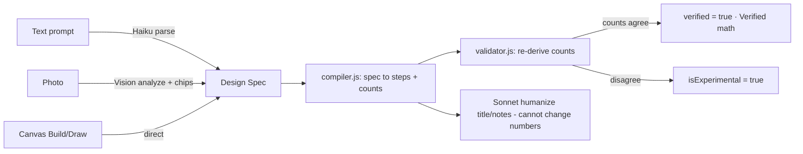
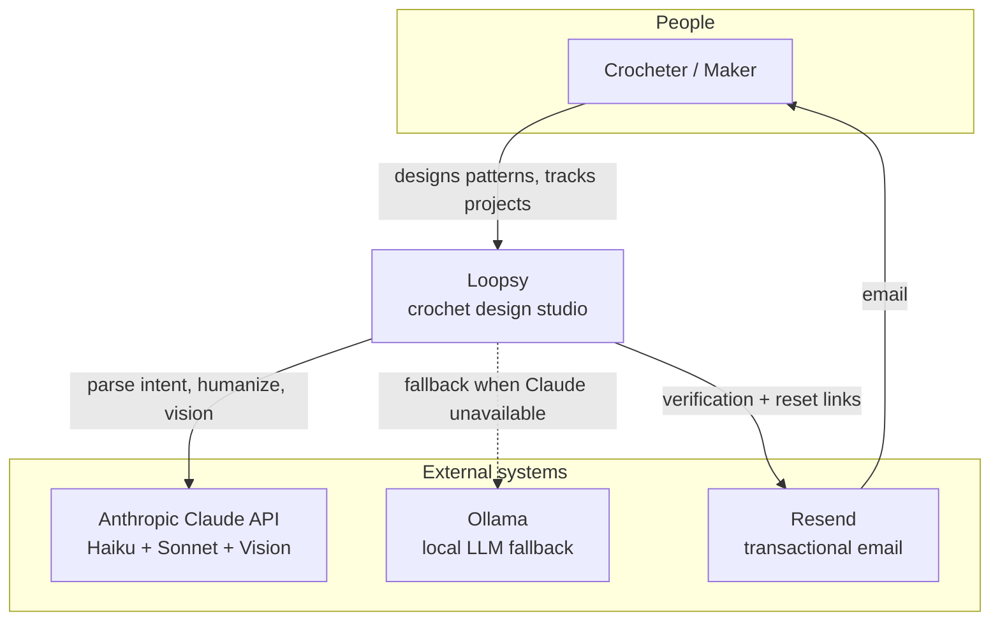
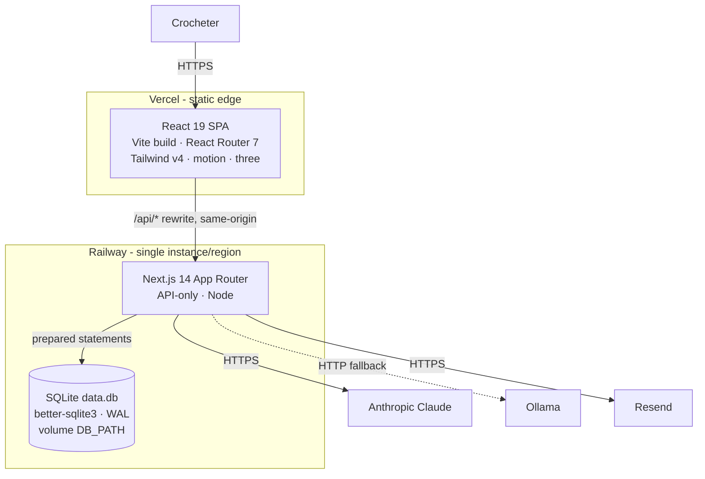
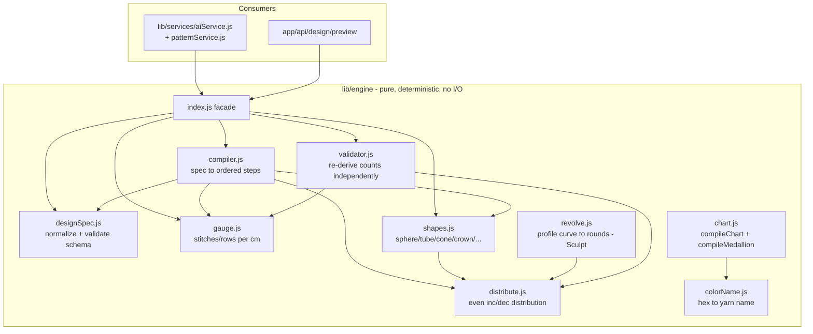
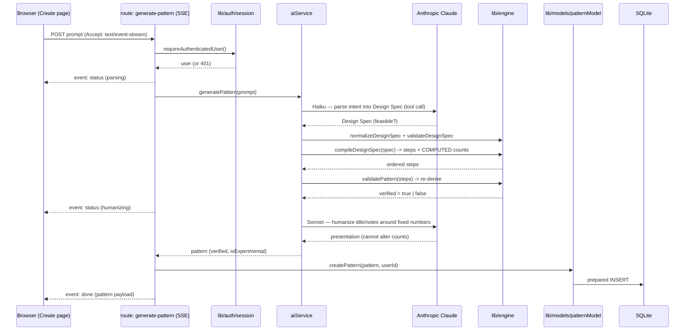

# Loopsy — Current Architecture (Phase 1) + C4 Model (Phase 7)

> Status: **as-built**. Every component named below exists in the repository today.
> Items that do not yet exist are explicitly marked **(target)**.

Loopsy is a crochet design studio that turns text prompts, photos, and a free-form
canvas into **verified** crochet patterns — patterns whose stitch counts are
*computed by a deterministic engine*, never produced by a language model. That single
property ("Verified math ✓") is the product's moat and it shapes the entire architecture.

---

## 1. Tech Stack

| Layer | Technology | Notes |
|---|---|---|
| Frontend SPA | React 19, Vite, React Router 7, Tailwind CSS v4 | Static build, deployed to Vercel |
| Animation / 3D | `motion` (v12), `three` (0.184), `@react-three/fiber` (v9), `@react-three/drei` (v10) | Two lazy 3D surfaces only |
| Image decode | `heic2any` | Lazy chunk; converts iPhone HEIC photos in-browser |
| Backend | Next.js 14 App Router, **API-only** (no SSR pages) | Node runtime |
| Module systems | Mixed: **ESM** in `app/api`, `lib/auth`, `lib/services`, `lib/engine` index facade; **CJS** in `lib/models`, `lib/db`, engine internals | The engine ships a CJS core behind an ESM-friendly index |
| Database | SQLite via `better-sqlite3` (synchronous, prepared statements) | Single file `data.db`; WAL mode |
| AI | `@anthropic-ai/sdk` — Claude Haiku (parse) + Claude Sonnet (humanize); Ollama HTTP fallback | Honest `AI_UNAVAILABLE` when all providers fail |
| Auth | First-party cookie sessions (`loopsy_session`), no OAuth yet | |
| Email | Provider-agnostic mailer (Resend when keyed, else logs the link) | |
| Hosting | Vercel (SPA) + Railway (`next start -p $PORT`, SQLite on a mounted volume at `DB_PATH=/data/data.db`) | |
| CI | GitHub Actions (`.github/workflows/ci.yml`) | Backend test+build, frontend test+lint+build |

**No Docker / Terraform / Kubernetes / staging environment / queue / cache tier /
observability stack exists yet.** Those appear only in `02-scalability.md`, all marked **(target)**.

---

## 2. Layered Backend

```
backend/
  app/api/                 HTTP boundary — Next.js route handlers (thin)
  lib/
    auth/                  session.js (cookie sessions), request.js (origin/ip/CSRF helpers)
    models/                better-sqlite3 prepared statements — THE ONLY DB SEAM
    services/              aiService.js, patternService.js — orchestration
    engine/                pure deterministic geometry — owns ALL arithmetic
    db/index.js            SQLite singleton + schema init + idempotent ALTER migrations
    email/mailer.js        provider-agnostic delivery
    config.js              boot-time config validation (validateConfig)
    logger.js              structured logger (child / captureError / newRequestId)
    utils/                 shared helpers
```

**Responsibility rules (enforced by convention and verified in this audit):**

1. **Route handlers** parse/validate input, call `requireAuthenticatedUser()`, invoke a
   service or model, and shape the HTTP/SSE response. They contain no math and no SQL.
2. **`lib/models/*`** is the *only* place that touches the database. Every query is a
   `better-sqlite3` prepared statement. Verified: engine files import nothing from
   `lib/db` (grep for db imports under `lib/engine/` returns **zero** matches).
3. **`lib/services/*`** orchestrates LLM calls + engine compilation + persistence. The
   AI service can *never* alter a stitch count — compiled steps are used verbatim.
4. **`lib/engine/*`** is pure, synchronous, deterministic, and dependency-free. It has no
   I/O, no DB, no network, no clock — making it trivially testable and portable.

### Backend route inventory (as-built)

| Group | Routes |
|---|---|
| Auth | `signup`, `login`, `logout`, `verify-email`, `forgot-password`, `reset-password` |
| Identity | `GET /api/me`, `GET /api/usage` |
| AI | `generate-pattern` (SSE), `regenerate`, `analyze-image` (metered), `generate-from-spec` (SSE), `generate-chart`, `tutor` |
| Designs | `GET/POST /api/designs`, `GET/PATCH /api/designs/:id`, `GET /api/designs/:id/og` |
| Canvas | `POST /api/design/preview` (no-save compile summary) |
| Patterns | `GET/POST /api/patterns`, `GET/PATCH/DELETE /api/patterns/:id` (soft delete) |
| Progress | `GET/POST /api/progress`, `:id`, `pattern/:patternId` |
| Templates | `GET /api/templates`, `GET /api/templates/:id` |
| Analytics | `POST /api/analytics` |

---

## 3. Data Flow

```text
Browser (Vercel SPA)
   │  fetch('/api/...')          same-origin to the browser
   ▼
frontend/vercel.json rewrite  /api/:path* → https://loopsy-backend.up.railway.app/api/:path*
   ▼
Next.js 14 App Router (Railway)  route handler
   ▼
lib/services  ── orchestrates ──►  lib/engine (pure math)  &  Anthropic / Ollama
   ▼
lib/models (prepared statements)
   ▼
SQLite data.db (Railway volume, WAL)
```

The Vite dev proxy mirrors this in development (`/api` → `http://localhost:3000`). To the
browser the API is always **same-origin**, which is what lets the SPA ship a strict CSP
with `connect-src 'self'` plus the explicit backend origin.

### The Design-Spec-as-Contract pattern

Every "front door" — text, photo, canvas — produces the **same artifact**: a normalized
**Design Spec** (`lib/engine/designSpec.js`). The spec is the only contract the engine
accepts. Downstream, the **compiler** (`compiler.js`) turns a spec into ordered steps with
computed counts, and the **validator** (`validator.js`) *independently re-derives* those
counts; only when they agree does a pattern earn `verified: true` and the "Verified math ✓"
badge in the UI.



This is the architecture's load-bearing decision: **an LLM never computes a stitch count.**
The LLM decomposes intent into a spec and writes prose around the engine's numbers.

---

## 4. C4 Model

### 4.1 Level 1 — System Context



### 4.2 Level 2 — Container



### 4.3 Level 3 — Component (the Engine)

The engine is the heart worth diagramming. It is pure and has a fan-in of two consumers
(services and the canvas-preview route) and a fan-out of zero (no dependencies).



### 4.4 Level 4 — Code (generation request sequence)

The compiler-first text generation path (`POST /api/ai/generate-pattern`, streaming SSE):



If Claude is unavailable, the service tries Ollama; if every provider fails it returns
`AI_UNAVAILABLE` and **does not** persist the static fallback as a ready pattern or charge quota.

---

## 5. Why the Engine is DB-agnostic — the migration seam

The engine touches **no database**. All persistence is funneled through `lib/models/*`,
each a thin wrapper over `better-sqlite3` prepared statements. This is deliberate and is
the single most valuable structural property of the codebase for future scale:

- **The engine is a pure library.** It can run in a route, a worker, a CLI, a test, or a
  future standalone "math service" with zero changes, because it has no I/O.
- **The DB is swappable behind one seam.** Migrating SQLite → Postgres means rewriting the
  bodies of `lib/models/*` (prepared statements → a Postgres client/pool). Route handlers,
  services, and the entire engine are untouched. This seam is what makes the scalability
  plan in `02-scalability.md` a *body-swap*, not a rewrite.
- **Migrations are idempotent.** `lib/db/index.js` performs schema init and `ALTER TABLE`
  migrations that swallow "duplicate column" errors, because Next's build collects page data
  across parallel workers that each init the same DB.

The known ceiling is exactly here: SQLite is a **single writer**. That is the one big
architectural constraint, and the models seam is the lever that relieves it.

---

## Reviewed by

- **Principal Reviewer** — Confirmed: diagrams match the as-built repo; engine purity
  verified (no DB imports under `lib/engine/`); route inventory matches `app/api/`.
- **Security Architect** — Confirmed: same-origin `/api` rewrite, strict CSP, cookie
  sessions (`loopsy_session`), CSRF origin checks, no LLM in the trust path for math.
- **PM** — Confirmed: "Verified math ✓" contract is accurately represented as the moat;
  all aspirational infrastructure is deferred to `02-scalability.md` and labeled **(target)**.
