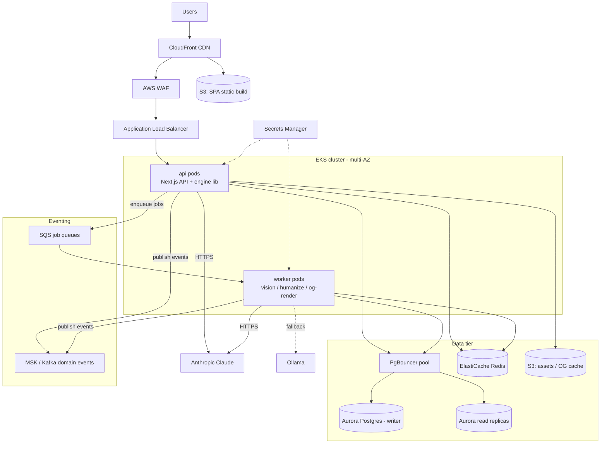
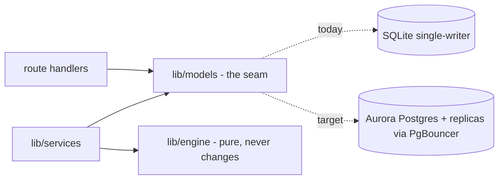
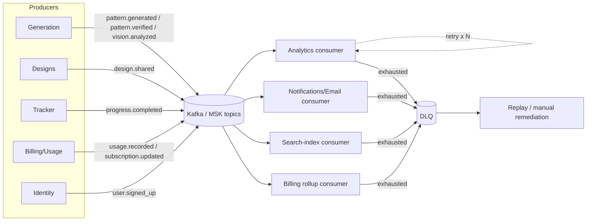

# Loopsy — Scalability (Phase 11): 10k → 100k → 1M → 10M users

> **Everything in this document beyond "Current state" is (target).** Loopsy today is a
> single Railway instance with SQLite on a volume, a static Vercel SPA, and no queue/cache/
> observability tier. The plan below describes how to grow into each stage *without rewriting
> the engine* — because `lib/engine` is pure and `lib/models` is the only DB seam.

## Current state (baseline)

- Static SPA on Vercel; Next.js 14 API-only on **one** Railway instance, **one** region.
- **SQLite (`better-sqlite3`), single writer** — the dominant scaling constraint.
- AI calls are synchronous inside the request (Haiku → engine → Sonnet, SSE-streamed).
- No queue, no Redis, no read replicas, no autoscaling, no metrics/traces/alerts.

---

## Stage-by-stage plan

### 10k users — *harden the monolith*

| Concern | Action (target) |
|---|---|
| Database | Stay SQLite **or** lift to a single managed **Aurora/RDS Postgres** by swapping `lib/models/*` bodies (engine untouched). Recommended: migrate now while data is small. |
| App | 2–3 stateless API instances behind a load balancer; move sessions to be DB/Redis-backed (already DB-backed via `sessions` table — works across instances as soon as the DB is shared). |
| Caching | CDN for the SPA (already Vercel). Add HTTP cache headers for `GET /api/templates` (static, seedable). |
| AI cost/latency | Cache Haiku spec-parses keyed by normalized prompt; SSE already streams. |
| Observability | Ship `lib/logger.js` JSON logs to a hosted log sink; add uptime checks. |

### 100k users — *split read/write, externalize state*

| Concern | Action (target) |
|---|---|
| Database | **Aurora Postgres** primary + **read replica(s)**; route read-heavy queries (templates, public designs, tracker reads) to replicas via the models seam. Front all connections with **PgBouncer** (transaction pooling). |
| Cache | **ElastiCache Redis**: sessions, `ai_usage`/rate-limit counters (move `rate_limits` hot path off the DB), template + public-design read cache. |
| CDN | CloudFront in front of the SPA and `GET /api/designs/:id/og` (OG images are deterministic — cache aggressively). |
| Async | Introduce a **queue** for the slow path: vision analysis and humanization move to worker pods so request threads aren't held during multi-second LLM calls. SSE becomes a thin reader over job status. |
| Containerize | Move API from Railway to **containers on EKS** (api + worker deployments). |

### 1M users — *event-driven core, regional CDN, autoscaling*

| Concern | Action (target) |
|---|---|
| Database | Aurora writer + multiple read replicas; partition hot tables (`patterns`, `progress`) by `userId`; consider Aurora Serverless v2 for elastic capacity. PgBouncer fleet. |
| Cache | Redis cluster (sharded); multi-layer cache (CDN → Redis → DB). |
| Queues | Full **event bus** (SQS for commands/jobs, **MSK/Kafka** for domain events) with consumers, retries, and **DLQ**s (see Event-Driven section). |
| Compute | EKS HPA autoscaling on api + worker pods; separate worker pools for `vision`, `humanize`, `og-render`. |
| Engine | Promote `lib/engine` to a **versioned internal package** consumed by api and workers identically — still a pure library, optionally exposed as an internal "compile" service. |
| Resilience | Multi-AZ; per-provider AI circuit breakers (Claude → Ollama → `AI_UNAVAILABLE`). |

### 10M users — *multi-region, sharded, decomposed*

| Concern | Action (target) |
|---|---|
| Database | Multi-region Aurora Global Database (one writer region, read replicas everywhere); shard by `userId`; CQRS read models materialized into Redis/OpenSearch. |
| Compute | Multi-region EKS behind CloudFront + global ALB/Route53 latency routing. |
| Services | Decompose along bounded contexts: **Identity/Auth**, **Generation (AI+engine)**, **Designs/Patterns**, **Tracker/Progress**, **Billing/Usage**, **Notifications**. Engine stays a shared pure library / internal service, never duplicated. |
| Eventing | Kafka as the backbone; per-context consumers; outbox pattern for exactly-once-ish publication; DLQ + replay tooling. |
| Cost/Observability | Full OpenTelemetry traces, RED/USE dashboards, SLOs + error budgets, AI spend governance per `ai_usage`. |

---

## Target AWS topology (target)

---

## Cross-cutting concerns

### Caching strategy (target)
- **Edge (CloudFront):** SPA bundle, OG images (`/api/designs/:id/og` — deterministic SVG),
  public design share pages.
- **Application (Redis):** sessions, rate-limit + usage counters (hot today on the DB),
  template catalogue, public design reads, Haiku spec-parse memoization.
- **DB:** source of truth only; read replicas absorb read fan-out.

### CDN
CloudFront fronts both static assets and cacheable GET APIs. The SPA already ships a strict
CSP with `connect-src 'self'` + the backend origin; the same-origin `/api` rewrite means CDN
and API share an origin to the browser, so caching is straightforward.

### Queues
The slow path (vision analysis, Sonnet humanization, OG rendering) moves off the request
thread into SQS-fed worker pods. SSE endpoints (`generate-pattern`, `generate-from-spec`)
become readers over job state. This decouples user-facing latency from LLM latency and lets
AI workers autoscale independently.

### Database scaling — the SQLite → Postgres path (zero engine changes)
This is the centerpiece, and it is cheap **because of the existing seam**:

1. `lib/engine/*` imports no DB — confirmed pure. **Nothing in the engine changes, ever.**
2. Only `lib/models/*` (prepared `better-sqlite3` statements) is rewritten to a Postgres
   client/pool. Route handlers and services call the same model function signatures.
3. Migrations: port the idempotent `ALTER TABLE` logic in `lib/db/index.js` to a real
   migration tool (e.g. node-pg-migrate); add `deletedAt` filters as-is.
4. Reads route to replicas via PgBouncer; writes to the Aurora writer.

### Load balancing
ALB across multi-AZ EKS api pods; sessions are already DB-backed (the `sessions` table), so
any instance can serve any user once the DB is shared — statelessness is a body-swap away.

### Microservices boundaries
Decompose along the bounded contexts listed for 10M. **Non-negotiable rule:** the engine
remains a single **pure shared library** (or one internal "compile" service) consumed
identically by every context — never reimplemented. The Design Spec stays the cross-service
contract, preserving "Verified math ✓" everywhere.

---

## Event-driven architecture (target)

Domain events let contexts react asynchronously (billing, analytics, notifications, search
indexing) without synchronous coupling. Kafka/MSK carries durable domain events; SQS carries
work commands. Every consumer has bounded retries and a **DLQ**.

| Event | Published by | Example consumers |
|---|---|---|
| `user.signed_up` | Identity | email (verification), analytics, onboarding |
| `vision.analyzed` | Generation | usage metering, analytics |
| `pattern.generated` | Generation | search index, analytics, notifications |
| `pattern.verified` | Generation (validator) | badge/cache update, analytics |
| `design.shared` | Designs | OG pre-render, search index, analytics |
| `progress.completed` | Tracker | gamification/notifications, analytics |
| `usage.recorded` | Billing/Usage | quota enforcement, billing rollups |
| `subscription.updated` | Billing | entitlement cache invalidation, email |

**Delivery guarantees (target):** transactional **outbox** in Postgres so events publish
atomically with the state change; at-least-once delivery with idempotent consumers keyed on
event id; exponential-backoff retries; DLQ with replay tooling for poison messages.

---

## Reviewed by

- **Principal Reviewer** — Confirmed: all infrastructure is labeled **(target)**; the
  SQLite→Postgres path correctly exploits the `lib/models` seam with zero engine changes;
  stages are realistic and incremental.
- **Security Architect** — Confirmed: WAF + CloudFront + Secrets Manager at the edge; CSP and
  same-origin model preserved; AI circuit-breaker chain (Claude → Ollama → `AI_UNAVAILABLE`)
  carried forward; outbox prevents event/state divergence.
- **PM** — Confirmed: stages map to user-count milestones with clear, fundable increments;
  the engine-as-shared-library rule protects the "Verified math ✓" moat across all scales.
