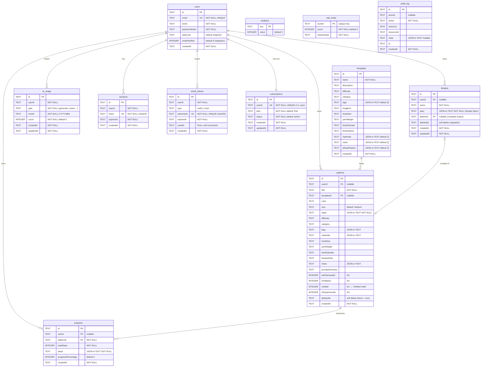

# Loopsy Database — Current Schema (Phase 8, current)

> **Engine:** SQLite via `better-sqlite3` (WAL mode), single file at `DB_PATH`
> (prod: `/data/data.db` on a Railway volume; dev: `backend/data.db`).
> **Source of truth:** `backend/lib/db/index.js` (schema + idempotent migrations).
> **Only DB access seam:** `backend/lib/models/*` (prepared statements). No route
> or service touches SQLite directly — this is what makes the Postgres migration
> tractable (see `02-target-postgres.md`).

This document is grounded line-for-line against `backend/lib/db/index.js` and the
model files (`patternModel.js`, `auditModel.js`, `emailTokenModel.js`, etc.).

---

## 1. Singleton, WAL, and idempotent migrations

- **Singleton.** The DB handle is cached on `globalThis.__crochetDb` so every
  Next.js worker/route shares one `better-sqlite3` connection (synchronous,
  in-process). `new Database(dbPath, { timeout: 5000 })`.
- **WAL.** `journal_mode = WAL` is set at init for better runtime read/write
  concurrency. The pragma call is wrapped to swallow `SQLITE_BUSY`, because
  parallel Next build workers can briefly lock the file while all of them import
  and initialise the same DB.
- **Idempotent ALTER migrations.** New columns are added by
  `addColumnIfMissing(existing, columnName, statement)`. It checks
  `PRAGMA table_info(...)` first, and **swallows `duplicate column name` errors**
  so that a race between parallel build workers (all running init) never crashes
  the build. This is why all migrations in this codebase must be additive and
  idempotent.
- **Seeded analytics.** Init runs `INSERT OR IGNORE INTO analytics` for
  `pattern_generations` and `active_users` counters.

Columns currently added via runtime `ALTER TABLE` (not in the original
`CREATE TABLE`), all idempotent:

| Table | Columns added via migration |
|-------|------------------------------|
| `patterns` | `category`, `tags`, `materials`, `hookSize`, `yarnWeight`, `timeEstimate`, `finishedSize`, `notes`, `promptSummary`, `isAIGenerated`, `isFallback`, `userId`, `verified`, `isExperimental`, `deletedAt` |
| `progress` | `userId` |
| `designs` | `deletedAt` |
| `users` | `emailVerified` |

---

## 2. Entity-Relationship Diagram (current)

> **Note on FKs.** Relationships are *logical*, enforced in `lib/models/*`, not by
> SQLite `FOREIGN KEY` constraints (none are declared, and `PRAGMA foreign_keys`
> is off by default). All ids are app-generated `TEXT` UUIDs. This is called out
> deliberately — the Postgres target reifies these as real FKs.

---

## 3. Table-by-table reference

### `users`
Account root. `email` is `NOT NULL UNIQUE`. `passwordHash` is the only credential
(local cookie auth, not OAuth). `emailVerified` (0/1) gates verified state and was
added via idempotent migration. `skillLevel` defaults to `'beginner'`.

### `subscriptions`
One row per user (`userId UNIQUE` → enforces the 1:1). `plan` / `status` default
to `'free'` / `'active'`. This is the single entitlement surface; per CLAUDE.md,
entitlement checks should stay centralized here, not scattered across routes.

### `sessions`
Cookie session store. `token UNIQUE` is the session secret looked up on every
authenticated request; `expiresAt` drives expiry. The session cookie is
`loopsy_session` (legacy `stitchflow_session` still read/cleared).

### `email_tokens`
Single-use, expiring, **hashed** tokens for email verification + password reset.
Only the SHA-256 `tokenHash` is stored (`UNIQUE`); the raw token lives only in the
email link, so a DB leak can't be replayed. `consumeEmailToken` checks
type + unused + unexpired, then atomically sets `usedAt` (and treats a 0-row
update as a lost race). Creating a new token invalidates prior unused tokens of
the same type (one live link at a time).

### `templates`
Seeded catalog (22 seed templates per the test suite). `tags`, `materials`,
`notes`, `defaultPattern` are JSON-in-TEXT. Read-mostly reference data; the source
of `defaultPattern` that feeds the engine.

### `patterns`
User-owned (or anonymous, `userId` nullable) generated/customized patterns.
`steps` is the compiled output (JSON-in-TEXT, NOT NULL). Boolean flags stored as
`INTEGER` 0/1: `isAIGenerated`, `isFallback`, `verified` (set only when the
validator proves the math — the "Verified math ✓" badge), `isExperimental`.
**Soft-deleted** via `deletedAt`: `deletePattern()` stamps `deletedAt`, and every
read (`getAllPatterns`, `getPatternById`) filters `deletedAt IS NULL` and scopes
by `userId`. Deletes also write an `audit_log` row (`pattern.delete`).

### `progress`
Per-user tracker state for a pattern. `steps` JSON-in-TEXT holds per-step
completion; `progressPercentage` is a denormalized cached integer. Linked to
`patterns` by `patternId` (kept even after a pattern soft-delete, by design).

### `designs`
Design Canvas persistence. `spec` is the canvas **Design Spec** (JSON-in-TEXT,
NOT NULL) — the single contract all three front doors produce. `patternId` links
to the compiled pattern (logical 1:1). Soft-deleted via `deletedAt`. Shared at
`/d/:id`.

### `ai_usage`
Per-user metering: `UNIQUE(userId, type, month)`. Powers monthly AI quota and the
lifetime vision trial. `count` is upserted per (user, type, month) bucket.

### `analytics`
Tiny key/value counter table (`pattern_generations`, `active_users`). Global, not
per-user.

### `rate_limits`
DB-backed rolling-window auth throttling. `bucket` is an opaque composite key
(e.g. per `(ip,email)` and per `ip`); `count` + `windowStart` implement
`peek/hit/clear` in `rateLimitModel.js`. Login: 5 failed/`(ip,email)` and 20/ip
per 15 min; signup: 10/ip per hour. A successful sign-in clears the account
bucket.

### `audit_log`
Append-only trail of privileged/destructive actions (deletes, plan changes, auth
events). Written best-effort by `recordAudit()` — wrapped in try/catch so auditing
**never breaks a request**. Never updated or deleted. `meta` is JSON-in-TEXT.

---

## 4. Indexes (current — exact list from `index.js`)

| Index | Table(s) / columns | Serves |
|-------|--------------------|--------|
| `idx_progress_patternId` | `progress(patternId)` | tracker lookups by pattern |
| `idx_patterns_userId` | `patterns(userId)` | "My patterns" list |
| `idx_progress_userId` | `progress(userId)` | "My projects" list |
| `idx_sessions_userId` | `sessions(userId)` | per-user session enumeration |
| `idx_users_email` | `users(email)` | login lookup (also backed by UNIQUE) |
| `idx_sessions_token` | `sessions(token)` | session validation per request |
| `idx_patterns_templateId` | `patterns(templateId)` | patterns derived from a template |
| `idx_ai_usage_user_type_month` | `ai_usage(userId, type, month)` | quota lookups (matches UNIQUE) |
| `idx_designs_userId` | `designs(userId)` | "My designs" list |
| `idx_audit_actor` | `audit_log(actorId)` | audit by actor |
| `idx_audit_resource` | `audit_log(resource, resourceId)` | audit by target object |
| `idx_email_tokens_user` | `email_tokens(userId, type)` | token invalidation per (user,type) |

Implicit unique indexes also exist for every `PRIMARY KEY` and `UNIQUE`
constraint (`users.email`, `subscriptions.userId`, `sessions.token`,
`ai_usage(userId,type,month)`, `email_tokens.tokenHash`).

**Observed gaps (current):** no index on `patterns(deletedAt)` /
`designs(deletedAt)` (soft-delete reads scan-then-filter, fine at SQLite scale but
flagged for the Postgres target), and no composite `(userId, createdAt)` to back
the very common `WHERE userId = ? ORDER BY createdAt DESC` pattern (list queries
currently use the single-column `userId` index then sort).

---

## 5. Cross-cutting mechanisms

### Soft delete
`patterns` and `designs` carry `deletedAt TEXT` (ISO timestamp, NULL = live).
Deletes are non-destructive: `deletePattern()` runs
`UPDATE ... SET deletedAt = ? WHERE id = ? AND userId = ? AND deletedAt IS NULL`,
and all reads append `AND deletedAt IS NULL`. Records are recoverable, and child
`progress` rows are retained so the audit trail stays meaningful.

### Audit trail
`audit_log` is append-only and best-effort. `recordAudit()` swallows any error so
a logging failure never propagates into the request path. Indexed by actor and by
`(resource, resourceId)`.

### Email tokens (verification + reset)
Hashed (SHA-256), single-use, expiring; only one live token per `(userId, type)`.
Consumption is atomic and race-safe (`markUsed` returns 0 rows → treated as
already consumed).

### Auth hardening tables
`rate_limits` (rolling-window throttling) and `sessions` (cookie sessions) plus
`audit_log` together implement the P0 auth hardening described in CLAUDE.md.

---

## 6. Normalization analysis

**Relational core is 3NF.** Scalar columns are atomic, depend on the whole PK, and
have no transitive dependencies:

- `users`, `subscriptions`, `sessions`, `email_tokens`, `ai_usage`, `rate_limits`,
  `audit_log` are clean 3NF. `subscriptions.userId UNIQUE` correctly models the
  1:1; `ai_usage`'s `UNIQUE(userId, type, month)` is a proper natural composite
  key surrogate.
- `patterns` / `progress` / `designs` are 3NF on their **scalar** columns.

**Deliberate denormalizations (documented, not defects):**

1. **JSON-in-TEXT blobs.** `patterns.{steps,tags,materials,notes}`,
   `templates.{tags,materials,notes,defaultPattern}`, `designs.spec`, and
   `audit_log.meta` store arrays/objects serialized as TEXT. In SQLite these are
   **opaque and not queryable** (no relational filtering/joining on their
   contents). This is an intentional trade: the engine owns this structure and the
   app always reads the whole blob. Cost: you cannot `WHERE` on a tag or a step
   server-side. This is the #1 thing the Postgres target fixes (JSONB + GIN).
2. **`progress.progressPercentage`** is a cached/derived value (derivable from
   `steps`); a denormalization for cheap reads. Risk: drift if `steps` is updated
   without recomputing — owned by `progressModel.js`.
3. **`progress.totalSteps`** duplicates the count implied by the linked pattern's
   `steps`; cached to avoid re-parsing the pattern blob on every tracker render.
4. **Pattern metadata** (`hookSize`, `yarnWeight`, `category`, etc.) is copied
   from the source `template` at generation time rather than referenced. This is
   correct: a pattern is a point-in-time snapshot and must not change if the
   template is later edited.

**No multi-tenancy.** Tenancy is single-level (`userId`). There is no
organization/team concept — a target-phase addition (see `02-target-postgres.md`).

**No declared FKs / referential integrity.** Relationships are enforced in
`lib/models/*` only. This is the most significant integrity gap and is addressed
in the target.

---

## 7. The scaling ceiling (why a target exists)

SQLite is a **single-writer** engine: all writes serialize on one file lock.
WAL relaxes reader/writer contention but does not give concurrent writers. For a
single Railway volume this is fine today, but it is the hard scaling ceiling.

The mitigating architectural decision is already in place: **`lib/models/*` is the
sole DB seam** and the deterministic geometry engine (`lib/engine/*`) is fully
DB-agnostic. Swapping SQLite for Postgres therefore touches only the model layer —
zero engine changes. That migration is specified in `02-target-postgres.md`.

---

Reviewed by: Principal Reviewer / Security Architect / Backend Architect
