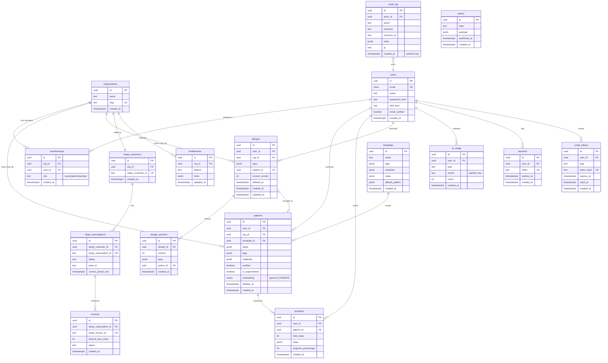

# Loopsy Database — Target Postgres Schema (Phase 8, improved)

> **Status: TARGET / PROPOSED.** Nothing in this document is implemented. It
> specifies the Postgres schema Loopsy migrates to when SQLite's single-writer
> ceiling (`docs/database/01-current-schema.md` §7) becomes the bottleneck.
> Every item below is a **[TARGET]** addition unless it mirrors a current table.
>
> **Guiding constraint:** the migration must touch **only `backend/lib/models/*`**
> (the sole DB seam) and require **zero changes to `backend/lib/engine/*`** (it is
> already DB-agnostic and pure). SQLite is **kept for local dev + the engine test
> suite**; Postgres is the production/staging target.

---

## 1. What changes vs. current

| Area | Current (SQLite) | **[TARGET]** Postgres |
|------|------------------|-----------------------|
| JSON | JSON-in-TEXT, opaque/unqueryable | **JSONB + GIN indexes** (`patterns.steps`, `designs.spec`, `audit_log.meta`) |
| Referential integrity | logical only, enforced in models | **real FOREIGN KEYs + CHECKs** |
| Tenancy | single-level (`user_id`) | **organizations + memberships**, `org_id` on patterns/designs |
| Billing | one `subscriptions` row | **Stripe mirror** (`stripe_customers`, `stripe_subscriptions`, `invoices`) + derived `entitlements` |
| Versioning | none | **`design_versions`** history |
| Time-series growth | unbounded `ai_usage` / `audit_log` | **range-partition by month** |
| Eventing | none | **transactional `outbox`** for event-driven publishing |
| Search | none | **pgvector** column for semantic pattern/design search [TARGET] |
| IDs | app `TEXT` UUID | `uuid` (`gen_random_uuid()` default) — text-compatible |
| Booleans | `INTEGER` 0/1 | native `boolean` |
| Timestamps | ISO `TEXT` | `timestamptz` |

---

## 2. Target ER Diagram

---

## 3. Constraints

### Foreign keys [TARGET]
All logical links become real FKs (none exist today):

- `memberships.org_id → organizations.id` `ON DELETE CASCADE`
- `memberships.user_id → users.id` `ON DELETE CASCADE`
- `patterns.user_id → users.id` `ON DELETE SET NULL`
- `patterns.org_id → organizations.id` `ON DELETE CASCADE`
- `patterns.template_id → templates.id` `ON DELETE SET NULL`
- `progress.pattern_id → patterns.id` `ON DELETE CASCADE`
- `progress.user_id → users.id` `ON DELETE CASCADE`
- `designs.{user_id,org_id} → ...`; `designs.pattern_id → patterns.id ON DELETE SET NULL`
- `design_versions.design_id → designs.id ON DELETE CASCADE`
- `sessions.user_id`, `email_tokens.user_id → users.id ON DELETE CASCADE`
- billing chain: `stripe_customers.org_id → organizations.id`;
  `stripe_subscriptions.stripe_customer_id → stripe_customers.id`;
  `invoices.stripe_subscription_id → stripe_subscriptions.id`;
  `entitlements.org_id → organizations.id`
- `audit_log.actor_id → users.id ON DELETE SET NULL` (keep the trail when a user
  is removed)

### Uniqueness [TARGET]
- `users.email` (`citext` so case-insensitive — improves on current TEXT UNIQUE)
- `organizations.slug`
- `memberships UNIQUE (org_id, user_id)` (one membership per user per org)
- `sessions.token`, `email_tokens.token_hash`
- `ai_usage UNIQUE (user_id, type, month)` (preserved from current)
- `design_versions UNIQUE (design_id, version)`
- Stripe mirror: `stripe_customer_id`, `stripe_subscription_id`,
  `stripe_invoice_id` each UNIQUE
- `entitlements UNIQUE (org_id, feature)`

### CHECK constraints [TARGET]
- `memberships.role IN ('owner','admin','member')`
- `email_tokens.type IN ('verify','reset')`
- `progress.progress_percentage BETWEEN 0 AND 100`
- `stripe_subscriptions.status IN ('active','trialing','past_due','canceled','unpaid')`
- `invoices.amount_due_cents >= 0`
- partial: a design's `pattern_id` must reference a non-deleted pattern (enforced
  in app + trigger, since cross-row CHECKs aren't native).

### Partial unique / soft delete [TARGET]
Replace "scan-then-filter" with partial indexes that also encode the invariant,
e.g. one active design name per org:
`CREATE UNIQUE INDEX ... ON designs (org_id, lower(name)) WHERE deleted_at IS NULL`.

---

## 4. Indexing strategy [TARGET]

**B-tree on every FK** (Postgres does not auto-index FKs):
`patterns(user_id)`, `patterns(org_id)`, `patterns(template_id)`,
`progress(pattern_id)`, `progress(user_id)`, `designs(user_id)`,
`designs(org_id)`, `memberships(org_id)`, `memberships(user_id)`,
`design_versions(design_id)`, billing FKs, `audit_log(actor_id)`.

**Composite `(owner, created_at DESC)`** to serve the list query directly
(fixes the current gap where `WHERE user_id ORDER BY created_at` does
index-then-sort):
- `patterns (org_id, created_at DESC)` and `patterns (user_id, created_at DESC)`
- `designs (org_id, created_at DESC)`
- `progress (user_id, created_at DESC)`

**Partial indexes for soft delete:** add `WHERE deleted_at IS NULL` to the list
indexes above so live-row reads never touch tombstones.

**GIN on JSONB** for content queries that are impossible today:
- `patterns USING gin (steps jsonb_path_ops)`
- `designs  USING gin (spec  jsonb_path_ops)`
- `audit_log USING gin (meta)` and/or `templates USING gin (tags)` for tag search.

**Unique/lookup:** preserve `sessions(token)`, `email_tokens(token_hash)`,
`users(email)`, `ai_usage(user_id, type, month)`.

**pgvector (semantic search) [TARGET]:** `patterns.embedding vector(N)` with an
`ivfflat`/`hnsw` index for "find similar patterns/designs". Embeddings are
computed out-of-band (engine stays DB-agnostic; the model layer just stores the
vector).

---

## 5. Audit, versioning, partitioning, eventing [TARGET]

### Audit
`audit_log` keeps its append-only contract, gains real `actor_id` FK, `meta jsonb`,
and `ip inet`. **Range-partitioned by `created_at` (monthly).** Old partitions can
be detached/archived to cold storage without touching hot data.

### AI usage
`ai_usage` keeps `UNIQUE(user_id, type, month)` and is **range-partitioned by
`month`** so quota math always hits a small current-month partition and historical
months age out cheaply.

### Versioning
`design_versions(design_id, version, spec, author_id, created_at)` captures every
saved canvas revision; `designs.current_version` points at the head. Enables undo,
diff, and "restore previous" on `/design`. `UNIQUE(design_id, version)`.

### Event-driven outbox
`outbox(topic, payload jsonb, published_at)` is written **in the same transaction**
as the business change (e.g. `pattern.created`, `subscription.updated`). A relay
polls `published_at IS NULL` and publishes to the broker, guaranteeing
at-least-once delivery without distributed transactions. This is how billing
webhooks (Stripe) and analytics fan out cleanly.

### Billing mirror
Stripe is the source of truth; Postgres mirrors it
(`stripe_customers` → `stripe_subscriptions` → `invoices`) via webhook handlers
that write through the outbox. `entitlements(org_id, feature, limits jsonb)` is the
**derived, app-facing** read model — every entitlement check reads one table,
keeping the CLAUDE.md rule ("keep subscription logic centralized") true at scale.
The current single `subscriptions` table folds into `entitlements` +
`stripe_subscriptions`.

---

## 6. Multi-tenancy [TARGET]

- New `organizations` + `memberships(org_id, user_id, role)`.
- `org_id` added to `patterns` and `designs` (and is the billing/entitlement
  boundary).
- Backfill: create a personal org per existing user, set `org_id` to it,
  add an `owner` membership. `user_id` (authorship) is retained alongside `org_id`
  (tenancy).
- Enforcement via **Row-Level Security** policies keyed on the current org claim,
  defense-in-depth behind the model-layer scoping that already exists.

---

## 7. SQLite → Postgres migration plan

**Principle:** the engine never changes; only `lib/models/*` gains a Postgres
implementation. SQLite stays the local/test backend.

### Phase A — Adapter seam (no behavior change)
1. Introduce a thin **DB adapter interface** that every file in `lib/models/*`
   targets, instead of importing `../db` (the `better-sqlite3` singleton)
   directly. Two drivers implement it: `sqlite` (current, sync) and `pg` (async).
2. Pick a query/migration tool — **Drizzle** (TS-first, lightweight, both dialects)
   or **Prisma**. Drizzle is preferred because it keeps a SQLite dialect for the
   `node:test` engine suite while emitting Postgres migrations.
3. Because `better-sqlite3` is synchronous and `pg` is async, normalize the model
   API to **async** now (await is a no-op on the sqlite driver) so route code is
   driver-agnostic before any cutover.

### Phase B — Schema parity migrations
4. Author Drizzle/Prisma migrations that reproduce the current tables in Postgres
   with: `uuid` ids (text-compatible with existing UUID strings), `timestamptz`,
   native `boolean`, and **`jsonb`** for all current JSON-in-TEXT columns.
5. Add the [TARGET] objects (orgs, memberships, billing mirror, versions, outbox,
   partitioning, GIN/pgvector) as **additive** migrations — same idempotent,
   forward-only discipline as today's `addColumnIfMissing`.

### Phase C — Dual-write + backfill
6. **Backfill:** one-shot ETL copies every SQLite row → Postgres, casting JSON
   text → jsonb, 0/1 → boolean, ISO text → timestamptz, and creating a personal
   `organization` + `membership` per user (set `org_id`). Verify row counts and
   checksums per table.
7. **Dual-write:** point the model layer at both drivers for writes (Postgres
   primary, SQLite shadow) for a soak window; reads still served by SQLite.
   Compare for drift.

### Phase D — Cutover
8. Flip reads to Postgres behind a feature flag, per route family, monitoring p95
   and error rate. Keep dual-write briefly as a rollback path.
9. Decommission SQLite writes in production. **Keep the SQLite driver** for local
   dev and CI (`backend/npm test` — the engine suite — continues to run against
   SQLite so the math moat stays fast and dependency-free).

### Phase E — Exploit Postgres
10. Add the JSONB GIN queries, pgvector search, RLS policies, and partition
    maintenance jobs that SQLite could never support.

### Rollback
At any phase before Phase D step 9, the SQLite file remains authoritative or
warm via dual-write; flip the read flag back. After decommission, restore from the
last SQLite backup (`npm run backup`) plus the Postgres WAL.

---

## 8. Risk notes

- **JSON cast correctness:** every JSON-in-TEXT blob must parse to valid JSON
  during backfill; quarantine rows that fail rather than silently dropping.
- **UUID compatibility:** existing app-generated UUID strings load directly into
  `uuid` columns; no re-keying needed (preserves shared links like `/d/:id`).
- **Async ripple:** making models async is the largest code change; it lands in
  Phase A while still on SQLite, de-risking the cutover.
- **Partition maintenance:** monthly partitions for `ai_usage`/`audit_log` need a
  scheduled "create next month / detach old" job (pg_partman or a cron).
- **FK + soft delete interaction:** `ON DELETE` rules must respect tombstones —
  prefer `SET NULL`/app-level cascades over hard `CASCADE` where soft delete is
  the intended behavior (patterns/designs).

---

Reviewed by: Principal Reviewer / Security Architect / Backend Architect
