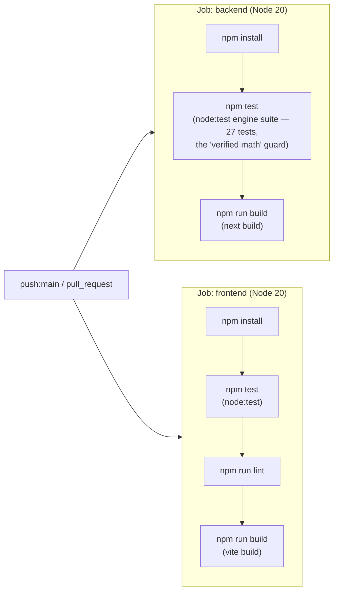
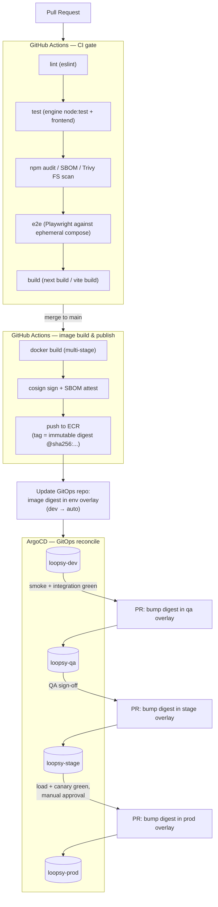
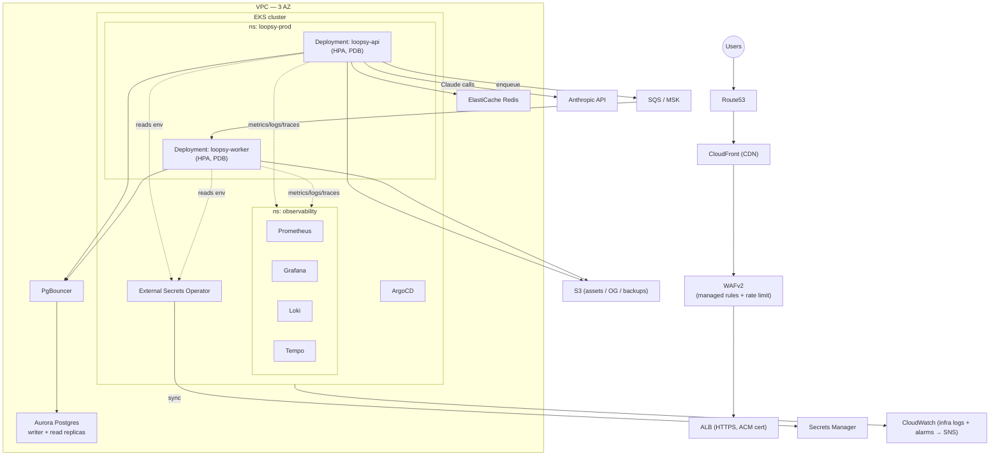
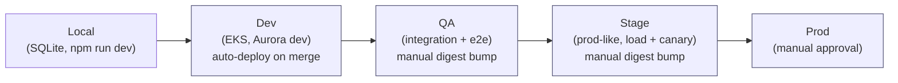
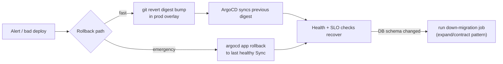

# Phase 12 — CI/CD & Infrastructure

> **Scope.** This document describes the **current** delivery pipeline for Loopsy
> honestly (Vercel + Railway + a single GitHub Actions CI workflow), and then a
> **TARGET** transformation onto AWS (GitHub Actions → ECR → ArgoCD/GitOps →
> Terraform-provisioned EKS/Aurora/Redis). Everything under a **`[TARGET]`** label
> is aspirational and not yet built. Everything under **`[CURRENT]`** reflects what
> ships today.

---

## 1. Current state `[CURRENT]`

### 1.1 Topology

```text
Browser
  │
  ├──────────► Vercel (static SPA, frontend/)
  │              vercel.json rewrites /api/*  ──┐
  │                                             │
  └─────────────────────────────────────────────┘
                                                ▼
                       Railway: Next.js 14 API (backend/)
                       `next start -p ${PORT:-3000}`
                                                │
                                                ▼
                       SQLite (better-sqlite3) at
                       DB_PATH=/data/data.db on a
                       Railway persistent volume
```

- **Frontend:** React 19 + Vite SPA, deployed as static assets on **Vercel**.
  `frontend/vercel.json` rewrites `/api/:path*` →
  `https://loopsy-backend.up.railway.app/api/:path*` and sets the CSP + security
  headers (nosniff / frame-deny / HSTS / referrer / permissions policy).
- **Backend:** Next.js 14 App Router (API-only) on **Railway**, started with
  `next start -p ${PORT:-3000}`.
- **Database:** **SQLite** (`better-sqlite3`) on a single Railway **persistent
  volume** at `DB_PATH=/data/data.db`. Single writer, no replica.
- **CORS** is pinned to `FRONTEND_URL` (no `*` fallback in prod).

### 1.2 Environment variables `[CURRENT]`

| Var | Purpose | Required in prod |
|-----|---------|------------------|
| `ANTHROPIC_API_KEY` | Claude generation (Haiku parse + Sonnet humanize, vision) | yes (else Ollama fallback / `AI_UNAVAILABLE`) |
| `FRONTEND_URL` | CORS allowlist + CSRF origin check + email links | yes |
| `RESEND_API_KEY` | transactional email (verify / reset) via `lib/email/mailer.js` | yes (else link is logged only) |
| `DB_PATH` | SQLite file path (`/data/data.db` on the Railway volume) | yes |
| `LOG_LEVEL` | logger threshold (`debug`/`info`/`warn`/`error`) | no (defaults `info`) |
| `ALLOWED_ORIGIN_SUFFIXES` | extra CORS suffixes (preview domains) | optional |

### 1.3 CI workflow `[CURRENT]` — `.github/workflows/ci.yml`

Triggered on **push to `main`** and on **all pull requests**. Node 20. Two
parallel jobs:



- The engine suite (`node --test test/*.test.js`) is the **moat**: distribution
  math, every shape/revolve/chart self-validating, the validator flagging wrong
  counts, and the 22-seed-template arithmetic regression lock.

### 1.4 Deployment (CD) `[CURRENT]`

There is **no dedicated CD pipeline**. Both platforms **auto-deploy from git**:

- **Vercel** builds & deploys the SPA on every push to the production branch (and
  preview deploys per PR).
- **Railway** rebuilds & restarts the Next.js service on every push to the
  tracked branch.

### 1.5 What is intentionally **NOT** present today

No Docker images, no Terraform, no Helm/Kubernetes, no ArgoCD, no staging
environment, no image registry, no immutable-digest promotion, no rollback
pipeline, no dependency-audit / SAST / e2e gates. CI is test-and-build only;
deploys are git-push-driven by the PaaS.

### 1.6 Honest gaps the target closes `[CURRENT]`

| Gap today | Risk |
|-----------|------|
| SQLite single volume, single writer | no HA, no horizontal scale, backup is a manual `npm run backup` cron-less script |
| Auto-deploy from git | no gate between "merged" and "in prod"; no promotion path; rollback = revert+redeploy |
| No staging/QA | first place a change meets prod traffic is prod |
| No supply-chain controls | unpinned `npm install` (not `npm ci`), no `npm audit`, no image signing |
| No DR / multi-AZ | a Railway volume loss is a data-loss event |

---

## 2. Target transformation `[TARGET]`

The architecture docs target **AWS**: CloudFront/WAF → ALB → **EKS**
(`loopsy-api` + `loopsy-worker` pods, HPA) → **Aurora Postgres** (read replicas +
PgBouncer) + **ElastiCache Redis** + **SQS/MSK** + **S3** + **Secrets Manager** +
**Route53** + **CloudWatch**. The migration off SQLite → Aurora Postgres is a
prerequisite (covered in the data-layer doc; the model layer in `lib/models/`
must move from `better-sqlite3` to a Postgres client/pool behind PgBouncer).

### 2.1 Target CI/CD pipeline `[TARGET]`



**Pipeline stages (target):**

1. **CI gate (every PR):** `npm ci` (locked), eslint, the engine `node:test`
   suite + frontend tests, `npm audit` + SBOM (`cyclonedx`) + **Trivy** filesystem
   scan, **Playwright e2e** against an ephemeral docker-compose (API + Postgres +
   Redis), then `next build` / `vite build`. Required status checks block merge.
2. **Image build & publish (on merge to `main`):** multi-stage Docker build →
   **cosign** signature + SBOM attestation → push to **ECR**. The image is
   addressed by **immutable digest** (`@sha256:...`), never a floating tag.
3. **GitOps bump:** the pipeline opens/commits a digest bump to the **dev**
   overlay in the GitOps repo. ArgoCD reconciles dev automatically.
4. **Promotion = re-using the *same* digest** up the ladder via PRs that edit
   only the per-env overlay (see §2.6). No rebuild between environments — what was
   tested is exactly what ships.

### 2.2 Terraform (IaC) `[TARGET]`

State in **S3 + DynamoDB lock**. Layered modules, one workspace/dir per env
(`dev/qa/stage/prod`):

```text
infra/terraform/
├── modules/
│   ├── vpc/            # 3-AZ VPC, public/private/db subnets, NAT, flow logs
│   ├── eks/            # EKS cluster, managed node groups, IRSA, addons
│   ├── rds-aurora/     # Aurora Postgres cluster, writer + read replicas, PgBouncer SG
│   ├── elasticache/    # Redis (replication group, multi-AZ)
│   ├── s3/             # asset / OG-image / backup buckets (SSE, lifecycle)
│   ├── cloudfront-waf/ # CF distribution + WAFv2 (managed rules + rate limit)
│   ├── ecr/            # repos (loopsy-api, loopsy-worker) + scan-on-push
│   ├── iam/            # IRSA roles: external-secrets, api, worker, alb-controller
│   ├── route53/        # zones + records → ALB / CloudFront
│   └── observability/  # CloudWatch log groups, alarms → SNS
└── envs/
    ├── dev/  qa/  stage/  prod/   # backend.tf (state key) + *.tfvars per env
```

Bootstrap order: `vpc → eks → (rds-aurora, elasticache, s3, ecr) → iam(IRSA) →
cloudfront-waf → route53 → observability`. Apply runs in CI via OIDC-assumed role
(no long-lived AWS keys), `plan` on PR, `apply` on merge with manual approval for
`stage`/`prod`.

### 2.3 Target AWS infrastructure diagram `[TARGET]`



### 2.4 Helm chart structure `[TARGET]`

A single umbrella chart, parameterized per environment via values overlays:

```text
charts/loopsy/
├── Chart.yaml
├── values.yaml                 # defaults
├── values-dev.yaml
├── values-qa.yaml
├── values-stage.yaml
├── values-prod.yaml
└── templates/
    ├── deployment-api.yaml     # loopsy-api: image digest, probes, resources
    ├── deployment-worker.yaml  # loopsy-worker: SQS consumer
    ├── service.yaml            # ClusterIP for api
    ├── ingress.yaml            # ALB ingress (group, ACM, WAF assoc)
    ├── hpa.yaml                # api + worker HPAs
    ├── pdb.yaml                # minAvailable for api + worker
    ├── configmap.yaml          # non-secret config (LOG_LEVEL, FRONTEND_URL...)
    ├── externalsecret.yaml     # ESO → Secrets Manager (API keys, DB URL)
    ├── networkpolicy.yaml      # default-deny + explicit allows
    ├── servicemonitor.yaml     # Prometheus scrape config
    └── serviceaccount.yaml     # IRSA-annotated SAs (api, worker)
```

Helm renders the manifests; **ArgoCD** owns *applying* them (GitOps), so the
Helm release is declarative and reconciled, never `helm install`-ed by a human.

### 2.5 Kubernetes design `[TARGET]`

**Namespaces:** `loopsy-dev`, `loopsy-qa`, `loopsy-stage`, `loopsy-prod`, and
`observability`. (`argocd`, `external-secrets`, `kube-system` are platform.)

| Object | Design |
|--------|--------|
| **Deployment `loopsy-api`** | Next.js image, readiness `/api/health` + liveness, `requests/limits` set, rolling update `maxSurge=1 maxUnavailable=0`, topology spread across AZs. |
| **Deployment `loopsy-worker`** | SQS/MSK consumer (engine compile + Claude calls offloaded from request path), separate scaling signal (queue depth). |
| **Service** | `ClusterIP` for `loopsy-api`; worker has no Service (consumer only). |
| **Ingress** | AWS Load Balancer Controller → ALB; one ingress group; ACM TLS; WAF web-ACL association. |
| **Secrets** | **External Secrets Operator** syncs from **Secrets Manager** into `Secret` objects (`ANTHROPIC_API_KEY`, `RESEND_API_KEY`, `DATABASE_URL`). No secrets in git. |
| **ConfigMaps** | non-secret config (`LOG_LEVEL`, `FRONTEND_URL`, feature flags). |
| **HPA** | `loopsy-api` on CPU + p95 latency (custom metric); `loopsy-worker` on **SQS queue depth** (external metric). |
| **PDB** | `minAvailable: 1` (api), tuned per replica count, to survive node drains. |
| **NetworkPolicy** | **default-deny** ingress+egress per namespace; explicit allows: ALB→api, api→pgbouncer/redis/SQS-endpoint/Anthropic-egress, worker→pgbouncer/SQS, all→DNS, app→observability collectors. |

Health endpoint: add `GET /api/health` (liveness = process up; readiness = DB +
Redis reachable). The structured logger already emits JSON for Loki ingest.

### 2.6 Environments & promotion `[TARGET]`



- **Local** stays on **SQLite** for zero-setup dev (the only env that does).
- **Promotion = immutable image digest.** The exact `@sha256:...` validated in dev
  is the artifact promoted to qa → stage → prod. Each promotion is a PR that edits
  only `values-<env>.yaml`'s `image.digest`. No rebuilds, no drift.
- **Gates:** dev auto on merge; qa after integration+e2e green; stage after
  load+canary; prod behind **manual approval** in the GitOps PR.

### 2.7 Rollback pipeline `[TARGET]`

Because promotion is "set image digest in git", rollback is **revert the digest**:



- App-level rollback is instant (previous digest still in ECR, immutable).
- DB changes use **expand/contract** migrations so an app rollback never requires
  a destructive schema rollback; a guarded down-migration `Job` exists for the
  rare contract step.

### 2.8 Dockerfile sketch (Next.js backend) `[TARGET]`

```dockerfile
# ── builder ─────────────────────────────────────────────
FROM node:20-bookworm-slim AS builder
WORKDIR /app
# better-sqlite3 needs build toolchain only at build time
RUN apt-get update && apt-get install -y --no-install-recommends python3 make g++ \
    && rm -rf /var/lib/apt/lists/*
COPY backend/package*.json ./
RUN npm ci
COPY backend/ ./
ENV NEXT_TELEMETRY_DISABLED=1
RUN npm run build       # next build (standalone output)

# ── runner ──────────────────────────────────────────────
FROM node:20-bookworm-slim AS runner
WORKDIR /app
ENV NODE_ENV=production NEXT_TELEMETRY_DISABLED=1 PORT=3000
RUN addgroup --system --gid 1001 nodejs \
    && adduser --system --uid 1001 nextjs
# Next.js standalone bundle (set output:'standalone' in next.config.js)
COPY --from=builder --chown=nextjs:nodejs /app/.next/standalone ./
COPY --from=builder --chown=nextjs:nodejs /app/.next/static ./.next/static
COPY --from=builder --chown=nextjs:nodejs /app/public ./public
USER nextjs
EXPOSE 3000
HEALTHCHECK --interval=30s --timeout=3s --retries=3 \
  CMD node -e "fetch('http://127.0.0.1:3000/api/health').then(r=>process.exit(r.ok?0:1)).catch(()=>process.exit(1))"
CMD ["node", "server.js"]
```

> Notes: enable `output: 'standalone'` in `next.config.js` for a slim runtime
> image. On AWS the data layer is **Aurora Postgres**, so `better-sqlite3` is
> replaced by a Postgres client in `lib/db` — the build toolchain line is only
> needed while any native module remains. The worker reuses the same image with a
> different entrypoint.

---

## 3. Summary

Today Loopsy ships via a single CI workflow (engine tests + builds) and
**git-push auto-deploy** to Vercel (SPA) + Railway (Next.js on SQLite). The target
replaces this with a gated GitHub Actions pipeline (lint/test/audit/e2e →
signed image → **ECR**), **Terraform**-provisioned AWS (VPC/EKS/Aurora/Redis/
S3/CloudFront/WAF/IAM), a **Helm** umbrella chart, and **ArgoCD** GitOps with
**immutable-digest promotion** across Local → Dev → QA → Stage → Prod and a
git-revert rollback path.

---

Reviewed by: Principal Reviewer / Security Architect / DevOps Architect
