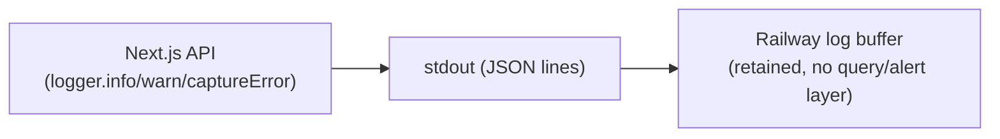
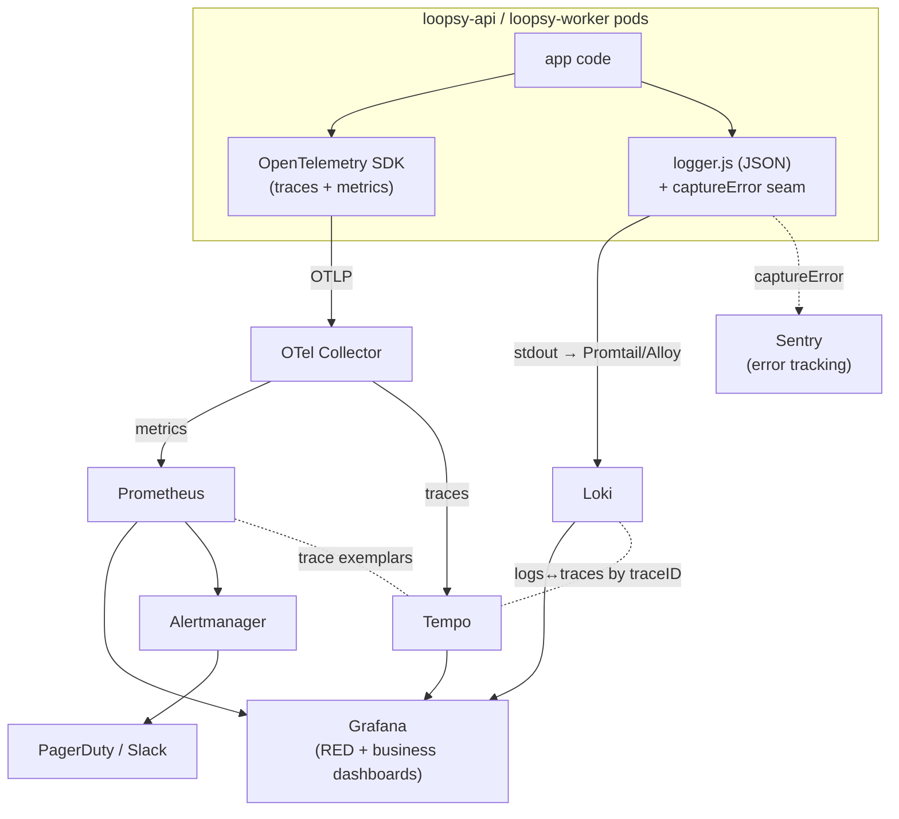
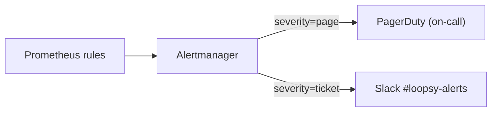
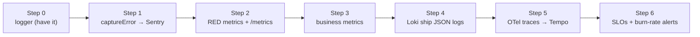

# Phase 13 — Observability

> **Scope.** Current observability is a **single structured logger** and nothing
> else. This document states that honestly, then defines a **TARGET** stack
> (Prometheus + Grafana + Loki + Tempo/OpenTelemetry, with `logger.captureError`
> wired to Sentry), SLIs/SLOs/SLA, an alerting strategy, and an **incremental**
> instrumentation plan that starts from the logger we already have.
> **`[CURRENT]`** = shipped today. **`[TARGET]`** = not yet built.

---

## 1. Current state `[CURRENT]`

The only observability primitive is `backend/lib/logger.js`:

- **JSON lines in production**, readable text in dev. Every record carries
  `level`, `event`, `time`, plus arbitrary fields.
- **`child(bindings)`** binds context (e.g. a `requestId`) to every subsequent
  line — the correlation-id seam.
- **`newRequestId()`** mints a UUID per request/operation.
- **`captureError(event, error, fields)`** is the **single error-reporting seam**:
  it logs `err` + `stack` today, and its docstring explicitly says *"swap the body
  for Sentry/OTel capture later without touching call sites."*

What is **NOT** present today: no Prometheus, no Grafana, no Loki, no Tempo, no
OpenTelemetry, no metrics, no tracing, no error tracker (Sentry), and **no
alerting**. Logs are emitted to stdout and whatever Railway/Vercel retain.



**Implication:** debugging is grep-over-stdout, there is no p95/error-rate signal,
no trace to see where a slow `generate` spent its time, and no one is paged when
things break. The good news is the JSON shape and the `captureError`/`child`
seams make the target a wiring exercise, not a rewrite.

---

## 2. Target observability stack `[TARGET]`



- **Prometheus** — metrics (RED + business). Pods expose `/metrics`; a
  `ServiceMonitor` scrapes them.
- **Grafana** — dashboards over Prometheus + Loki + Tempo, with **exemplars** so a
  latency spike links straight to a trace.
- **Loki** — log aggregation. The **existing JSON logger already fits**; Promtail/
  Grafana Alloy ships stdout to Loki. Add `traceID`/`spanID` to every line (via
  `child()`) so logs ↔ traces join.
- **Tempo + OpenTelemetry** — distributed tracing. Instrument the three hot spans:
  **engine compile** (`lib/engine/compiler.js` + `validator.js`), the **Claude
  call** (Haiku parse / Sonnet humanize / vision), and the **DB** query.
- **Sentry** — error tracking, wired through the existing
  `logger.captureError` seam (one function body swap, no call-site churn).

### 2.1 Metrics taxonomy `[TARGET]`

**RED (per route):**

| Metric | Type | Notes |
|--------|------|-------|
| `http_requests_total{route,method,status}` | counter | Rate + **Errors** (5xx ratio) |
| `http_request_duration_seconds{route}` | histogram | **Duration** (p50/p95/p99) |
| `http_inflight_requests` | gauge | concurrency |

**Business metrics (the product's truth):**

| Metric | Type | Why it matters |
|--------|------|----------------|
| `loopsy_generation_duration_seconds{stage}` | histogram | **generation latency p95** — `stage` ∈ {parse, compile, humanize, total} |
| `loopsy_pattern_verified_total{verified}` | counter | **verified-rate** — fraction earning the "Verified math ✓" badge |
| `loopsy_ai_cost_usd_total{model}` | counter | **AI cost per request** — tokens × price, by model |
| `loopsy_ai_errors_total{provider,kind}` | counter | `AI_UNAVAILABLE`, timeouts, fallbacks |
| `loopsy_queue_depth{queue}` | gauge | **queue depth** (SQS, worker backlog) |
| `loopsy_engine_validation_failures_total` | counter | validator rejecting computed counts (math regression alarm) |
| `loopsy_vision_trial_used_total` | counter | metered free-trial consumption |

### 2.2 Tracing spans `[TARGET]`

A single `traceID` spans the request; child spans:

```text
POST /api/ai/generate-pattern  (root span, traceID)
 ├─ claude.parse        (Haiku — intent → Design Spec)
 ├─ engine.compile      (compiler.js: spec → ordered steps w/ counts)
 ├─ engine.validate     (validator.js: independent re-derivation)
 ├─ claude.humanize     (Sonnet — presentation)
 └─ db.write            (persist pattern)
```

The same `traceID` is injected into every log line via `logger.child({ traceID })`
so Loki ↔ Tempo cross-navigation works.

---

## 3. SLIs, SLOs, SLA `[TARGET]`

### 3.1 SLIs

| SLI | Definition | Source |
|-----|------------|--------|
| **API availability** | `1 − (5xx / total)` over rolling window | Prometheus RED |
| **Non-AI compile latency** | p95 of `loopsy_generation_duration_seconds{stage="compile"}` (engine only, no Claude) | Prometheus |
| **End-to-end generate latency** | p95 of `loopsy_generation_duration_seconds{stage="total"}` | Prometheus |
| **Verified-rate** | `verified / total` for in-vocabulary requests | `loopsy_pattern_verified_total` |

### 3.2 SLOs

| SLO | Target | Window |
|-----|--------|--------|
| API availability | **99.9%** | 30-day rolling |
| p95 non-AI compile | **< 300 ms** | 30-day |
| p95 end-to-end generate | **< 8 s** | 30-day |
| Verified-rate (in-vocabulary) | **≥ 99%** | 30-day |

Each SLO has an **error budget** (e.g. 99.9% ⇒ ~43 min/month). Budget burn gates
risky deploys (freeze when exhausted).

### 3.3 SLA (external)

- **Public SLA:** **99.5% monthly availability** of the generation API
  (deliberately looser than the 99.9% internal SLO — the gap is operating
  headroom). AI-generation latency is offered as a **target, not a guarantee**,
  since it depends on the upstream Anthropic API; `AI_UNAVAILABLE` is returned
  honestly and does **not** count against the verified-math correctness SLO.
- Correctness guarantee: a pattern marked **"Verified math ✓"** has had its stitch
  counts independently re-derived by the validator — the engine never guesses.

---

## 4. Alerting strategy `[TARGET]`



**Multi-window SLO burn-rate alerts** (Google SRE pattern) on availability +
latency SLOs:

| Alert | Condition | Severity |
|-------|-----------|----------|
| Availability fast burn | 2% budget in 1h **and** 5m windows | page |
| Availability slow burn | 5% budget in 6h **and** 30m windows | ticket |
| p95 latency SLO breach | end-to-end p95 > 8s (or compile p95 > 300ms) sustained 10m | page / ticket |

**Operational alerts:**

| Alert | Condition | Severity |
|-------|-----------|----------|
| **DLQ not empty** | `loopsy_queue_depth{queue="dlq"} > 0` | page |
| **AI error spike** | `rate(loopsy_ai_errors_total[5m])` > baseline×3, or `AI_UNAVAILABLE` surge | page |
| **Verified-rate drop** | verified-rate < 99% (in-vocab) over 15m → math regression | page |
| **RDS CPU** | Aurora writer CPU > 80% for 10m | ticket→page |
| **RDS connections** | connections > 85% of `max_connections` (PgBouncer saturation) | page |
| **Redis evictions / memory** | evicted keys > 0 or memory > 85% | ticket |
| **Error-budget exhausted** | 30-day budget spent | ticket (deploy freeze) |

Every alert links to a **Grafana dashboard panel** and a **runbook**. Routing by
`severity` label; pages go to PagerDuty, tickets to Slack.

---

## 5. Instrument-it-incrementally plan `[TARGET]`

Start from the logger that already exists — each step is shippable on its own.



1. **Step 0 — baseline (done `[CURRENT]`):** structured JSON logger with
   `child()`, `newRequestId()`, `captureError()`.
2. **Step 1 — error tracking (smallest win):** implement the Sentry SDK *inside
   `captureError`*; init at process start. Zero call-site changes. Now every
   handled error is grouped, with stack + `requestId`.
3. **Step 2 — RED metrics:** add `prom-client`, expose `/metrics`, wrap the API
   with a middleware emitting `http_requests_total` + `http_request_duration_seconds`.
   Add the `ServiceMonitor`. First p95 / 5xx-rate dashboard in Grafana.
4. **Step 3 — business metrics:** instrument `lib/services` (AI generation) and
   `lib/engine` for `loopsy_generation_duration_seconds`,
   `loopsy_pattern_verified_total`, `loopsy_ai_cost_usd_total`,
   `loopsy_engine_validation_failures_total`. These are the product's real SLIs.
5. **Step 4 — logs to Loki:** deploy Promtail/Alloy; the JSON already parses. Add
   `traceID` to `child()` bindings to pre-wire the logs↔traces join.
6. **Step 5 — tracing:** add the OpenTelemetry SDK + OTLP exporter → Tempo;
   create the three spans (`claude.*`, `engine.*`, `db.*`). Stamp `traceID` into
   the request-scoped `child()` logger so Loki ↔ Tempo navigation lights up.
7. **Step 6 — SLOs & alerts:** encode the SLOs in §3 as Prometheus recording
   rules, add multi-window burn-rate + operational alerts (§4), wire Alertmanager
   → PagerDuty/Slack, attach runbooks.

> Sequencing rationale: error visibility (cheapest, highest signal) → request
> health → product-specific truth → log/trace correlation → SLO enforcement.
> Nothing here requires re-architecting the app; it builds out from the seams the
> logger already exposes.

---

## 6. Summary

Loopsy today has only a structured JSON logger (with `child()`/`newRequestId()`/
`captureError()` seams) and no metrics, tracing, or alerting. The target stack is
**Prometheus** (RED + business metrics: generation p95, verified-rate, AI cost/req,
queue depth, 5xx) → **Grafana**, **Loki** (the JSON logger already fits),
**Tempo + OpenTelemetry** tracing the compile + Claude + DB spans, and **Sentry**
wired through the existing `captureError` seam. It is governed by explicit
SLIs/SLOs (99.9% availability, p95 compile < 300 ms, p95 generate < 8 s,
verified-rate ≥ 99%), a 99.5% external SLA, SLO burn-rate + operational alerting
(DLQ, AI-error spike, RDS CPU/connections), and a six-step incremental plan that
starts by swapping the body of `logger.captureError`.

---

Reviewed by: Principal Reviewer / Security Architect / DevOps Architect
