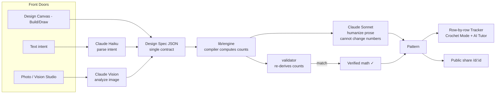
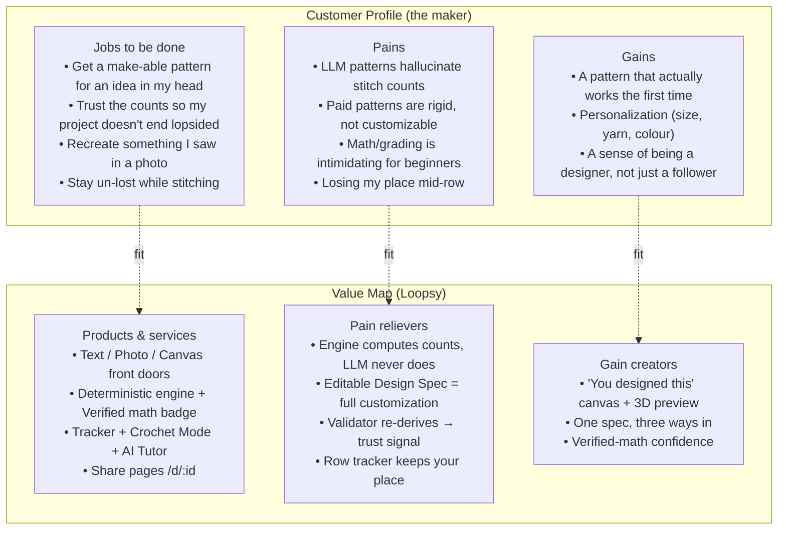

# Loopsy — Product Overview (Phase 1)

> **Status:** M1–M4 shipped + a P0 hardening pass. Stripe billing, teams/orgs, and
> global search are **(target)**. Everything below is grounded in the codebase as of
> 2026-06-20; aspirational items are explicitly labeled **(target)**.

---

## 1. What Loopsy is

Loopsy is an **AI-native crochet design studio**. It turns a maker's intent —
expressed as **text**, a **photo**, or a **hands-on canvas drawing** — into a
**verified, row-by-row crochet pattern** with **exact stitch counts**, then guides
the maker through stitching it with a row-by-row tracker, a hands-free "Crochet
Mode," and an AI tutor.

The product is deliberately split so that **creativity is AI-driven** but
**arithmetic is deterministic**. An LLM proposes *what to make*; a pure geometry
engine computes *exactly how many stitches it takes*. That separation is the
entire reason a Loopsy pattern can wear a **"Verified math ✓"** badge.

### The three front doors

| Front door | Route / API | What it does |
|---|---|---|
| **Text** | `POST /api/ai/generate-pattern` (SSE) | Natural-language intent → Design Spec → verified pattern, streamed live |
| **Photo (Vision Studio)** | `POST /api/ai/analyze-image` (metered) → `POST /api/ai/generate-from-spec` | A reference photo → confidence-scored, **editable** Design Spec → the same compiler |
| **Design Canvas** | `/design` | **Build** (primitive shapes + a *Sculpt*/revolve tool + live 3D preview) or **Draw** (colourwork grid → flat chart or worked-in-the-round medallion) |

All three converge on a single artifact — the **Design Spec** — and from there the
exact same engine path runs. Output flows into a **row-by-row Tracker** (with
**Crochet Mode** and an **AI Tutor**) and optional **public share pages** at
`/d/:id` with auto-generated Open Graph images.

---

## 2. The moat — deterministic math behind an AI front

This is the defensible core and the thing competitors structurally cannot copy by
prompting a bigger model.

`backend/lib/engine/` is a **pure, deterministic geometry engine**:

- `gauge.js` — stitches/rows per cm from yarn weight + hook
- `distribute.js` — even increase/decrease distribution for any delta across a round (exhaustively tested)
- `shapes.js` — shape generators (sphere, ellipsoid, hemisphere, tube, cone, flatPanel, hatCrown, grannySquare)
- `revolve.js` — profile curve → amigurumi worked in rounds (the "Sculpt" engine)
- `chart.js` — colourwork: `compileChart` (flat) + `compileMedallion` (in the round)
- `colorName.js` — maps any hex to a readable yarn name
- `designSpec.js` — the Design Spec schema (normalize + validate)
- `compiler.js` — Design Spec → ordered steps with computed counts
- `validator.js` — **independently re-derives** every count; earns the "Verified math ✓" badge

**The guardrail (non-negotiable):** an LLM **never** computes stitch counts. The
Design Spec JSON is the single contract every front door emits; the engine owns
**all** arithmetic. A `node:test` suite (27 engine tests) plus GitHub Actions CI
lock this — including a regression lock that all 22 seed templates have **zero**
arithmetic errors.

### AI pipeline detail

1. **Claude Haiku** parses intent into a Design Spec (via the `submit_design_spec` tool).
2. **The engine** computes exact counts.
3. **Claude Sonnet** humanizes the prose presentation — and **cannot change the numbers**.
4. **Ollama (phi3)** is a keyless local fallback; when every provider fails the
   route returns an honest `AI_UNAVAILABLE` error (it never saves a static
   fallback as a "ready" pattern, and never charges quota for a failure).

---

## 3. Value Proposition Canvas

---

## 4. Positioning, mission, vision

**Positioning statement**
> For **crochet makers and aspiring pattern designers** who are frustrated that
> AI chatbots invent stitch counts and store-bought patterns can't be
> customized, **Loopsy** is an **AI-native crochet design studio** that turns any
> idea — typed, photographed, or drawn — into a **verified, row-by-row pattern
> with exact, engine-computed stitch counts**. Unlike generic LLMs (which
> hallucinate counts) and pattern marketplaces (which sell fixed PDFs), Loopsy
> pairs an AI creative front with a **deterministic geometry engine** so every
> pattern is provably make-able.

**Mission.** Let anyone turn a crochet idea into a pattern that actually works —
no math anxiety, no guesswork.

**Vision.** Become the design layer for fiber crafts: the place where makers go
from inspiration to a verified, shareable, trackable pattern — and eventually a
collaborative studio for indie designers and teams **(target)**.

---

## 5. Target market

- **Primary (current):** hobbyist crocheters across skill levels who want
  customized, trustworthy patterns — especially amigurumi and colourwork makers.
- **Secondary (current):** indie/aspiring **pattern designers** who want to
  prototype and grade designs fast, then share/sell.
- **Tertiary (target):** **teams/organizations** — craft studios, pattern
  publishers, education programs — needing shared workspaces, roles, and seats
  (the Team tier, dependent on M5 billing + orgs/RBAC, both unbuilt).

**Plans today** (`backend/lib/utils/planLimits.js`; **no Stripe yet** — seats are
set by manual DB edits, billing is milestone **M5 (target)**):

| Plan | Generations | AI Tutor | Vision Studio |
|---|---|---|---|
| **free** | 3 | 3 | 1 lifetime trial |
| **maker_pro** | 30 | ∞ | counts as a monthly generation |
| **creator** | ∞ | ∞ | ∞ |

---

## 6. Competitor analysis

| | **Loopsy** | **Ravelry** | **Generic LLMs** (ChatGPT/Claude) | **Etsy / indie sellers** | **Chart/stitch tools** (StitchFiddle, etc.) |
|---|---|---|---|---|---|
| Generates a *new* custom pattern from intent | ✅ text/photo/canvas | ❌ (catalog) | ⚠️ yes but unreliable | ❌ (fixed PDFs) | ❌ (you draw it) |
| **Verified, exact stitch counts** | ✅ engine + validator badge | n/a (curated human patterns) | ❌ hallucinates counts | ✅ (human-authored, fixed) | ⚠️ chart math only |
| Customization (size/yarn/colour) | ✅ editable Design Spec | ❌ | ⚠️ inconsistent | ❌ | ⚠️ manual |
| Photo → pattern | ✅ Vision Studio | ❌ | ⚠️ describes, can't compute | ❌ | ❌ |
| 3D shape design (Sculpt/revolve) | ✅ live 3D | ❌ | ❌ | ❌ | ❌ |
| Colourwork chart + medallion | ✅ flat + in-the-round | ❌ | ❌ | ⚠️ pattern-specific | ✅ flat charts |
| Row tracker + guided mode + tutor | ✅ | ⚠️ basic | ❌ | ❌ | ❌ |
| Community / marketplace | ⚠️ share pages only (target: marketplace) | ✅ huge | ❌ | ✅ | ❌ |
| **Core differentiator** | **AI front + deterministic engine** | **community + catalog** | **general intelligence** | **curated human design** | **manual charting** |

**Read:** Loopsy's wedge is the combination no incumbent holds — an AI creative
front door **fused to** provable, engine-computed math. Ravelry owns community and
catalog; LLMs own general flexibility but fail on arithmetic trust; sellers own
hand-crafted quality but zero customization; chart tools own manual precision but
do no generation.

---

## 7. Business context

- **Deployment:** backend (Next.js 14 App Router, API-only) on **Railway** over
  **SQLite**; frontend (React 19 + Vite + React Router 7 + Tailwind v4 + motion +
  three.js) on **Vercel**, proxying `/api/*` to Railway via a `vercel.json` rewrite.
- **Monetization:** freemium with metered AI. The **Vision Studio free trial
  (1 lifetime)** is the headline upgrade hook. Conversion to paid is gated on
  **M5 Stripe billing (target)** — today plan changes are manual DB edits.
- **Cost posture:** AI is metered per plan; honest `AI_UNAVAILABLE` and the
  keyless Ollama fallback bound provider spend and avoid charging for failures.
- **Trust as a growth loop:** the "Verified math ✓" badge + public share pages
  (`/d/:id` with OG images) turn every finished design into a credibility-bearing
  share unit.
- **Hardening already in place:** engine tests + CI, structured logger, online DB
  backup, mobile-responsive UI (bottom tab bar), and a P0 security pass (login
  throttling, security headers, CSP, CORS hardening, CSRF origin-check, email
  verification + password reset, soft-delete + audit log, a11y focus-traps + skip
  link).
- **Known gaps / not yet built (target):** Stripe billing, teams/orgs/RBAC,
  global search, Sentry/metrics/tracing, Postgres migration.

---

### Reviewed by: Principal Reviewer / Security Architect / PM — sign-off & open questions

- **Principal Reviewer — sign-off:** Approved. Moat and pipeline descriptions match
  `backend/lib/engine/` and the AI route flow. *Open:* confirm the exact engine
  test count (cited as 27) as the suite grows; keep the "LLM never computes counts"
  claim load-bearing in every future doc.
- **Security Architect — sign-off:** Approved. P0 hardening claims (throttling,
  CSP, CORS, CSRF origin-check, email verification, soft-delete + audit) match the
  documented surface. *Open:* SQLite-on-Railway durability vs. the Postgres
  migration (target); no Sentry/tracing yet is an operational-visibility risk.
- **PM — sign-off:** Approved as Phase 1 overview. *Open questions:* (1) Is "creator"
  the final top-tier name vs. a future "Team" tier? (2) Does the Team tier ship with
  or after orgs/RBAC? (3) Marketplace vs. share-only — is monetizing maker-authored
  patterns in scope post-M5?
