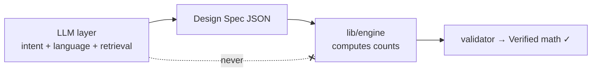
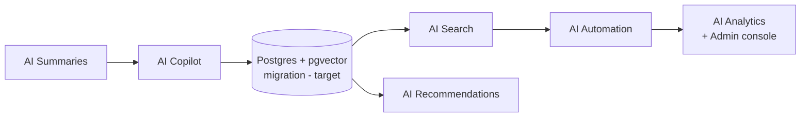

# Loopsy — AI Enhancement Opportunities (Phase 14)

> **Status:** All six initiatives below are **(target)**. They build on the shipped
> AI pipeline (Haiku → Design Spec → engine → Sonnet humanize) and the deterministic
> engine. Grounded as of 2026-06-20.

## The non-negotiable guardrail

> **LLMs never compute stitch counts. The engine (`backend/lib/engine/`) owns all
> arithmetic; the `validator` re-derives every count to earn the "Verified math ✓"
> badge.**

Every AI opportunity below is designed to **respect** this. The pattern is always:
an LLM operates on **intent and presentation** (the Design Spec, prose, search
intent, summaries), and the **engine** does the math. Any feature that would let a
model emit a stitch count is out of scope by construction.



---

## 1. The six opportunities

### 1.1 AI Copilot — edit the Design Spec in the canvas **(target)**
A conversational copilot inside `/design`: *"make the head 20% bigger,"* *"add a
second colour from row 8,"* *"taper the tail."* The copilot **edits the Design Spec
only**; the engine recompiles and the validator re-verifies. It is the natural
extension of the existing `submit_design_spec` Haiku tool, now applied to mutate an
*existing* spec rather than create one.
- **Guardrail fit:** copilot mutates spec fields (sizes, shapes, colours, profile
  points); the engine recomputes counts. The copilot is forbidden from writing count fields.

### 1.2 AI Recommendations **(target)**
"Makers who designed this also made…", next-project suggestions, yarn/colour
pairings, and a difficulty-aware beginner path. Drives activation (beginners) and
retention (designers). Can start rules-based on `analytics`/`patterns` and graduate
to embeddings.
- **Guardrail fit:** recommends *patterns/specs*, never counts.

### 1.3 AI Search — semantic over patterns/templates **(target)**
Natural-language and visual-intent search ("low-poly fox amigurumi in autumn
colours") over patterns + templates using **pgvector** embeddings. This is the
flagship reason the **Postgres migration (target)** matters, and it fills the
**no-global-search** gap noted in current state.
- **Dependency:** Postgres + pgvector (today: SQLite). Embed Design Specs / prose;
  rank by semantic similarity.
- **Guardrail fit:** retrieval/ranking only; results are existing verified patterns.

### 1.4 AI Summaries **(target)**
Auto-generate share-page blurbs, pattern "at a glance" summaries (skill, time,
yarn), changelog/diff summaries between Design Spec revisions, and OG caption text
(complements the existing `/api/designs/:id/og` image).
- **Guardrail fit:** Sonnet-style humanization of *engine-produced facts*; it
  describes counts the engine computed, it does not produce them.

### 1.5 AI Automation **(target)**
Auto-grading across a size range from one spec, batch colourway variants, "clean up
my canvas into a tidy spec," and auto-tagging for search/recommendations. High
leverage for the **Power User / Pattern Designer** persona.
- **Guardrail fit:** automation orchestrates the **engine** across parameter sweeps;
  the engine grades, the LLM only proposes parameters/labels.

### 1.6 AI Analytics **(target)**
Internal, **Admin-facing (target)**: natural-language querying over `analytics` +
`ai_usage` ("which front door converts best?"), anomaly/abuse detection, AI-cost
attribution, and funnel insight. Pairs with the (target) Admin console.
- **Guardrail fit:** operates on product telemetry, not patterns; no math surface.

---

## 2. Prioritization — RICE

> Scoring is directional (a planning aid, not a commitment). **Reach** = share of
> active users touched/quarter (1–10). **Impact** (0.25/0.5/1/2/3). **Confidence**
> (%). **Effort** = person-months. **RICE = R × I × C ÷ E.**

| # | Opportunity | Reach | Impact | Confidence | Effort (pm) | **RICE** | Notes |
|---|---|:--:|:--:|:--:|:--:|:--:|---|
| 1 | **AI Copilot** (edit spec) | 7 | 2 | 80% | 2.0 | **5.6** | Extends existing Haiku tool; high designer delight |
| 2 | **AI Recommendations** | 8 | 1 | 70% | 1.5 | **3.7** | Rules-based v1 cheap; activation + retention |
| 3 | **AI Search** (pgvector) | 9 | 2 | 60% | 4.0 | **2.7** | Highest reach; gated on Postgres migration |
| 4 | **AI Summaries** | 8 | 1 | 85% | 1.0 | **6.8** | Cheapest, lowest-risk; share-loop fuel |
| 5 | **AI Automation** (auto-grade/batch) | 5 | 3 | 65% | 3.0 | **3.25** | Deep value for paying designers |
| 6 | **AI Analytics** (admin) | 2 | 2 | 60% | 2.5 | **0.96** | Internal; blocked on Admin console (target) |

**RICE ranking:** Summaries (6.8) → Copilot (5.6) → Recommendations (3.7) →
Automation (3.25) → Search (2.7) → Analytics (0.96).

---

## 3. Impact-vs-Effort quadrant

```mermaid
quadrantChart
  title AI Opportunities — Impact vs Effort
  x-axis Low Effort --> High Effort
  y-axis Low Impact --> High Impact
  quadrant-1 Big bets (high impact, high effort)
  quadrant-2 Quick wins (high impact, low effort)
  quadrant-3 Fill-ins (low impact, low effort)
  quadrant-4 Money pits (low impact, high effort)
  AI Summaries: [0.20, 0.62]
  AI Copilot: [0.45, 0.80]
  AI Recommendations: [0.38, 0.55]
  AI Automation: [0.70, 0.88]
  AI Search: [0.85, 0.82]
  AI Analytics: [0.62, 0.45]
```

**Reading the quadrant**
- **Quick wins (do now):** **AI Summaries** (cheap, safe, feeds the share loop) and
  **AI Copilot** (moderate effort, leans on the existing spec tool, high delight).
- **Big bets (plan & resource):** **AI Search** (gated on Postgres/pgvector, highest
  reach) and **AI Automation** (deep paid-designer value).
- **Fill-in / supporting:** **AI Recommendations** — start rules-based, grow with
  embeddings (shares infra with Search).
- **Defer:** **AI Analytics** — internal, blocked on the (target) Admin console; low
  external reach until then.

---

## 4. Sequencing recommendation

1. **Now:** AI Summaries (validate the humanize-only pattern at low risk) + AI
   Copilot (highest-delight extension of shipped infra).
2. **Next:** Postgres migration → AI Search + embeddings-backed AI Recommendations
   (one infra investment, two features).
3. **Then:** AI Automation (auto-grading/batch) for paid designers.
4. **Later:** AI Analytics, alongside the Admin console (both target).



---

### Reviewed by: Principal Reviewer / Security Architect / PM — sign-off & open questions

- **Principal Reviewer — sign-off:** Approved. Every initiative preserves the
  "engine owns arithmetic" invariant; Copilot/Automation explicitly mutate the
  Design Spec and recompile, never emit counts. *Open:* define automated tests that
  fail if any AI feature ever writes a count field directly into a spec.
- **Security Architect — sign-off:** Approved with conditions. (1) AI Search/embeddings
  must respect `deletedAt` soft-delete and per-user (later per-org) scoping — never
  leak another tenant's specs via retrieval. (2) AI Analytics touches `ai_usage` +
  `analytics` and is Admin-only — must wait for **enforced RBAC**, not implicit
  access. (3) New AI surfaces inherit existing metering/rate limits to bound cost
  and abuse. *Open:* PII/IP handling for embeddings of user-authored designs.
- **PM — sign-off:** Approved as the Phase 14 opportunity set. *Open questions:*
  (1) Is AI Search worth pulling the Postgres migration forward, or wait for scale?
  (2) Does Copilot belong on free (activation) or paid (monetization)? (3) Should
  Automation's auto-grading be a `creator`/Team-tier differentiator? (4) Confirm RICE
  effort estimates with engineering before committing the sequence.
