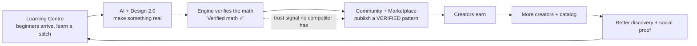
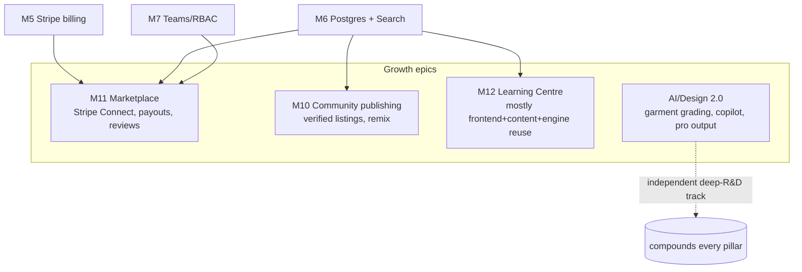

# Loopsy — Product Expansion: Community, Marketplace, AI/Design 2.0 & Learning Centre

> Authored by the CEO / PM / AI Product Architect / Staff Designer agents, reviewed by the
> Principal Reviewer. This is the **growth-stage product strategy** layered on top of the
> hardening + scale roadmap (`docs/roadmap/`). It answers three owner directives:
> (1) make the catalog **community-driven + a marketplace**, (2) the **AI/design USP feels
> basic/childish — make it industry-ready**, and (3) add a **Learning Centre**.
>
> Everything below is anchored to Loopsy's one durable moat: **the Design Spec contract +
> the deterministic verification engine.** A feature only earns a place here if it *compounds*
> that moat. Current-state claims are grounded; new work is **(target)**.

---

## 0. The strategic frame — one flywheel, not three features

These three asks are not separate; they are the three arcs of a single growth loop. The
verification engine is the hub that makes each arc defensible.

**The insight that ties it together:** every other crochet marketplace (Ravelry, Etsy) sells
**unverified PDFs**. Loopsy can be *the only place where every published pattern's stitch math
is machine-verified, and every pattern is a remixable Design Spec rather than a flat PDF.* That
turns the engine from a generation gimmick into a **trust-and-remix layer** for an entire
marketplace — a moat competitors can't copy without rebuilding the engine.

---

## 1. Pillar A — Community Catalog → Marketplace

### 1.1 Today (grounded)
The catalog is **22 seed templates** loaded on first startup (`backend/lib/models/templateModel.js`,
read-only). Users create private patterns/designs; sharing is limited to a public read-only
design page (`/d/:id`). There is **no contribution, no marketplace, no payouts, no discovery
surface** beyond Home's static template grid.

### 1.2 The opportunity
Open the catalog to the community **with the verification engine as the quality gate**, then
layer a marketplace on top.

### 1.3 Feature set (phased)

**Phase A1 — Community publishing (free, verified):**
- "Publish" action on any saved pattern/design → a public **Listing**.
- **Auto-verification gate:** a listing can only be published if it passes `validator.js`
  ("Verified math ✓"). Unverified/experimental specs are clearly labelled or blocked. *This is
  the differentiator — quality is enforced by the engine, not by reviewers.*
- Patterns publish as **Design Specs**, so others can **Fork / Remix / Re-grade / Re-colour** —
  not download a dead PDF. "Make it bigger / in my colours" re-runs the engine.
- Creator profiles, collections, follows, "I made this" project gallery (ties to Tracker
  completions → social proof).
- Discovery: search, categories, trending, "verified", difficulty, yarn-weight filters.

**Phase A2 — Marketplace (paid, payouts):**
- Free or **paid** listings; **Stripe Connect** for creator payouts + platform take-rate
  (revenue *additive* to subscriptions).
- Purchases grant the pattern (and its editable Spec) into the buyer's library/entitlements.
- Ratings/reviews, refunds, sales analytics for creators, storefronts.

**Phase A3 — Social & curation:**
- Curated collections, editorial drops (seasonal), creator tiers, bundles, gifting.

### 1.4 What it needs (architecture)
- **Postgres** (keystone — see roadmap M6): new tables `listings`, `purchases`, `reviews`,
  `collections`, `follows`, `payouts`, `creator_profiles`; `org_id`/`creator_id` scoping.
- **Stripe + Stripe Connect** (extends M5 billing).
- **Search** (FTS → pgvector for "patterns like this").
- **RBAC** (creator role; moderation role) — extends M7.
- **Trust & safety:** moderation/reporting, DMCA + licensing model (each listing carries a
  license: personal-use / sell-finished-items / etc.), content policy.

### 1.5 Why it's defensible
Verified-by-construction patterns + remixable Specs + a verified-maker community. Ravelry has
scale but no verification or generation; LLM tools have generation but no marketplace/trust.

---

## 2. Pillar B — AI + Design 2.0 ("feels basic" → industry-ready)

### 2.1 Honest current-state diagnosis (grounded)
This is the fair critique, and here's *exactly* why it reads childish:

| Area | Today | Why it feels basic |
|---|---|---|
| **Engine vocabulary** | `sphere, ellipsoid, hemisphere, tube, cone, flatPanel, hatCrown, grannySquare, revolve` + flat/medallion colourwork | Makes amigurumi blobs, hats, squares, shields. **No garments, no grading, no cables/lace/texture, no colourwork on 3D forms.** |
| **AI generation** | One-shot Haiku→Spec→Sonnet | No conversation/refinement; narrow intent; can't iterate "make the ears longer." |
| **Design Canvas** | 2D drag-resize "blobs" + a smooth lathe 3D preview | Looks like a toy, not a CAD tool. No stitch-level render, no reference overlay, no history/layers, no measurement-driven sizing. |
| **Output** | Plain-text row list | Real designers expect **charts, schematics, graded sizes, photoreal renders, branded printable PDF**. |

The moat (computed, verified math) is real — but it's pointed at *toys*. Industry-ready means
pointing the same rigor at **garments and pro-grade output.**

### 2.2 Upgrades (grouped; all still computed + validated — the LLM never invents counts)

**B1 — Engine vocabulary (the deep moat work, highest value):**
- **Garment construction + size grading** *(flagship)* — sweaters, cardigans, beanies,
  accessories generated to **measurements + gauge**, graded across sizes (XS–XXL). This single
  capability is the jump from "cute" to "a tool you'd sell patterns from."
- **Stitch/texture pattern library** — cables, bobbles, ribbing, textured repeats as
  parameterized patterns the compiler understands and the validator can check.
- **Lace / openwork** — charted, with verified stitch+chain counts.
- **Colourwork integrated into 3D** — tapestry/intarsia on amigurumi, stranded yokes (today
  colourwork is flat/medallion only).
- **Richer shaping** — short rows, smarter limb/appendage joins, anatomical curves.
- **Gauge & yarn intelligence** — yarn substitution, yardage estimation, gauge-swatch calculator.

**B2 — AI quality:**
- **Conversational Copilot** (multi-turn) that edits the Spec — "longer ears," "add stripes,"
  "make it newborn size" — engine recomputes + re-verifies each turn.
- **Stronger intent parsing** + reference-image-guided design (beyond the single-shot Vision Studio).
- **Calibration from real data** — difficulty/time estimates learned from actual Tracker
  completion data (we have it).

**B3 — Design Canvas → pro editor:**
- **Stitch-level 3D rendering** (real stitch geometry + PBR yarn) instead of a smooth lathe.
- Reference-image overlay, symmetry/mirror tools, **undo/redo history**, layers, multi-part
  assembly intelligence, **measurement-driven sizing**, posing.

**B4 — Output quality (half the "pro" feeling is presentation):**
- Auto **stitch charts/diagrams**, **schematics with measurements**, **photoreal renders**,
  **branded printable/exportable PDF**, **multiple graded sizes**, and animated/video stitch guidance.

### 2.3 The guardrail (non-negotiable)
Every upgrade routes through **Design Spec → engine → validator**. As vocabulary grows
(garments, lace, cables), the **test suite + validator must grow with it** — that's what keeps
"Verified math ✓" honest and is the moat. No LLM-computed counts, ever.

### 2.4 Sequencing within B
Garment grading (B1) is the flagship and the hardest R&D. Copilot (B2) and pro output (B4) are
high-impact and partially independent. Canvas polish (B3) is continuous.

---

## 3. Pillar C — Learning Centre

### 3.1 Today (grounded)
There's an **AI Tutor** (step Q&A in Tracker), a **StitchTooltip** + `crochetAbbreviations.js`
glossary, a beginner path on Home, and `users.skillLevel`. There is **no structured learning
hub, no stitch library, no courses.**

### 3.2 Feature set
- **Stitch Library** — every stitch with animation/video + written steps + *the engine's own
  definition*; searchable; deep-links from any pattern step (extends StitchTooltip).
- **Technique guides & Courses / Learning Paths** — by skill level, with progress + badges,
  driving `users.skillLevel` progression.
- **Interactive, learn-by-doing lessons** — a lesson **generates a practice swatch** (a real
  Design Spec) you **track in the Tracker** and the **AI Tutor** coaches you through. This reuses
  the entire engine + tracker + tutor — high leverage, low new infra.
- **Glossary, gauge/measurement tutorials, "read a chart" trainer**, community Q&A.

### 3.3 Strategic role
- **Top-of-funnel + SEO** (evergreen content ranks; beginners are the largest segment).
- **Retention** (a reason to return between projects).
- **The on-ramp of the flywheel:** learner → maker → creator → marketplace supply.

---

## 4. How this maps onto the existing roadmap

These are **new epics M10–M12** that sit *on top of* the platform roadmap; they share its
dependencies, so they're cheap once the keystones land.

- **Learning Centre (M12)** is the **least-blocked** — it mostly reuses the engine + tracker +
  tutor + existing content, so it can start early and drive funnel/retention while the platform
  hardens.
- **Community publishing (M10)** needs Postgres + verification gate (the engine already exists).
- **Marketplace (M11)** needs Stripe Connect (extends M5) + RBAC (M7) + moderation.
- **AI/Design 2.0** is an independent **deep-R&D track** that raises the ceiling of everything —
  it's the long-term differentiator and should be staffed continuously.

---

## 5. Prioritization (RICE — directional)

| Initiative | Reach | Impact | Confidence | Effort | RICE | Notes |
|---|---|---|---|---|---|---|
| **Learning Centre v1** (stitch library + courses + practice-swatch lessons) | High | High | High | Med | **High** | Funnel + retention + SEO; reuses engine/tracker/tutor; least blocked. |
| **AI Copilot** (conversational spec refine) | High | High | Med | Med | **High** | Fixes the #1 "feels basic" complaint directly; reuses pipeline. |
| **Pro output** (charts/schematics/graded PDF) | High | High | Med | Med | **High** | Presentation is half the "industry-ready" perception. |
| **Community publishing** (verified, free) | Med | High | Med | Med | **High** | Unlocks the flywheel; the verification gate is the USP. |
| **Garment construction + grading** | Med | Very High | Low | High | **Med** | The flagship moat extension, but hardest R&D; stage it. |
| **Marketplace + payouts** (Stripe Connect) | Med | High | Med | High | **Med** | Revenue; needs trust/safety + compliance. |
| **Stitch/texture + lace vocabulary** | Med | High | Low | High | **Med** | Deepens the moat; grow validator/tests in lockstep. |

**Recommended near-term order:** **Learning Centre v1 + AI Copilot + Pro output** first (high
impact, mostly reuse existing engine, drive retention and directly answer "feels basic"), then
**Community publishing (verified)** to ignite the flywheel, then **Marketplace** and the deep
**garment-grading** R&D in parallel.

---

## 6. Risks & honest caveats
- **Engine 2.0 is real R&D**, not config. Garment grading and lace are genuinely hard math; the
  value is precisely that they stay *verified*. Each new construction needs new `lib/engine`
  modules **and** new `test/` coverage before it ships. Don't let the LLM paper over gaps.
- **Marketplace = operational surface:** payments/payouts (Connect, tax), moderation, IP/licensing,
  refunds, fraud. This is a business, not just a feature.
- **Learning content has production cost** (videos/animations) — but the interactive
  practice-swatch format is cheap because it reuses the product.
- **Dependencies:** none of M10/M11 ship meaningfully before **Postgres (M6)** and **Stripe (M5)**.
  Learning Centre and the AI/Design upgrades are the parts you can start **without** waiting on infra.

---

**Reviewed by: CEO / Principal Reviewer / PM / AI Product Architect / Security Architect.**
Open questions for the owner: (1) marketplace take-rate + free-vs-paid policy; (2) how far to
push garment grading in v1 (one category, e.g. beanies/sweaters, vs broad); (3) build vs license
the learning video content; (4) moderation model (auto-verify gate only, or human review for paid).
