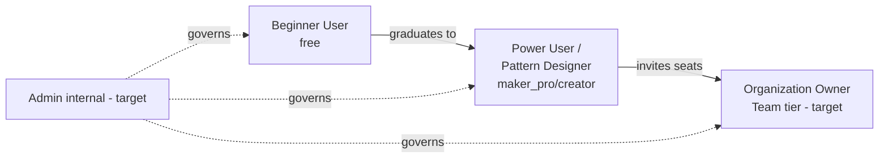

# Loopsy — Personas (Phase 3)

> **Legend:** **(current)** = served by shipped functionality today; **(target)** =
> depends on unbuilt work (Stripe billing M5, teams/orgs/RBAC, admin tooling).
> Grounded in the codebase as of 2026-06-20.

| Persona | Status | Tier mapping |
|---|---|---|
| Beginner User | **current** | `free` |
| Power User / Pattern Designer | **current** | `maker_pro` / `creator` |
| Admin (internal) | **target** | internal (no UI yet; DB + audit log only) |
| Organization Owner | **target** | Team tier (needs M5 billing + orgs/RBAC) |

---

## 1. Beginner User — "Maya" **(current)**

**Demographics.** 24–45, hobbyist, found Loopsy via TikTok/Pinterest. Low-to-no
pattern-reading confidence; intimidated by stitch math and gauge. On her phone as
much as her laptop.

**Goals.**
- Make a specific cute thing (an amigurumi animal, a beanie, a coaster) without
  decoding dense pattern jargon.
- Trust that the counts are right so her project doesn't end lopsided.
- Not get lost mid-row.

**Frustrations.**
- AI chatbots confidently produce patterns that **don't add up**.
- Store-bought PDFs can't be resized to her yarn or hook.
- "Gauge," "even distribution of increases," and grading feel like gatekeeping.

**Usage patterns.**
- Enters via the **Text** front door ("a small orange fox, worsted yarn") or the
  **Vision Studio** photo trial.
- Leans on **Crochet Mode** and the **AI Tutor** while stitching.
- Mobile-first (bottom tab bar); short, frequent sessions.

**Key actions.**
- `POST /api/ai/generate-pattern`, uses her **1 lifetime Vision trial**, runs the
  **Tracker** row-by-row, asks the AI Tutor up to **3** questions (free plan).
- Hits free limits (gen=3 / tutor=3) → encounters the upgrade hook.

**JTBD.** *"When I have a crochet idea but no confidence in the math, I want a
pattern I can trust and follow step-by-step, so I can finish a project I'm proud of
without feeling like I need to be an expert first."*

---

## 2. Power User / Pattern Designer — "Devon" **(current)**

**Demographics.** 28–55, sells on Etsy / runs a small pattern shop or a craft
following. Comfortable with gauge, grading, and colourwork. Values precision and
speed; will pay to remove friction.

**Goals.**
- Prototype original designs fast and **grade** them across sizes/yarns.
- Produce **trustworthy, verified** patterns to sell or publish.
- Design shapes and colourwork visually instead of doing the math by hand.

**Frustrations.**
- Manual grading and increase/decrease distribution is slow and error-prone.
- Existing tools either generate (and hallucinate) or chart (and don't generate).
- Wants the **editable Design Spec**, not a black-box one-shot.

**Usage patterns.**
- Lives in the **Design Canvas** (`/design`): **Build** (shapes + Sculpt/revolve +
  live 3D) and **Draw** (colourwork chart / medallion).
- Edits the **Design Spec** chips directly; uses `POST /api/ai/generate-from-spec`
  and `POST /api/design/preview` for fast no-save iteration.
- Heavy generation volume; relies on the **Verified math ✓** badge as a sales/trust
  signal; **shares** finished work at `/d/:id`.

**Key actions.**
- Canvas Build/Draw → preview → compile; persist designs (`/api/designs`); generate
  charts (`POST /api/ai/generate-chart`); unlimited tutor on paid plans.
- Hits **maker_pro** gen cap (30/mo) → upgrades to **creator** (∞).

**JTBD.** *"When I'm designing a pattern to share or sell, I want to shape it
visually and have the exact counts computed and verified for me, so I can ship
professional, make-able patterns faster than doing the math by hand."*

---

## 3. Admin (internal) — "Sam" **(target)**

> **Status (target).** There is **no admin UI** today. The substrate exists — the
> `audit_log` (append-only privileged/destructive actions), soft-delete
> (`deletedAt`) on patterns/designs, the `analytics` table, and per-user `ai_usage`
> — but role-gated tooling is **not built**.

**Demographics.** Internal operator / founding engineer wearing a support + trust
& safety + ops hat.

**Goals.**
- Investigate and resolve account/abuse/billing issues.
- Read the audit trail; recover soft-deleted patterns/designs.
- Adjust a user's plan/seats (today: manual DB edits; **target:** an admin panel).
- Watch AI usage, costs, and limits.

**Frustrations (today).**
- Plan changes and recoveries require direct DB access — no guardrails, no UI.
- **No Sentry/metrics/tracing (target)** → limited operational visibility.
- No RBAC means "admin" is implicit, not enforced in app code.

**Usage patterns (target).**
- An admin console over `audit_log`, `ai_usage`, `analytics`; soft-delete recovery;
  impersonation/support tooling; plan/seat management once **M5 billing** lands.

**Key actions (target).**
- View audit trail, restore soft-deleted records, set plans/seats, inspect usage,
  action abuse reports.

**JTBD.** *"When something goes wrong for a user or the system, I want governed,
auditable tools to investigate and fix it, so I can keep accounts safe and the
platform trustworthy without hand-editing the database."*

---

## 4. Organization Owner — "Priya" **(target)**

> **Status (target).** The Team tier requires **teams/orgs/RBAC** and **M5 Stripe
> billing**, both unbuilt. Today the closest analog is the `creator` (∞) plan for a
> single user, provisioned by manual DB edit.

**Demographics.** Runs a craft studio, a small pattern-publishing brand, or a
teaching program. Manages a handful of designers/students. Buys seats, owns the
account, cares about consistency and IP.

**Goals.**
- Provision **seats** and **roles** for designers/students under one workspace.
- Standardize on verified patterns across the team; share a library.
- Centralized billing and entitlement, not N individual subscriptions.

**Frustrations (anticipated).**
- No way to invite teammates, assign roles, or share a workspace today.
- No org-level billing; entitlement is per-user only.
- No shared/searchable pattern library (**global search is target**).

**Usage patterns (target).**
- Creates an org, invites members, assigns roles (owner/designer/viewer), manages
  seats + billing centrally, governs a shared design library.

**Key actions (target).**
- Org creation, seat/role management, centralized billing (M5), shared-library
  governance, member audit visibility.

**JTBD.** *"When I run a team that designs crochet patterns together, I want one
workspace with seats, roles, and shared verified patterns, so my designers
collaborate consistently and I manage access and billing in one place."*

---

## Persona → capability matrix

| Capability | Beginner | Power/Designer | Admin (target) | Org Owner (target) |
|---|:--:|:--:|:--:|:--:|
| Text generation | ✅ (3) | ✅ (30 / ∞) | — | ✅ |
| Vision Studio | ✅ (1 lifetime) | ✅ | — | ✅ |
| Design Canvas (Build/Draw/3D) | ⚠️ light | ✅ core | — | ✅ |
| Tracker + Crochet Mode + AI Tutor | ✅ (tutor 3) | ✅ (tutor ∞) | — | ✅ |
| Share pages `/d/:id` | ✅ | ✅ | — | ✅ |
| Audit log / soft-delete recovery | — | — | ✅ (target) | ⚠️ member-scoped (target) |
| Seats / roles / RBAC | — | — | ✅ governs (target) | ✅ owns (target) |
| Centralized billing | — | per-user (M5 target) | ✅ (target) | ✅ (target) |

---

### Reviewed by: Principal Reviewer / Security Architect / PM — sign-off & open questions

- **Principal Reviewer — sign-off:** Approved. Current personas map cleanly to
  shipped front doors and `planLimits.js` tiers; target personas are honestly
  labeled. *Open:* validate that "Power User" and "Pattern Designer" shouldn't be
  split into two personas as the marketplace thesis (target) matures.
- **Security Architect — sign-off:** Approved with emphasis: the **Admin** persona is
  **(target)** and must ship with **enforced RBAC**, not implicit DB access — the
  `audit_log` exists but app-level role checks do not. Org Owner introduces
  multi-tenant data isolation requirements (per-user scoping exists for
  patterns/progress; org scoping does not). *Open:* tenancy model (row-level org_id
  vs. separate schemas) before any Team build.
- **PM — sign-off:** Approved. *Open questions:* (1) Does the Org Owner JTBD justify
  Team tier before marketplace, or after? (2) Should the Admin console predate Org
  Owner (it governs all personas and unblocks support today)? (3) What's the
  minimum RBAC role set for v1 of Teams?
