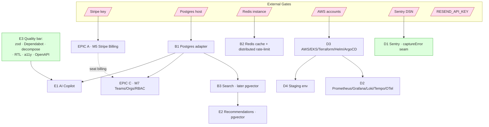
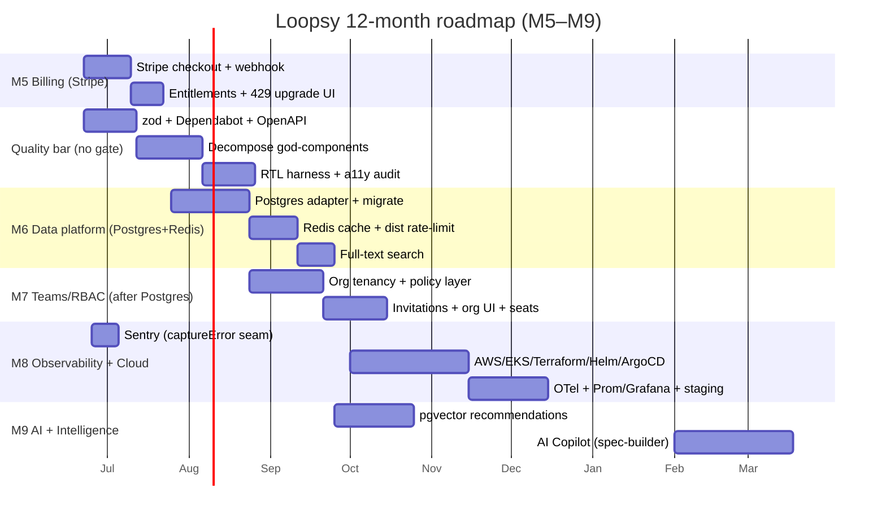

# Loopsy — Execution Roadmap (Phase 15)

> **Owner:** CEO / Product / Principal Reviewer agents
> **Status:** Forward-looking plan. M1–M4 + the hardening pass are **shipped** (see
> ground truth below). This document sequences everything that is **not yet built**.
> **Companion:** [`02-implementation-pr-plan.md`](./02-implementation-pr-plan.md) turns
> these epics into an ordered, reviewable PR queue.

---

## 0. Where we are (ground truth)

**Shipped — the product moat.**

- **M1 Templates → M2 Compiler:** the deterministic geometry engine (`backend/lib/engine/*`).
  Stitch counts are *computed, never guessed*. The `validator.js` independently re-derives
  every count and earns the "Verified math ✓" badge.
- **M3 Vision Studio:** photo → confidence-scored Design Spec → editable chips → the same compiler.
- **M4 Design Canvas:** Build (primitive shapes + Sculpt/revolve + live 3D) and Draw
  (colourwork grid → flat or worked-in-the-round medallion).
- **The Design Spec is the single contract** every front door (text, photo, canvas) produces;
  the engine owns all arithmetic.

**Shipped — the hardening pass.**

- Engine `node:test` suite (27 tests, `backend/test/`) + CI (`.github/workflows/ci.yml`).
- Structured logger (`captureError`/`requestId` seams), online SQLite backup.
- Full mobile-responsive UI (bottom tab bar, `dvh`, safe-area insets).
- **P0 security:** login/signup throttling (`rate_limits` table), security headers, strict CSP,
  CORS hardening, CSRF origin-check, email verification + password reset (provider-agnostic mailer),
  soft-delete + `audit_log`, config validation.
- a11y baseline (focus traps, skip link, dialog roles), frontend `node:test` suite,
  Vite bundle splitting, cookie rename.

**The clean seams that make the forward work cheap.**

| Seam | Location | Unlocks |
|---|---|---|
| Entitlements centralized | `backend/lib/utils/planLimits.js` | M5 Stripe (drop in keys + webhook) |
| Models isolate SQL | `backend/lib/models/*` | Postgres migration (swap the adapter, not call-sites) |
| Engine is DB-agnostic & pure | `backend/lib/engine/*` | survives every infra change untouched |
| 429 upgrade hook exists | route layer + `planLimits` | billing CTA already wired |
| Logger error/requestId seams | `backend/lib/logger.js` | Sentry/OTel drop-in |

---

## 1. Epic → Feature → Task hierarchy

Five epics. Each maps to a milestone (M5–M9). Tasks are sized for a single reviewable PR
(cross-referenced to `02-implementation-pr-plan.md`).

### EPIC A — Monetization (Milestone **M5: Stripe Billing**)

> *Independent of all infra epics. Gated only on a Stripe key. Highest revenue leverage.*

- **A1. Stripe integration**
  - A1.1 Add `stripe` SDK + `STRIPE_SECRET_KEY`/`STRIPE_WEBHOOK_SECRET` to config validation.
  - A1.2 `POST /api/billing/checkout` → Checkout Session for `maker_pro` / `creator`.
  - A1.3 `POST /api/billing/webhook` → verify signature, upsert `subscriptions` row, write `audit_log`.
  - A1.4 `POST /api/billing/portal` → Stripe Customer Portal session.
- **A2. Entitlement enforcement**
  - A2.1 Map Stripe price IDs → plan strings consumed by `planLimits.PLAN_LIMITS`.
  - A2.2 Handle `customer.subscription.updated/deleted` → downgrade/grace logic.
  - A2.3 Idempotent webhook processing (store `stripe_event_id`, dedupe).
- **A3. Billing UI**
  - A3.1 `/account` plan card → upgrade CTA → Checkout.
  - A3.2 Wire the existing **429 upgrade hook** to the Checkout flow.
  - A3.3 Manage-subscription button → Customer Portal.

### EPIC B — Data Platform (Milestone **M6: Postgres + Redis**)

> *The scaling-ceiling removal. Postgres is the keystone dependency — it blocks Teams/RBAC and Search.*

- **B1. Postgres adapter**
  - B1.1 Introduce a DB-driver abstraction behind `lib/db/index.js` (keep SQLite for local/test).
  - B1.2 Port schema + idempotent migrations to Postgres dialect (`docs/database/02-target-postgres.md`).
  - B1.3 Rewrite `lib/models/*` queries against the adapter (parameterized; no call-site changes elsewhere).
  - B1.4 Data backfill/export script (SQLite → Postgres) + dual-read verification.
  - B1.5 Connection pooling (pgBouncer or `pg.Pool`).
- **B2. Redis**
  - B2.1 Cache adapter (template reads, `/api/me`, design previews) behind an interface.
  - B2.2 Move rolling-window rate limits from `rate_limits` table → Redis (distributed, atomic).
  - B2.3 Session store option (keep cookie sessions; Redis as the lookup backplane).
- **B3. Search**
  - B3.1 Postgres full-text search over patterns/templates/designs (`GET /api/search`).
  - B3.2 (Later) pgvector for semantic search — feeds AI Copilot/Recommendations.

### EPIC C — Multi-tenancy (Milestone **M7: Teams / Orgs / RBAC**)

> *Blocked-on: Postgres (B1). Needs a relational tenancy model + a central policy layer.*

- **C1. Tenancy model** — `orgs`, `org_members`, `org_id` FK on `patterns`/`designs`/`progress`.
- **C2. RBAC** — roles (`owner`/`admin`/`member`/`viewer`); a single `can(user, action, resource)`
  policy module (do **not** scatter entitlement checks — CLAUDE.md rule).
- **C3. Invitations** — invite tokens (reuse `email_tokens` pattern), accept/join flow.
- **C4. Org-scoped UI** — org switcher, shared library, seat-based billing tie-in to M5.

### EPIC D — Observability & Cloud (Milestone **M8: Sentry + OTel + AWS**)

> *Sentry is unblocked-now (DSN). The full Prometheus/Grafana/Loki/Tempo stack is blocked-on AWS.*

- **D1. Error tracking** — wire Sentry into the logger `captureError` seam (front + back). *Unblocked.*
- **D2. Tracing/metrics** — OpenTelemetry SDK → OTLP; Prometheus metrics; Grafana/Loki/Tempo dashboards.
- **D3. Cloud infra** — AWS accounts, EKS, Terraform (network/RDS/Redis), Helm charts, ArgoCD GitOps.
- **D4. Environments** — a real **staging** environment mirroring prod; promote-on-green.

### EPIC E — Intelligence & Quality (Milestone **M9: AI Copilot + Quality bar**)

> *AI layer leans on Search (B3) + Postgres (B1). Quality tasks are unblocked-now.*

- **E1. AI Copilot** — conversational design assistant that emits Design Specs (engine still owns math).
- **E2. Recommendations** — "patterns like this" via pgvector embeddings.
- **E3. Quality bar (all unblocked-now):**
  - E3.1 zod validation at every route edge.
  - E3.2 Dependabot + `npm audit` gate in CI.
  - E3.3 Decompose god-components — `Create.jsx` (729), `Tracker.jsx` (682), `VisionStudio.jsx` (411).
  - E3.4 React component test harness (RTL + jsdom).
  - E3.5 Full a11y heading-order + contrast audit.
  - E3.6 OpenAPI spec generated from the route catalog.
  - E3.7 MFA, secrets manager, broader input validation.

---

## 2. Dependency graph

**Reading the graph**

- **Postgres-adapter (B1) is the keystone** — it blocks Teams/RBAC (C) and Search (B3 → E2).
- **Redis (B2)** blocks distributed rate-limiting (it works today via the `rate_limits` table; Redis is the *scale-out* upgrade).
- **AWS (D3)** blocks the full observability stack (D2) and a real staging env (D4).
- **Stripe (A)** is fully independent — ship it first for revenue.
- **The Quality bar (E3)** and **Sentry (D1)** have **no external gate** — start immediately.

---

## 3. Milestones M5–M9

| Milestone | Theme | Exit criteria | Gating dependency |
|---|---|---|---|
| **M5** | Stripe Billing | Live Checkout + webhook upserting `subscriptions`; 429 hook → upgrade; plans enforced via `planLimits` | Stripe key |
| **M6** | Postgres + Redis | Prod on Postgres via `lib/models` adapter, zero call-site changes; Redis cache + distributed rate-limit; FTS search | Postgres host, Redis instance |
| **M7** | Teams / Orgs / RBAC | Org tenancy + central `can()` policy; invitations; org-scoped library; seat billing | **M6 (Postgres)** |
| **M8** | Observability + Cloud | Sentry live; OTel traces + Prom/Grafana/Loki/Tempo; EKS via Terraform/Helm/ArgoCD; staging | Sentry DSN (D1 now); AWS (rest) |
| **M9** | AI Copilot + Quality | Conversational spec-builder; pgvector recommendations; quality bar (zod/RTL/a11y/OpenAPI) green | **M6 + M8 (Search)** |

---

## 4. Time-boxed roadmap

> Engineering-driven dates. Each window names the **gating external dependency**.
> Unblocked work is front-loaded so external procurement never stalls the team.

### 30 days — "Revenue + Quality floor" (no external blocker except Stripe)

- **M5 Stripe Billing** end-to-end (Checkout, webhook, portal, 429 → upgrade). *Gate: Stripe key.*
- Quality bar kickoff (all unblocked): **zod at route edges**, **Dependabot + npm audit in CI**,
  decompose `Create.jsx`, **RTL+jsdom harness**, **OpenAPI spec**.
- **Sentry** wired into the `captureError` seam. *Gate: Sentry DSN (cheap/instant).*
- **Exit:** first paid subscription processed; CI fails on vulnerable deps; error visibility live.

### 90 days — "Remove the scaling ceiling" (gate: Postgres host + Redis instance)

- **M6:** Postgres adapter behind `lib/db` + `lib/models`; migrate prod with dual-read verification;
  Redis cache + distributed rate-limit; Postgres full-text **search**.
- Finish decomposition (`Tracker.jsx`, `VisionStudio.jsx`); **a11y heading/contrast audit**.
- **Exit:** SQLite single-writer ceiling gone; horizontal scale possible; search shipped.

### 6 months — "Multi-tenant + observable + cloud" (gate: AWS accounts)

- **M7 Teams/Orgs/RBAC** on Postgres with the central policy layer; seat-based billing.
- **M8:** AWS/EKS via Terraform/Helm/ArgoCD; **staging** env; OTel + Prom/Grafana/Loki/Tempo.
- Security depth: **MFA**, secrets manager, broader validation.
- **Exit:** teams can collaborate; full-fidelity tracing; promote-on-green from staging.

### 12 months — "Intelligence layer" (gate: Search/pgvector from M6)

- **M9 AI Copilot** (conversational spec-builder — engine still owns all arithmetic) +
  **pgvector recommendations** + semantic search.
- Platform polish: cost controls, SLOs/error budgets, design-system 2.0 rollout.
- **Exit:** AI assistant drives creation; "patterns like this" recommendations; enterprise-ready.

---

## 5. Gantt

---

## 6. Risks & guardrails

- **Never let an LLM compute stitch counts** (CLAUDE.md #10). M9 Copilot emits *Design Specs*; the engine arithmetic stays untouched.
- **Engine tests are the moat** — the 27-test `node:test` suite must stay green through every PR, especially the Postgres migration (the engine is DB-agnostic, so it should not even need touching).
- **No blind refactors** — decomposition PRs preserve behavior and ship behind the existing frontend test suite + new RTL coverage.
- **Centralize entitlements/policy** — RBAC `can()` and Stripe plan mapping live in one module each; no scattered checks.
- **Idempotent migrations** — Postgres migrations follow the existing swallow-duplicate-column discipline (parallel Next build workers).

---

**Reviewed by: CEO / Principal Reviewer / PM**
