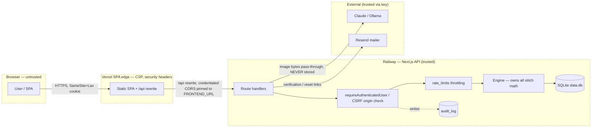

# Loopsy — Security Remediation Plan

> Prioritized backlog for the live web product. **P0 items already shipped** in
> the recent hardening pass and are listed for completeness/regression-guarding.
> P1 / P2 are outstanding. Billing items are **[TARGET]** (M5 not built).
>
> Companion to `01-owasp-review.md`.

Severity: 🔴 High · 🟠 Medium · 🟡 Low. Effort: S (<1d) · M (1–3d) · L (>3d).

---

## P0 — Done this pass (regression-guard only)

| Item | Sev | Gap it closed | Fix shipped | Evidence |
|------|-----|---------------|-------------|----------|
| Password hashing | 🔴 | Weak/plaintext storage | scrypt + 16-byte salt + `timingSafeEqual` | `backend/lib/auth/session.js:13-25` |
| Login/signup throttling | 🔴 | Credential stuffing / brute force | DB rolling windows, cleared on success | `lib/models/rateLimitModel.js` |
| Account enumeration | 🟠 | Distinguishable login/forgot responses | Identical 401 / generic forgot reply | login + forgot handlers |
| CSRF defense-in-depth | 🟠 | Only SameSite | `isCrossSiteRequest()` origin allowlist | `lib/auth/request.js:82` |
| Security headers | 🟠 | Missing nosniff/frame/HSTS | Header set on API + SPA | `next.config.js:10-16`, `vercel.json:16-20` |
| Strict CSP | 🟠 | Inline-script XSS surface | `script-src 'self'`; external theme-init | `frontend/vercel.json:14` |
| CORS pinning | 🟠 | Wildcard + credentials risk | Pinned to `FRONTEND_URL`, no `*` | `next.config.js:24-30` |
| Hashed single-use tokens | 🟠 | Verify/reset token replay | SHA-256-hashed expiring tokens | `emailTokenModel` |
| Soft-delete + audit | 🟡 | Unrecoverable deletes / no trail | `deletedAt` + append-only `audit_log` | `auditModel` |
| Boot config validation | 🟡 | Silent misconfig | `validateConfig()` loud-on-missing | `lib/config.js:15` |

---

## P1 — Next (outstanding)

| Item | Sev | Current gap | Fix | Effort | Dependency |
|------|-----|-------------|-----|--------|------------|
| Central `can(user,action,resource)` policy + RBAC | 🔴 | Per-handler checks; no single decision point; no roles | Introduce a policy module + role model; route guards delegate to it | L | Precedes Team/Admin & SOC 2 |
| Dependabot + `npm audit` in CI | 🔴 | No supply-chain gate (A06) | Add Dependabot config + `npm audit --omit=dev` step in `ci.yml` | S | — |
| `zod` input validation at route edges | 🟠 | Hand-rolled/missing edge validation (A04) | Validate request bodies/params with `zod` schemas per route | M | — |
| Sentry + alerting | 🟠 | No error monitoring / anomaly alerts (A09) | Wire Sentry; alert on lockouts, `auth.cross_site_blocked`, 5xx | M | Retained log store |
| Rotate session on password change | 🟠 | Stolen session survives reset | Invalidate all sessions for the user on reset/change | S | — |
| MFA for elevated roles | 🟠 | No second factor | TOTP enrollment for Admin/Team first, then opt-in for all | L | RBAC (roles) |
| Full double-submit CSRF token | 🟠 | Header-trust only beyond SameSite | Issue + verify a per-session CSRF token on state-changing POSTs | M | — |

---

## P2 — Hardening (outstanding)

| Item | Sev | Current gap | Fix | Effort | Dependency |
|------|-----|-------------|-----|--------|------------|
| Secrets manager (AWS) + rotation | 🟠 | Env-only secrets, no rotation | Move to AWS Secrets Manager; rotation policy | M | Infra |
| Password pepper / Argon2id eval | 🟡 | scrypt, no pepper | Add KMS-held pepper; evaluate Argon2id migration | M | Secrets manager |
| GDPR/CCPA data export + hard-purge | 🟠 | Soft-delete only | Per-user JSON export endpoint + scheduled purge of `deletedAt` | M | Audit retention |
| Field-level encryption for PII | 🟡 | At-rest = volume only | Encrypt sensitive fields; guarantee volume encryption | M | Secrets manager |
| Tamper-evident audit retention | 🟡 | Audit in app DB | Ship `audit_log` to retained/WORM store | M | Sentry/log infra |
| **[TARGET]** Billing (Stripe M5) security | 🟠 | Not built | Webhook signature verify, idempotency keys, server-side price auth, PCI-SAQ-A scope | L | M5 delivery |

---

## Threat model (STRIDE)

Surfaces: **Auth**, **AI generation** (text/vision → Design Spec → engine),
**Billing [TARGET]**.

| STRIDE | Auth | AI generation | Billing **[TARGET]** |
|--------|------|---------------|----------------------|
| **S**poofing | Stolen session cookie / credential stuffing → *httpOnly+Secure cookie, throttling, no enumeration; **MFA Open*** | Forged request to metered endpoints → *requireAuthenticatedUser + per-user quota* | Spoofed Stripe webhook → *verify signature [TARGET]* |
| **T**ampering | Cookie/token tampering → *opaque 32-byte server-side token; CSRF origin check* | Prompt-injected stitch counts → *engine owns arithmetic; LLM never computes counts (invariant)* | Replayed/altered webhook → *idempotency keys [TARGET]* |
| **R**epudiation | "I didn't do that" → *append-only audit_log (actor/action/ip)* | Disputed generation → *audit_log + usage records* | Disputed charge → *Stripe ledger + audit [TARGET]* |
| **I**nformation disclosure | Enumeration / timing → *identical 401, timingSafeEqual* | Vision photo leakage → **images NEVER stored** invariant; pass-through only* | Card data → *never touch PAN; SAQ-A redirect [TARGET]* |
| **D**enial of service | Login/signup flood → *rate_limits rolling windows* | AI cost-exhaustion → *per-user monthly/lifetime quota (`ai_usage`); vision = 1 free trial* | Webhook flood → *rate limit + idempotency [TARGET]* |
| **E**levation of privilege | Accessing another user's data → *userId scoping; **central authz/RBAC Open*** | Bypassing the metered step → *server-side metering, not client-trusted* | Self-upgrading plan → *server-authoritative entitlements [TARGET]* |

**Top residual risks:** (1) a missed ownership check in a new route — mitigated
only when the central policy layer lands; (2) no MFA on elevated roles; (3) no
runtime alerting to detect an active attack.

---

## Trust-boundary data-flow diagram

**Trust boundaries crossed:** Browser→Edge (CSP/header enforcement),
Edge→Backend (auth + pinned CORS + CSRF origin check + throttling), Backend→DB
(parameterized statements), Backend→Providers (API-key trust; the image
pass-through boundary is where the "never stored" invariant lives).

---

*Reviewed by: Principal Reviewer / Security Architect / Backend Architect*
