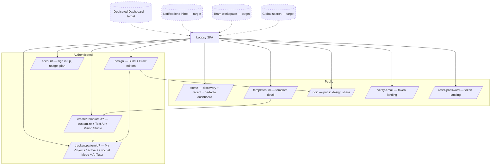
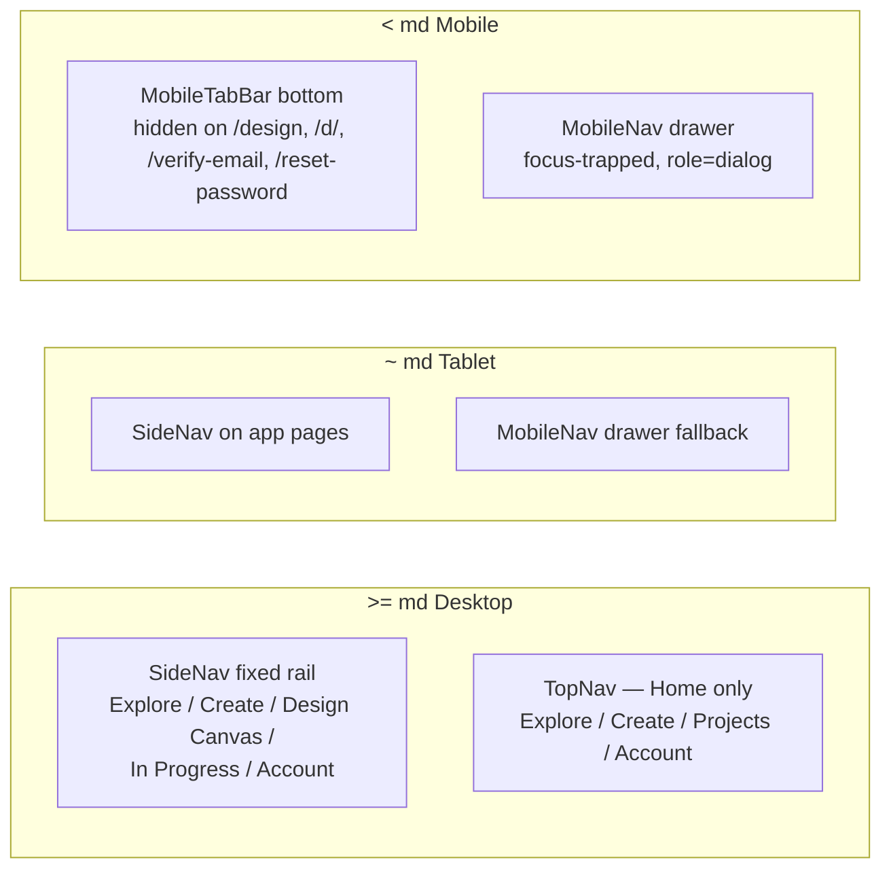
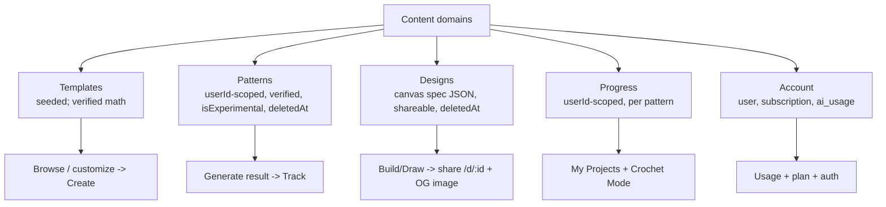

# Loopsy — Information Architecture (Phase 4)

> Grounded against `frontend/src/App.jsx` (routes), `SideNav.jsx`, `TopNav.jsx`,
> `MobileTabBar.jsx`, `MobileNav.jsx`, and page components. Aspirational items
> are labeled **(target)**.

---

## 1. Sitemap

---

## 2. Navigation Architecture per Breakpoint

Navigation is breakpoint-driven (Tailwind `md` = 768px). Grounded in components.

| Breakpoint | Primary nav | Secondary nav | Notes |
|-----------|-------------|---------------|-------|
| **Desktop (≥ md)** | `SideNav` rail on app pages: Explore (`/`), Create (`/create`), Design Canvas (`/design`), In Progress (`/tracker`), Account (`/account`) | `TopNav` shown on **Home only** (Explore / Create / Projects / Account) | SideNav and TopNav use slightly different labels for the same routes (Explore=/, In Progress vs Projects=/tracker). |
| **Tablet (~ md)** | `SideNav` where rendered | `MobileNav` drawer as fallback | Transitional; same routes. |
| **Mobile (< md)** | `MobileTabBar` fixed bottom (Home / Create / Design / Tracker / Account) | `MobileNav` drawer (focus-trapped, `role=dialog`) | TabBar hidden on `/design`, `/d/`, `/verify-email`, `/reset-password` (`MobileTabBar.jsx:20-23`) to give editors/landings full height. |

**IA debt:**
- Label inconsistency across `SideNav` (Explore / In Progress) vs `TopNav` (Explore / Projects) for identical routes.
- No **global search** at any breakpoint **(target)**.
- No **notifications** entry point **(target)**.

---

## 3. Content Architecture

- **Primary content objects:** Template, Pattern, Design, Progress, Account/Usage.
- **Single contract:** all three front doors (text, photo, canvas) produce a **Design Spec**; the engine owns arithmetic (per CLAUDE.md decision 10).
- **Visibility:** Templates and Design shares (`/d/:id`) are public; patterns, progress, and designs are `userId`-scoped. Soft-delete (`deletedAt`) hides without destroying.

---

## 4. Feature Hierarchy

```mermaid
flowchart TD
    L1[L1 Core jobs] --> Discover[Discover & customize templates]
    L1 --> Generate[Generate verified patterns]
    L1 --> DesignF[Design from scratch — Build / Draw]
    L1 --> Track[Track & finish projects]

    Generate --> Text[Text AI — generate-pattern SSE]
    Generate --> Vision[Vision Studio — analyze-image metered]
    Generate --> Spec[generate-from-spec]
    DesignF --> Build[Build: shapes + Sculpt + 3D preview]
    DesignF --> Draw[Draw: colorwork chart / medallion]
    Track --> Crochet[Crochet Mode — row-by-row]
    Track --> Tutor[AI Tutor — per-step help]

    L2[L2 Account] --> Auth[Sign up / in / verify / reset]
    L2 --> Usage[Usage + plan summary]

    L3[L3 Target] -.-> Billing[Stripe checkout + entitlement]
    L3 -.-> Dash[Dedicated dashboard]
    L3 -.-> Notif[Notifications inbox]
    L3 -.-> Teams[Teams / collaboration]
    L3 -.-> GSearch[Global search]
    classDef t stroke-dasharray: 5 5;
    class Billing,Dash,Notif,Teams,GSearch t;
```

| Tier | Features | Status |
|------|----------|--------|
| L1 Core | Discover/customize, Text AI, Vision Studio, Design Build/Draw, Track + Crochet Mode + AI Tutor | Built |
| L2 Account | Auth (signup/verify/reset/login/logout), usage + plan summary | Built |
| L3 Growth | Stripe billing + entitlement, dashboard, notifications, teams, global search | **(target)** |

---

## 5. Permission / Role Matrix

Legend: ✅ allowed · ⚠️ metered/limited · ❌ not allowed · 🔒 **(target)** role/feature not built.

| Resource / Action | Guest | Free Maker | Maker Pro 🔒 | Creator 🔒 | Team Owner 🔒 | Admin 🔒 |
|-------------------|:-----:|:----------:|:-----------:|:----------:|:------------:|:--------:|
| Browse templates / Home / shares | ✅ | ✅ | ✅ | ✅ | ✅ | ✅ |
| View public design `/d/:id` | ✅ | ✅ | ✅ | ✅ | ✅ | ✅ |
| Sign up / sign in | ✅ | n/a | n/a | n/a | n/a | n/a |
| Generate pattern (text) | ❌ | ⚠️ 3/mo | ✅ higher cap | ✅ highest cap | ✅ pooled | ✅ |
| Vision Studio (analyze-image) | ❌ | ⚠️ 1 lifetime trial | ✅ | ✅ | ✅ pooled | ✅ |
| AI Tutor | ❌ | ✅ | ✅ | ✅ | ✅ | ✅ |
| Save / track projects | ❌ | ✅ | ✅ | ✅ | ✅ | ✅ |
| Create / share designs | ❌ | ✅ | ✅ | ✅ | ✅ | ✅ |
| Soft-delete own pattern/design | ❌ | ✅ | ✅ | ✅ | ✅ | ✅ |
| Team shared library / co-edit | ❌ | ❌ | ❌ | ❌ | 🔒 | 🔒 |
| Manage seats / invites | ❌ | ❌ | ❌ | ❌ | 🔒 | 🔒 |
| Manage billing (Stripe) | ❌ | ❌ | 🔒 self | 🔒 self | 🔒 team | 🔒 |
| Admin actions (audit, moderate) | ❌ | ❌ | ❌ | ❌ | ❌ | 🔒 |

Notes:
- **Free Maker** caps (3 generations/mo, 1 lifetime Vision trial) are enforced server-side via `ai_usage` + `rate_limits`; exceeding returns `429 RATE_LIMIT_EXCEEDED`.
- **Maker Pro / Creator** caps are illustrative — tiers exist conceptually but **billing/entitlement is M5 (target)**; today plan upgrades are manual.
- **Team Owner / Admin** rows are entirely **(target)** — no team entity or admin surface in schema yet.
- Privileged/destructive actions already append to `audit_log` (the substrate for future admin/moderation).

---

**Reviewed by: Principal Reviewer / PM** — Sitemap, breakpoint nav, content/feature hierarchy, and role matrix verified against current components and DB scoping. Key IA actions: reconcile SideNav/TopNav label drift, add a dedicated dashboard + global search, and design team-scoped ownership ahead of the M5 billing/teams work (target).
