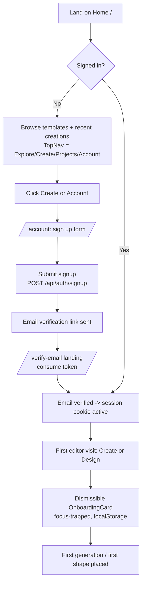
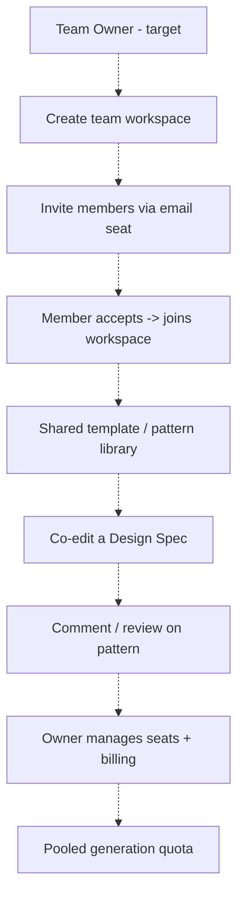

# Loopsy — Journey Maps (Phase 3)

> Grounded against the live SPA (`frontend/src/App.jsx` routes; `SideNav`, `TopNav`,
> `MobileTabBar`, `MobileNav` navigation; `Create.jsx`, `Tracker.jsx`, `VisionStudio.jsx`,
> `Account.jsx` flows). Aspirational steps are labeled **(target)**.

Personas referenced:
- **Guest** — unauthenticated browser of templates/shares.
- **Free Maker** — signed in; 3 generations/mo + 1 lifetime Vision trial.
- **Maker Pro / Creator (target)** — paid tiers; billing not yet built (M5).
- **Team Owner / Member (target)** — collaboration not yet built.

---

## 1. Onboarding Journey



| Stage | Emotion | Pain point | Current vs Target |
|-------|---------|------------|-------------------|
| Land on Home | Curious | Home doubles as dashboard; no "what is Loopsy" hero-to-action funnel for first-timers | Current: discovery feed. Target: role-aware first-run hero + sample pattern. |
| Sign up | Neutral | Verification email gates the loop; if mail provider unset, link is only logged (`lib/email/mailer.js`) | Current: works, but dev/no-provider mode silently logs link. Target: clearer "check your email" state + resend. |
| Verify email | Mild friction | Round-trip out of app, back to `/verify-email` | Current: single-use token landing. OK. |
| First editor | Encouraged | OnboardingCard is the only guidance; no interactive tour | Current: dismissible card. Target: contextual coachmarks on Build/Draw/Vision. |
| First success | Delight | None major — verified-math badge is a strong "aha" | Current: `VerifiedBadge` on result. Keep. |

**Gap:** No guided "first win" path. The product relies on the user self-selecting Create vs Design with only a static OnboardingCard.

---

## 2. Core Usage Journey (idea → Design Spec → verified pattern → track → finish)

```mermaid
flowchart TD
    A[Idea] --> B{Front door}
    B -- Template --> C[/templates/:id -> Create customize/]
    B -- Text --> D[Create: describe in words]
    B -- Photo --> E[Create: Vision Studio upload]
    B -- Design --> F[/design: Build shapes+Sculpt / Draw colorwork/]
    C --> G[Design Spec]
    D --> H[POST /api/ai/generate-pattern SSE<br/>Haiku intent -> engine counts -> Sonnet prose]
    E --> I[POST /api/ai/analyze-image<br/>metered: free=1 lifetime trial]
    I --> J[Confidence-scored chips -> edit]
    F --> K[POST /api/design/preview live compile]
    G --> L[POST /api/ai/generate-from-spec SSE]
    J --> L
    K --> L
    H --> M[Verified pattern<br/>verified flag if validator proves math]
    L --> M
    M --> N[/tracker/:patternId active project]
    N --> O[Crochet Mode<br/>focus-trapped, row-by-row]
    N --> P[AI Tutor: ask about a step]
    O --> Q[Finish project]
```

| Stage | Emotion | Pain point | Current vs Target |
|-------|---------|------------|-------------------|
| Choose front door | Decisive / overwhelmed | Four entry points (template, text, photo, canvas) with no unified "start" picker | Current: split across Create + Design. Target: one "New pattern" chooser. |
| Generate (text) | Anticipation | Streaming SSE is good; failure path returns honest `AI_UNAVAILABLE` but errors surface as toasts only | Current: `aria-live` status region exists. Target: inline retry + error state component. |
| Vision analyze | Hopeful → cautious | Metered (1 lifetime free trial); spending the trial is irreversible and the gate is easy to hit by accident | Current: trial consumed on analyze. Target: explicit "this uses your trial" confirm. |
| Edit chips | In control | Good — confidence scores expose model uncertainty | Keep. |
| Verified pattern | Trust / delight | The verified-math badge is the core value moment | Keep; promote it more in result UI. |
| Track | Focused | `Tracker.jsx` ~682 lines; Crochet Mode is strong but list↔active state is heavy | Current: works. Target: decompose god-component. |
| AI Tutor | Reassured | Tutor is per-step help; discoverability is moderate | Current: present. Target: surface proactively on stuck rows. |

**Gap:** The Design Spec is a clean single contract server-side, but the *user* never sees a unified "this is your spec" review screen across all three doors — text and canvas skip the chip-edit step that Vision gets.

---

## 3. Retention Journey (WIP resume, finish → share → celebrate)

```mermaid
flowchart TD
    A[Return visit] --> B[Home / — recent creations]
    B --> C[/tracker no id = My Projects list]
    C --> D[Animated progress ring per card]
    D --> E[Resume -> active project + Crochet Mode]
    E --> F[Complete final round]
    F --> G[Finish project]
    G --> H{Share?}
    H -- Design --> I[/d/:id public share page]
    I --> J[OG image GET /api/designs/:id/og]
    J --> K[Send link / social]
    H -- No --> L[Project marked done]
    G --> M[Celebrate moment - target]
```

| Stage | Emotion | Pain point | Current vs Target |
|-------|---------|------------|-------------------|
| Return | Habitual | No dedicated dashboard — Home is discovery, `/tracker` is the de-facto "my work" hub | Current: split. Target: real dashboard with continue-where-you-left-off. |
| Resume WIP | Motivated | Good — My Projects cards show progress rings | Keep. |
| Finish | Pride | No explicit completion celebration / milestone | Current: silent done state. **Target: celebration moment.** |
| Share | Generous | Sharing exists for **designs** (`/d/:id` + OG image) but not for **tracked patterns/finished makes** | Current: design share only. Target: share finished projects + photo of result. |
| Re-engage | — | No notifications inbox; nothing pulls a lapsed user back | **Target: notifications + email nudges.** |

**Gap:** The finish → share → celebrate loop is half-built: designs share beautifully, but completing a *project* in the tracker has no celebration and no share-your-make path. No re-engagement surface (notifications/email) exists.

---

## 4. Upgrade Journey (hit free limit → plans → checkout (target) → entitlement → resume)

```mermaid
flowchart TD
    A[Free Maker generating] --> B[4th generation this month]
    B --> C[API 429 RATE_LIMIT_EXCEEDED<br/>Create.jsx:342]
    C --> D[Upgrade hook -> View plans link to /account<br/>Create.jsx:628]
    D --> E[/account: plan summary + usage]
    E --> F{Checkout}
    F -. target Stripe .-> G[Stripe checkout - NOT built]
    G -. target .-> H[Webhook -> subscriptions table]
    H -. target .-> I[Entitlement unlocked]
    F -- today --> J[Manual upgrade only<br/>M5]
    I -. target .-> K[Resume generation]
    J --> K
```

| Stage | Emotion | Pain point | Current vs Target |
|-------|---------|------------|-------------------|
| Hit limit | Frustration | Limit is hit mid-task; the generation that triggered it is lost | Current: 429 + toast + "View plans →". Target: preserve the in-flight prompt across upgrade. |
| See plans | Evaluating | `/account` shows plan summary + usage, but tier comparison is thin | Current: usage display. Target: full plan-comparison + value framing at the moment of need. |
| Checkout | Intent → dead-end | **Billing not built** — Stripe is M5; upgrade is manual today | Current: manual. **Target: Stripe checkout + webhook → `subscriptions`.** |
| Entitlement | — | No automatic unlock since no billing | **Target: webhook-driven entitlement.** |
| Resume | Relief | The blocked action must be re-initiated by hand | **Target: auto-resume the blocked generation.** |

**Gap:** The entire monetization path past the 429 is aspirational. The upgrade *hook* fires correctly and routes to `/account`, but there is no checkout, no automated entitlement, and no resume — all **(target)**.

---

## 5. Collaboration Journey — Team flow (target)

> Teams/collaboration are **not built**. This is the intended shape only.



| Stage | Emotion (anticipated) | Pain point (anticipated) | Current vs Target |
|-------|----------------------|--------------------------|-------------------|
| Create workspace | Organized | No team/org entity in schema today | **Target.** |
| Invite seats | Collaborative | No invite/seat model | **Target.** |
| Shared library | Efficient | `patterns`/`designs` are scoped by `userId` only — no team scope | **Target: add team scoping.** |
| Co-edit spec | Creative | No realtime/multi-user editing on the canvas | **Target.** |
| Comment/review | Aligned | No commenting surface | **Target.** |
| Manage seats/billing | In control | No seat or billing admin | **Target (depends on M5 billing).** |

**Gap:** Entire journey is **(target)**. Prerequisite work: a team/org entity, team-scoped resource ownership, invites/seats, and pooled quota — all gated behind the M5 billing foundation.

---

**Reviewed by: Principal Reviewer / PM** — Journeys validated against current routes and flow code; aspirational stages explicitly labeled (target). Highest-leverage gaps: unified "new pattern" entry, the finish→celebrate→share-your-make loop, and the post-429 monetization path.
