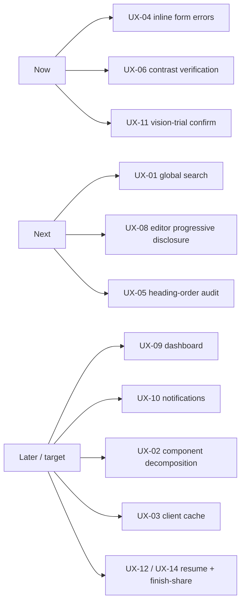

# Loopsy — UX / UI / Accessibility Audit (Phase 2)

> Grounded against `frontend/src/` pages and components. Severity reflects user
> impact × reach. "Status" marks items already fixed vs open. Aspirational
> remediations are labeled **(target)**.

## Severity scale
- **Critical** — blocks a core task or excludes a user class.
- **High** — significant friction / accessibility risk at scale.
- **Med** — noticeable but workaround exists.
- **Low** — polish / consistency.

---

## Findings

| ID | Finding | Severity | Impact | Evidence | Recommendation | Status |
|----|---------|:--------:|--------|----------|----------------|:------:|
| UX-01 | **No global search** across templates, patterns, designs, projects | High | As the library grows, users can't find prior work or templates; forces scroll/recall | No search entry in any nav (`SideNav.jsx`, `TopNav.jsx`, `MobileTabBar.jsx`) | Add global command-style search over templates + user patterns/designs (target) | Open |
| UX-02 | **God-components** raise change-risk and slow load | Med | Harder to maintain; large render trees; couples error/empty states to page logic | `Create.jsx` ~729 lines, `Tracker.jsx` ~682, `VisionStudio.jsx` ~411 | Decompose into feature subcomponents (generation panel, project list/active, vision steps) | Open |
| UX-03 | **No client-side cache** — every page raw-fetches | Med | Repeated fetches on nav; flashes of loading; wasted requests on back/forward | Pages fetch on mount with no shared cache layer (no query/cache lib in `frontend/src`) | Introduce a fetch cache / query layer; cache templates + project list | Open |
| UX-04 | **Form errors are toast-only**, not tied to fields | High | Screen-reader and keyboard users lose error↔field association; transient toasts vanish | Auth/generation errors surface via `Toast.jsx`; no `aria-describedby` on inputs | Add inline field errors with `aria-describedby` + `aria-invalid`; keep toast as secondary | Open |
| UX-05 | **Heading-order audit incomplete** | Med | Inconsistent `h1→h6` hierarchy hurts SR navigation and SEO | Not yet audited across pages (per a11y backlog) | Run full heading-order pass; one `h1` per page, no skips | Open |
| UX-06 | **Color-contrast tokens unverified** | High | Theme tokens may fail WCAG AA (esp. muted/`on-surface-variant` text) | Tailwind v4 token palette not contrast-checked | Verify all text/bg token pairs ≥ 4.5:1 (3:1 large); fix failing tokens | Open |
| UX-07 | **Missing empty/error states** in places | Med | Empty My Projects / failed loads can read as blank or broken | `Tracker.jsx` list, fetch failure paths | Add explicit empty-state + retryable error components | Open |
| UX-08 | **Cognitive load on Design editor** (Build shapes + Sculpt + 3D + Draw colorwork) | High | First-timers face many tools at once; OnboardingCard is the only scaffold | `Design.jsx` (Build/Draw), `OnboardingCard.jsx` dismissible | Progressive disclosure + contextual coachmarks; default to a simple starting state | Open |
| UX-09 | **No dedicated dashboard** — Home doubles as discovery + dashboard | Med | Returning users lack a "continue where I left off" home | `Home.jsx` is discovery feed; `/tracker` is de-facto work hub | Add a role-aware dashboard (WIP, recent, quota) (target) | Open |
| UX-10 | **No notifications inbox** | Med | No re-engagement / completion / share-back signals; lapsed users get no nudge | No notifications surface in routes or nav | Add notifications inbox + email nudges (target) | Open |
| UX-11 | **Vision trial is easy to spend by accident** | High | 1 lifetime free trial consumed on first analyze with no confirm; irreversible for free users | `VisionStudio.jsx` analyze flow; metered `analyze-image` | Add an explicit "this uses your 1 free trial" confirm before metered call | Open |
| UX-12 | **Rate-limit (429) loses in-flight work** | Med | Hitting the cap mid-generation discards the prompt; upgrade path doesn't resume it | `Create.jsx:342` (429 handling) → `Create.jsx:628` View plans link | Preserve prompt across the upgrade redirect; auto-resume after entitlement (target) | Open |
| UX-13 | **Nav label drift** between SideNav and TopNav for same routes | Low | Minor confusion (Explore vs Explore, In Progress vs Projects) | `SideNav.jsx:47-51` ("In Progress") vs `TopNav.jsx:11-14` ("Projects") | Unify labels per route | Open |
| UX-14 | **No share path for finished projects** (only designs share) | Med | Completion has no celebration or share-your-make moment; weakens retention loop | `/d/:id` + `/api/designs/:id/og` exist for designs; tracker finish has none | Add finished-make share + celebration (target) | Open |
| A11Y-01 | **Focus traps** on overlays | — | Keyboard users stay contained in modals/drawers | `useFocusTrap` on `MobileNav`, `OnboardingCard`, `CrochetMode` | Keep; extend to any new overlay | **Fixed** |
| A11Y-02 | **Skip-to-content link** | — | Keyboard users bypass nav to main | `App.jsx:20-25` skip link → `#main-content` | Keep | **Fixed** |
| A11Y-03 | **Accessible mobile nav** | — | Drawer is `role=dialog`, focus-trapped; TabBar labeled | `MobileNav.jsx` (role=dialog), `MobileTabBar.jsx` | Keep | **Fixed** |
| A11Y-04 | **aria-live on generation status** | — | SR users hear streaming progress updates | `aria-live` region on generation status | Keep | **Fixed** |
| A11Y-05 | **prefers-reduced-motion global kill-switch** | — | Motion-sensitive users get reduced animation | `App.jsx:19` `MotionConfig reducedMotion="user"` | Keep | **Fixed** |
| A11Y-06 | **sr-only labels** on icon controls | — | Icon-only controls are announced | `sr-only` usage across nav/components | Keep; audit any unlabeled icon buttons | **Fixed (verify coverage)** |

---

## Priority remediation order

- **Now (a11y/inclusion blockers):** UX-04, UX-06, UX-11 — these exclude or surprise users and are bounded fixes.
- **Next (findability + onboarding):** UX-01, UX-08, UX-05.
- **Later / structural (target):** UX-09, UX-10, UX-02, UX-03, UX-12, UX-14.

---

**Reviewed by: Principal Reviewer / PM** — Findings verified against current source (file:line where load-bearing). Already-shipped a11y work (focus traps, skip link, accessible mobile nav, aria-live, reduced-motion) is credited as Fixed; the open set is led by toast-only form errors, unverified contrast tokens, and the accidental Vision-trial spend. Structural debt (god-components, no cache, no dashboard/notifications) is real but lower-urgency than the inclusion gaps. Aspirational remediations labeled (target).
